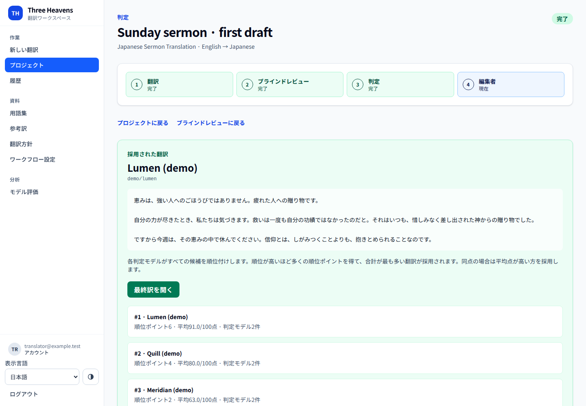
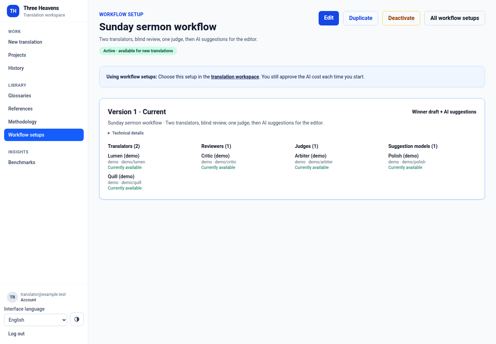
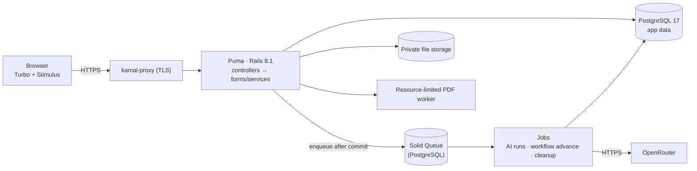
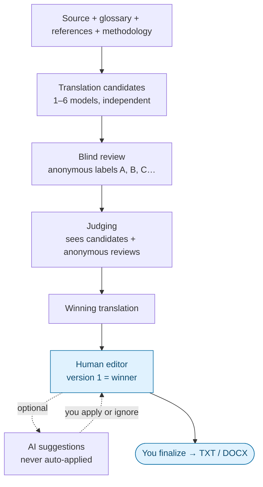
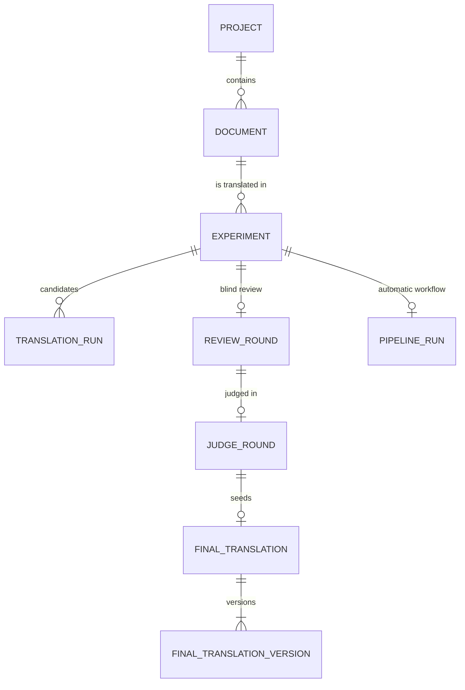
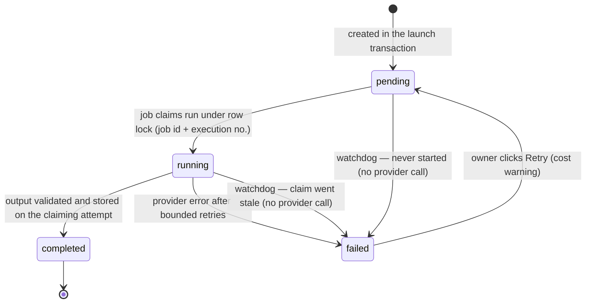

# Three Heavens

**An AI-assisted translation workspace where several models translate the same text, other models review and judge the results without knowing who wrote them, and a human editor makes the final call.**

[](https://github.com/XKeviNguyen/three_heavens/actions/workflows/ci.yml)


It is built for translators of long-form texts — sermons, articles, books — who want more than one AI opinion, need terminology to stay consistent, and must stay responsible for the final wording. You paste or upload a document and add the terms that must not change. Several models translate it independently. Reviewer models score the anonymous candidates, judge models rank them, and you edit the winner, optionally with AI suggestions, before approving a final version. AI never finalizes anything on its own.


The interface is available in English, Vietnamese, and Japanese. New to the app? Start with the [user guide](docs/user-guide.md).

> **About the screenshots.** They come from the real application running locally against a throwaway database. All names, texts, scores, token counts, and costs are **synthetic demo data** from a deterministic fake AI client ([`bin/capture-readme-screenshots`](bin/capture-readme-screenshots)). No AI service was called.

**Contents** — Product: [What it does](#what-it-does) · [Product tour](#product-tour) · [Using the app](#using-the-app) — Engineering: [Key design decisions](#key-design-decisions) · [Architecture](#architecture) · [Translation workflow](#translation-workflow) · [Data model](#data-model) · [Reliability](#reliability) · [Security](#security) · [Testing](#testing-and-release-quality) · [Tech stack](#tech-stack) · [Run it locally](#run-it-locally) · [Project structure](#project-structure) · [Deployment](#deployment) · [Status](#status-and-limitations)

## What it does

| Step (as named in the app) | What happens | Who decides |
| --- | --- | --- |
| **New translation** | Paste text or upload TXT, Markdown, DOCX, or text PDF. Add a glossary, approved reference translations, and a methodology (style guide). | You |
| **Translation** | 1–6 models each write their own translation (at least 2 to continue to review and judging). | AI, in parallel |
| **Blind review** | Reviewer models score every candidate on faithfulness, naturalness, terminology, and instructions — under anonymous labels. | AI |
| **Judging** | Judge models rank the anonymous candidates; the rankings are combined into one winner. | AI |
| **Human editor** | The winner becomes version 1 of your draft. Edit it, ask for AI suggestions, apply or ignore them, restore older versions. | You |
| **Finalize** | Approve a version and download it as TXT or DOCX. | You |

Each step can be started by hand, or a saved **workflow setup** runs translation → review → judging (→ optional AI suggestions) automatically and then stops at the editor. A **Benchmarks** page compares models across your own translations (wins, review and judge scores, cost, response time). It describes past results; the app makes no claim that competing models produce better translations in general.

## Product tour

<table>
<tr>
<td width="50%"></td>
<td width="50%"></td>
</tr>
<tr>
<td><b>1. Start a translation.</b> Pick languages, paste or upload the source, choose a glossary, and select several models. The form autosaves to the server about a second after you stop typing.</td>
<td><b>2. Compare independent candidates.</b> Every model translates the same source with the same instructions; nothing is merged or hidden.</td>
</tr>
<tr>
<td></td>
<td></td>
</tr>
<tr>
<td><b>3. Blind review.</b> Review prompts carry anonymous labels instead of model names, which is designed to reduce brand and self-preference bias. Only you see which model wrote each candidate.</td>
<td><b>4. Judging</b> (shown in the Japanese interface). Each judge ranks every candidate; ranking points are summed across judges. No winner is declared until every judge finishes.</td>
</tr>
<tr>
<td></td>
<td></td>
</tr>
<tr>
<td><b>5. You edit the winner.</b> Source, instructions, glossary, and review evidence stay beside the editor. Saving changed text creates a new version.</td>
<td><b>6. AI suggests, you decide.</b> A suggestion is tied to the exact version it was made for and is applied only when you click <i>Apply suggestion</i>.</td>
</tr>
<tr>
<td></td>
<td></td>
</tr>
<tr>
<td><b>7. Save a workflow setup</b> once: which models translate, review, judge, and suggest.</td>
<td><b>8. Run it automatically</b> on a second text ("Advent devotional"). You approve the AI requests for each translation before anything is sent.</td>
</tr>
<tr>
<td></td>
<td></td>
</tr>
<tr>
<td><b>9. It always stops for you.</b> The run ends at "Ready for you to edit": nothing applied, nothing finalized.</td>
<td><b>10. History</b> keeps every translation, its winner, and its AI cost, marked partial if a step did not report cost.</td>
</tr>
</table>

Also captured: [glossary](docs/images/readme/10-glossary.png) and [the editor on a phone](docs/images/readme/12-mobile-final-editor.png).

## Using the app

1. Sign in, and ask an administrator to turn on **AI access** for your account (Admin → Users).
2. **New translation:** choose languages, paste or upload the source, add guidance, pick models or a workflow setup, and start.
3. Follow the steps: candidates → blind review → judging → **Edit the winning translation**.
4. Save versions, request AI suggestions, then **Finalize current version** and download TXT or DOCX.

The [user guide](docs/user-guide.md) covers every screen and lists the key terms in English, Vietnamese, and Japanese.

## Key design decisions

Most of the engineering is in making paid, slow, failure-prone AI calls behave like a dependable workflow. Each decision links to the code and the tests that exercise it.

- **The human checkpoint is a domain invariant.** Only the explicit finalize action finalizes a translation, and AI suggestions become versions only when a person applies them. Automatic workflows always end at "Ready for you to edit". — [`Finalizations::ApplyProposal`](app/services/finalizations/apply_proposal.rb), [`Pipelines::Advance`](app/services/pipelines/advance.rb); [automatic pipeline tests](test/system/automatic_pipelines_test.rb)
- **Paid AI work needs explicit, bounded approval.** An automatic launch stores the approved plan (models × document parts × retry limit) on the workflow run; for multi-part documents the plan's digest is rechecked at submit and the launch is refused if it changed. Actual spend is recorded per request and shown as known or partial; a later retry is a separate action with its own cost warning. — [`Pipelines::Start`](app/services/pipelines/start.rb); [submission tests](test/integration/translation_workspace_submission_test.rb)
- **Every launch is idempotent.** Each form carries a signed, single-use submission identity consumed under a row lock, so a double click or a replayed POST returns the existing translation instead of starting a second paid run. — [`TranslationWorkspace`](app/forms/translation_workspace.rb), [`ReplayIdentity`](app/services/replay_identity.rb); [replay tests](test/integration/replay_adversarial_test.rb)
- **AI jobs tolerate duplicates, late arrivals, and crashes.** Runs are committed before their jobs are enqueued; a job claims its run under a row lock by job ID and execution number, and a late result can only update the attempt that claimed it. A watchdog fails stuck work without calling a provider. — [`Ai::ExecutionClaim`](app/services/ai/execution_claim.rb), [`Ai::StaleExecutionReconciler`](app/services/ai/stale_execution_reconciler.rb); [job lineage tests](test/jobs/ai_job_lineage_test.rb)
- **Drafts live on the server, not in localStorage.** An encrypted server draft, a per-tab editor identity, and a monotonically increasing sequence number resolve lost responses and late duplicates deterministically, report another tab's newer draft as a conflict, and work across devices. — [`TranslationWorkspaceDrafts::Save`](app/services/translation_workspace_drafts/save.rb); [draft tests](test/integration/translation_workspace_draft_test.rb), [browser history tests](test/system/translation_workspace_history_test.rb)
- **Configuration is versioned, not edited in place.** Glossaries, methodologies, references, and workflow setups append revisions; a translation stores the exact revisions it used, and PostgreSQL triggers stop terminal history from being rewritten. — [database design](docs/architecture/database.md)
- **PostgreSQL coordinates all persistent workflow state.** Row and advisory locks, unique indexes, and `SKIP LOCKED` give idempotency and batched cleanup; Solid Queue keeps jobs in PostgreSQL too, so there is one stateful dependency to back up and reason about. — [reliability](docs/architecture/reliability.md); [multi-process concurrency tests](test/support/process_barrier.rb)
- **Untrusted input is contained.** DOCX goes through a bounded ZIP reader and DTD-free XML; PDFs are extracted in a resource-limited child process; model output is validated against JSON schemas before it is stored. — [`SourceImports::PdfExtractor`](app/services/source_imports/pdf_extractor.rb); [security](docs/security.md)

## Architecture



A single Rails monolith. Controllers handle HTTP and ownership checks; a form object and namespaced services (`TranslationExperiments::`, `BlindReviews::`, `Judging::`, `Finalizations::`, `Pipelines::`, `SourceImports::`) own the workflows; jobs make every AI call through one provider client (`Ai::OpenRouterClient`). There is no Redis: in production Solid Queue, Solid Cache, and Solid Cable each use their own PostgreSQL database. Full topology, request path, and recurring jobs: [architecture overview](docs/architecture/overview.md).

## Translation workflow



Judges receive the anonymous candidates and the anonymous review feedback. The winner is chosen by a Borda count: a candidate ranked *r* of *N* earns *N − r + 1* points from each judge; ties go to the higher average score. Sources longer than 4,000 characters (up to 100,000) are split losslessly into parts at paragraph and sentence boundaries, and each model processes every part. Details: [workflow and long documents](docs/architecture/workflow.md).

## Data model

The UI says **Translation**; the code calls it `Experiment`, because each one is one source run against several competing candidates. Users only see the plain name.



This is a simplified domain view. Diagrams of all 47 application tables with their keys, and the constraints that protect history, are in [database design](docs/architecture/database.md); per-table purpose and lifecycle are in the [data dictionary](docs/architecture/data-dictionary.md).

## Reliability

An AI run's lifecycle, the core of the reliability design:



| Problem | What the code does | Tested by |
| --- | --- | --- |
| Response lost after an autosave | Editor identity + increasing sequence; if this tab wrote last, equal or older sequences are acknowledged as replays | [draft tests](test/integration/translation_workspace_draft_test.rb) |
| Two tabs edit one draft | Optimistic `lock_version` → HTTP 409; the tab keeps its local text | [draft concurrency tests](test/services/translation_workspace_drafts/save_concurrency_test.rb) |
| Double-submitted launch | Signed single-use submission identity consumed under a row lock | [submission tests](test/integration/translation_workspace_submission_test.rb) |
| Duplicate or late job execution | Claim by job ID + execution number; late results update only their own attempt | [job lineage tests](test/jobs/ai_job_lineage_test.rb) |
| Many stuck automatic workflows | Bounded sweeper with a least-recently-reconciled cursor and `SKIP LOCKED` | [reliability doc](docs/architecture/reliability.md#4-automatic-workflows) |

Autosave, idempotency, recovery, and cleanup fairness in detail: [reliability design](docs/architecture/reliability.md).

## Security

- Every owned record is loaded through the signed-in user's associations; other users' records look exactly like missing ones.
- Database-backed sessions that sign-out revokes, bcrypt passwords with email confirmation, and Google ID-token verification with single-use nonces.
- A strict nonce-based Content Security Policy, CSRF protection, per-route request-size limits, and rate limits on sign-in and uploads.
- Hostile-file handling (bounded DOCX parsing, a resource-limited PDF worker), encrypted drafts, and log filtering of text and identities.

Controls, limits, and residual risks: [security](docs/security.md).

## Testing and release quality

At the V1.1 release verification (October 2026): **1,209 Rails tests** (unit and integration) and **192 browser system tests** (headless Chrome), all passing in CI. These counts are taken from the dated [V1.1.0 release audit](docs/releases/v1.1.0-audit.md) and its CI runs; they are not from a new test run.

- **Concurrency:** multi-process tests with barriers for upload budgets, launches, and reference creation; draft-save races.
- **Replay and recovery:** lost responses, Back/Forward navigation, multiple tabs, cancelled uploads, duplicate and stale jobs.
- **Database:** constraint and trigger tests, migration lock rehearsals, and a check that `structure.sql` matches PostgreSQL's own output.
- **Operations:** a local backup/restore drill, a production-boot contract test for the Kamal configuration, and a [breaker script](script/breakers/chunked_request_memory.rb) that loads the production Docker image with many large request bodies under a 768 MiB memory limit.
- **Languages:** a test that the EN/VI/JA locale files define the same keys.

`bin/ci` runs the full gate locally: RuboCop, whitespace, bundler-audit, importmap audit, Brakeman, Zeitwerk, a pending-migration check, and every test. GitHub Actions runs the same checks (except the local-only migration-status steps) as five jobs (`scan_ruby`, `scan_js`, `lint`, `test`, `system-test`), and [a test](test/config/ci_gate_test.rb) fails if `bin/ci` gains a step that CI does not run. Tests never call a real AI provider: provider clients are replaced by fakes, and Ruby `Net::HTTP` connections from tests are limited to loopback.

Every change is reviewed along the same dimensions:

| Dimension | Examples here |
| --- | --- |
| Security | ownership scoping, signed identities, input bounds, bounded file parsing |
| Data | PostgreSQL constraints and triggers, versioned history, restore drills |
| Flow | idempotent launches, replay-safe autosave, explicit retries |
| Environment | browser system tests, production-boot contract, preflight checks |
| Performance | bounded cleanup batches, upload and response size limits |
| Simplicity | one monolith, PostgreSQL-only infrastructure, focused services |

## Tech stack

| Layer | Choice |
| --- | --- |
| Backend | Ruby 3.4, Rails 8.1, Puma |
| Frontend | Hotwire (Turbo, Stimulus) via importmap — no JavaScript build step; Tailwind CSS 4 |
| Database | PostgreSQL 17 with `structure.sql`, CHECK constraints, triggers, advisory locks |
| Jobs, cache, cable | Solid Queue, Solid Cache, Solid Cable (all PostgreSQL; no Redis) |
| AI gateway | OpenRouter behind `Ai::OpenRouterClient` (timeouts, 1 MiB response cap) |
| Files | Active Storage on a private volume; `rubyzip`, `pdf-reader` |
| Auth | `has_secure_password`, database sessions, Google Identity Services |
| Testing and scanning | Minitest, Capybara, Selenium; RuboCop, Brakeman, bundler-audit |
| Deployment | Docker, Kamal 2, kamal-proxy, Thruster |

## Run it locally

**Prerequisites:** Ruby 3.4.10, Docker (for PostgreSQL 17), and Chrome or Chromium for system tests. Ubuntu and macOS both work.

```sh
git clone https://github.com/XKeviNguyen/three_heavens.git
cd three_heavens
cp .env.example .env        # then set the values below
bundle install
```

`.env` (read by `dotenv-rails` in development and test only, and ignored by git):

```sh
POSTGRES_USER=three_heavens
POSTGRES_PASSWORD=choose_a_local_password
POSTGRES_PORT=5433
OPENROUTER_API_KEY=          # optional; leave empty unless you intend to pay for real AI calls
GOOGLE_CLIENT_ID=            # optional; Google sign-in is hidden when empty
```

```sh
docker compose up -d postgres        # PostgreSQL 17 bound to 127.0.0.1 only
bin/rails db:prepare                 # creates and migrates the databases
bin/rails accounts:bootstrap_admin   # prompts for an admin email and password
bin/dev                              # Rails + Tailwind watcher on http://localhost:3000
```

In development, jobs run inside the web process (Rails' async adapter), so no separate worker is needed.

**Without an AI key** everything except the AI steps works: accounts, projects, uploads and text extraction, glossaries, references, methodologies, workflow setups, drafts, history, and the UI in all three languages. Running translations, reviews, judging, or suggestions needs a paid `OPENROUTER_API_KEY` and **AI access** turned on for the account under Admin → Users. Models are picked from the OpenRouter catalog right in the form; browsing the catalog is free. To see the full flow without paying, run `bin/capture-readme-screenshots`, which drives the real UI end to end with a fake AI client against the Rails test database. The run wipes and resets that database (the same one `bin/rails test` uses), so run it only in a disposable checkout connected to an isolated, throwaway database.

**Checks:**

```sh
bin/rails test            # unit and integration tests
bin/rails test:system     # browser tests (headless Chrome)
bin/ci                    # the full local gate, same checks as CI
```

> The Compose volume `three_heavens_postgres_data` (prefixed with the Compose project name) holds your local data; `docker compose down -v` deletes it.

## Project structure

```text
app/
  controllers/   HTTP boundary: authentication, ownership lookups, parameter shape
  forms/         TranslationWorkspace – validates and launches a translation
  models/        durable state and invariants (Experiment, TranslationRun, …)
  services/      workflows by domain: blind_reviews/, judging/, pipelines/,
                 source_imports/, translation_workspace_drafts/, ai/, operations/
  jobs/          AI runs, automatic-workflow advancement, reconciliation, cleanup
  javascript/    Stimulus controllers: autosave and navigation guard, uploads, model browser
  views/         server-rendered ERB with Turbo
config/          routes, CI gate (ci.rb), recurring jobs, Kamal deploy.yml, locales (en/vi/ja)
db/              migrations and structure.sql (PostgreSQL's own dump)
bin/ops/         backup, restore verification, preflight, post-deploy smoke test
docs/            architecture, security, operations, user guide
script/          README screenshot capture, production-image breaker, edge-proxy evaluation
test/            unit, integration, system, concurrency, migration, and config tests
```

## Deployment

The repository is configured for a single-host [Kamal](https://kamal-deploy.org/) deployment: a non-root Docker image behind kamal-proxy (TLS), Thruster in front of Puma, Solid Queue supervised inside Puma, four PostgreSQL databases (primary, queue, cache, cable), and a persistent private volume for uploaded files. Configuration comes only from environment variables and the operator's secret manager, and a contract test proves production refuses to boot without each required variable.

Runbooks: [configuration](docs/operations/configuration.md) · [production deploy and rollback](docs/operations/production-deploy.md) · [backup and restore](docs/operations/backup-and-restore.md) · [disaster recovery](docs/operations/disaster-recovery.md).

## Status and limitations

- **V1.1.0, integrated into `main`.** [PR #79](https://github.com/XKeviNguyen/three_heavens/pull/79) merged V1.1.0 into `main` as `43b0184db56d499610b0186d71bf54265f3ac6cd`, and the post-merge CI run on `main` passed all five jobs. The `v1.1.0` tag and GitHub Release have not been published yet. Production deployment, uptime, traffic and operation with a real paid AI provider are not verified; this README does not claim any of them.
- **One AI provider:** all AI calls go through OpenRouter.
- **Retries can cost more than once:** application state is deduplicated, but after a network failure the provider may already have processed (and billed) a request that is then retried.
- **Text only:** no OCR for scanned PDFs, no legacy `.doc`, no layout-preserving export.
- **Single host:** horizontal scaling would need a dedicated job role and shared file storage.
- **Approximate token budgets:** context planning uses a conservative byte-based estimate, not each provider's tokenizer.
- **License: [MIT](LICENSE).** Copyright © 2026 Nguyen Thai Hoang. Three Heavens is open source: reuse, modification, distribution and commercial use are permitted under the MIT License, provided its copyright and permission notices are retained. Third-party components remain subject to their own licenses.

Deep dives: [architecture](docs/architecture/overview.md) · [workflow](docs/architecture/workflow.md) · [database](docs/architecture/database.md) · [data dictionary](docs/architecture/data-dictionary.md) · [reliability](docs/architecture/reliability.md) · [documents](docs/architecture/documents.md) · [security](docs/security.md) · [user guide](docs/user-guide.md)
