# Database design

PostgreSQL 17 is the source of truth. This page shows every application table, grouped by domain, with its keys and relationships. Per-table purpose, lifecycle, and constraints are in the [data dictionary](data-dictionary.md).

## At a glance

As of V1.1, the primary database (`db/structure.sql`) contains:

| | Count |
| --- | --- |
| Tables | 52 — 47 application tables + 5 Rails/Active Storage tables |
| Foreign-key constraints | 79 (including 9 composite ownership keys) |
| Unique indexes | 70 (several partial, e.g. `WHERE experiment_id IS NOT NULL`) |
| CHECK constraints | 264 |
| Triggers | 76 |

These are structural counts, not quality measures.

In production, three more PostgreSQL databases hold operational state that can be rebuilt: Solid Queue (13 tables, `db/queue_schema.rb`), Solid Cache (`solid_cache_entries`), and Solid Cable (`solid_cable_messages`). They are not authoritative: disaster recovery restores the primary database and file storage and rebuilds the queue empty, so old paid-work jobs are never replayed. In development and test, a single database is used, with in-memory cache and async jobs.

### Why `structure.sql`

Rails' Ruby schema format can express CHECK constraints and partial or expression indexes, but not PostgreSQL functions and triggers. Three Heavens relies on 76 triggers — for immutable history, lineage between parent and child records, and revision sequencing — so the SQL format is the only faithful dump. It also preserves composite foreign keys and constraint expressions exactly as PostgreSQL deparses them, which `test/config/database_schema_format_test.rb` checks for every constraint and index.

`structure.sql` is regenerated by `pg_dump` when a migration runs in development (production sets `dump_schema_after_migration = false`). Regenerate it by running the migration against a database prepared from the committed file, with a PostgreSQL 17 `pg_dump` on the `PATH`; never edit it by hand, and never modify a merged migration.

## How to read the diagrams

- Entities are the real table names. `PK`, `FK`, and `UK` mark primary, foreign, and unique keys; a comment such as `UK (a, b)` names a composite unique index.
- Only the columns needed to understand the relationships are shown. Timestamps and the [shared execution columns](#shared-execution-columns) of AI run tables are omitted.
- **Cardinalities show what PostgreSQL enforces** (nullable foreign keys, unique indexes). Rules enforced by services or triggers rather than by keys, such as "a translation has at least two candidates before review", are described in the notes, not in the crow's feet.
- Solid lines are foreign keys. Dotted lines are relationships with no ordinary foreign key: polymorphic links (checked by triggers or by Rails) and logical links through shared columns.
- A table that belongs to another group appears with only its key columns.

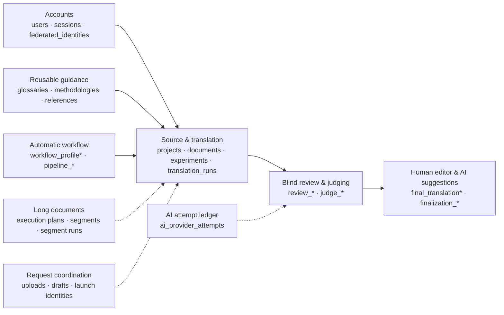

## 1. Accounts and sessions

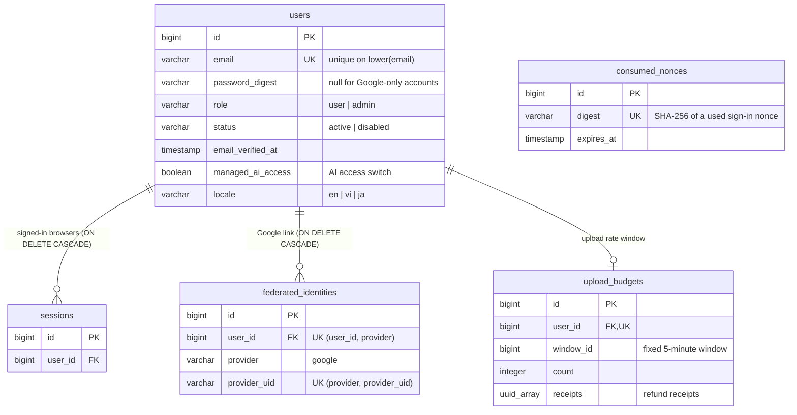

- A session row is the whole server-side session; the encrypted cookie carries only its ID. Signing out deletes the row.
- `consumed_nonces` stores only digests, so a Google sign-in nonce can be used once; it has no owner link by design.

## 2. Source and translation

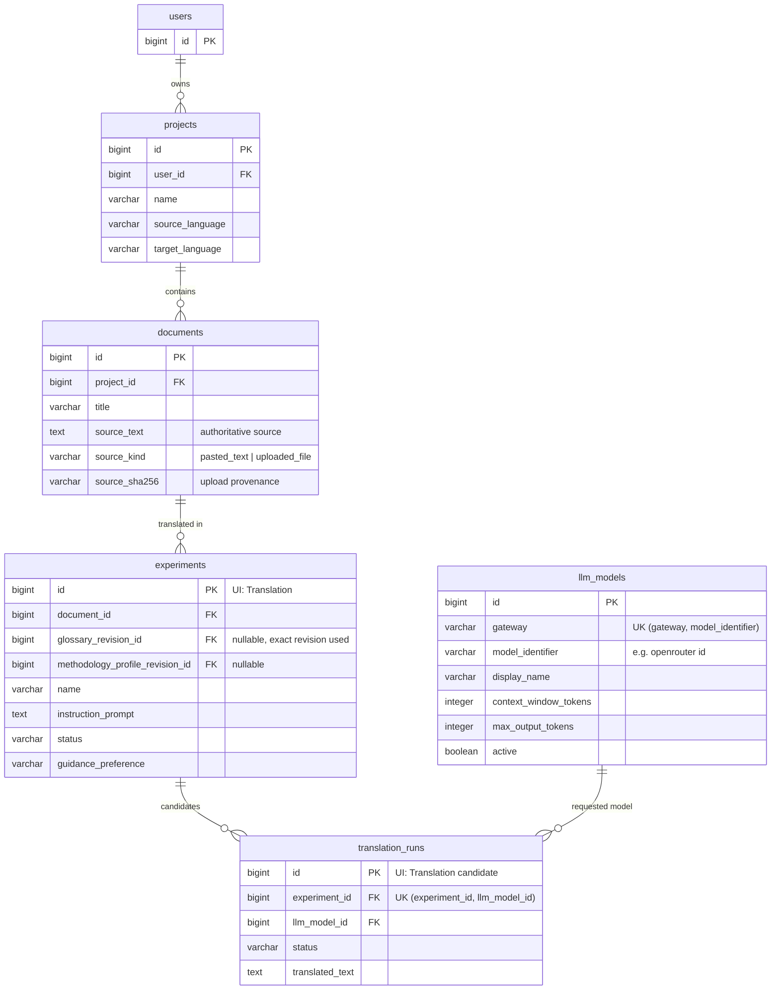

- The UI calls an `Experiment` a **Translation**: one source run against several competing candidates.
- One candidate per model per translation (`UK (experiment_id, llm_model_id)`). The rule "at least two completed candidates before blind review" is enforced by `BlindReviews::Start`.
- Triggers keep guidance snapshots consistent if a document or project is moved, and stop a translation's glossary revision or guidance preference from being rewritten.

## 3. Blind review and judging

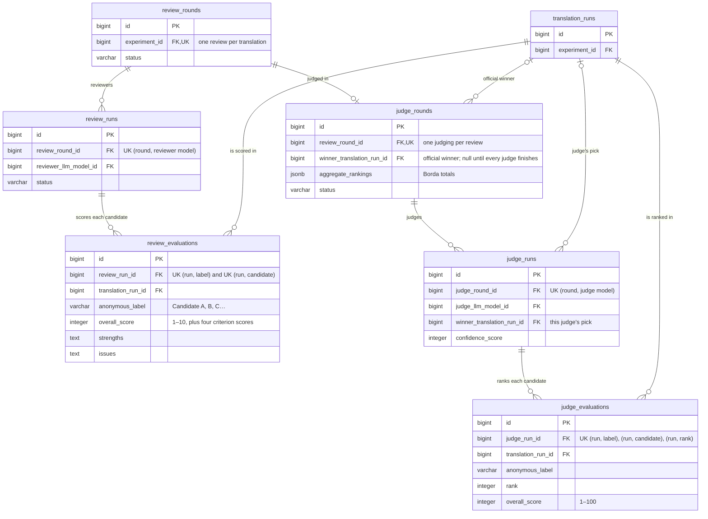

- Each reviewer and each judge has its **own** evaluations; nothing is shared between models. Labels are assigned per run.
- Lineage triggers check that every evaluated or winning candidate belongs to the same translation as the round. Completed rounds, runs, and evaluations cannot be updated or deleted.
- `reviewer_llm_model_id` and `judge_llm_model_id` reference `llm_models` (omitted here for readability).

## 4. Human editor and AI suggestions

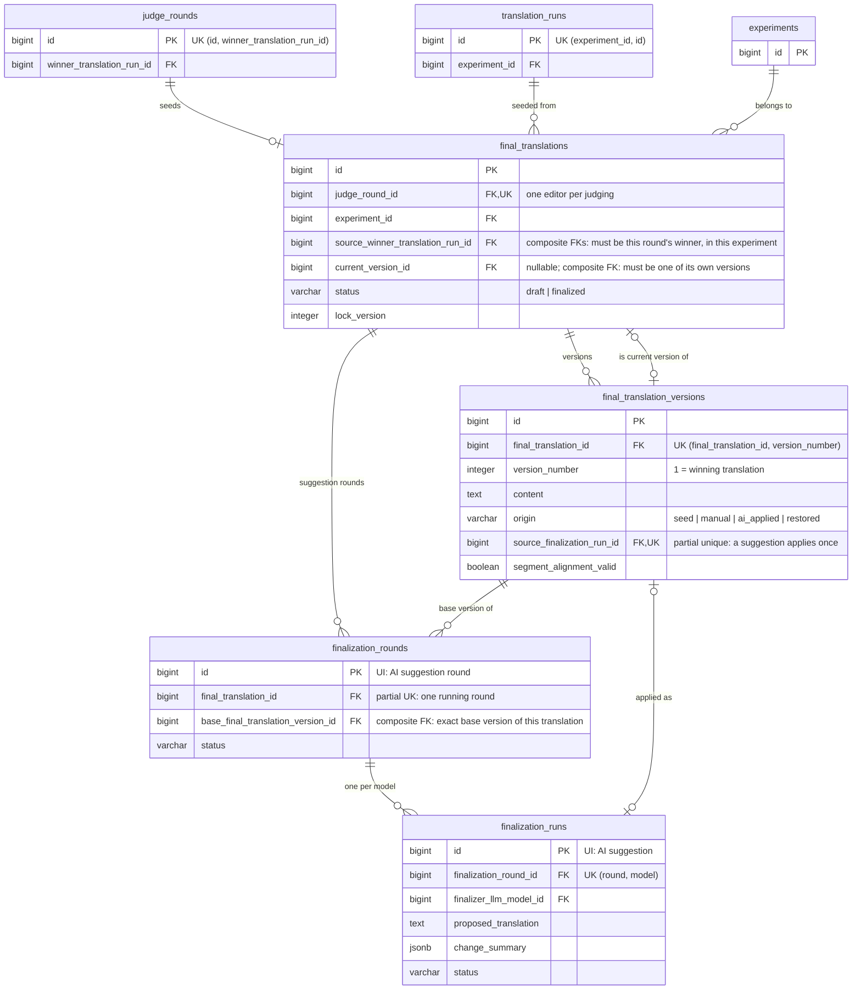

- `current_version_id` is nullable only because the translation and its first version reference each other and are created in one transaction. The composite key `(id, current_version_id) → final_translation_versions(final_translation_id, id)` guarantees the current version belongs to the same translation.
- Versions are append-only: a trigger assigns gapless version numbers and blocks updates and deletes. Saving unchanged text returns the current version instead of creating one.
- A suggestion applies only to its exact base version and only once (partial unique on `source_finalization_run_id`).
- Finalizing is a status change by the owner; no service finalizes automatically.

## 5. Long documents

Sources longer than the 4,000-character target are split into parts. Each AI stage then runs once per model and part.

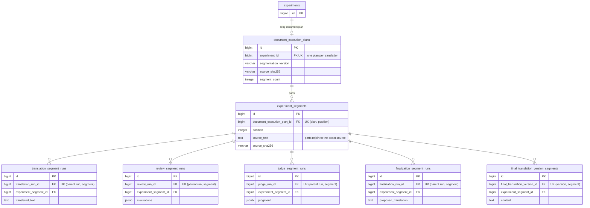

- The parent runs (`translation_runs`, `review_runs`, `judge_runs`, `finalization_runs`) remain the logical records used by history, judging, and benchmarks; segment runs are the per-part executions. Their parent links (`translation_run_id` → `translation_runs`, and so on) are foreign keys with `ON DELETE RESTRICT`.
- A segment-lineage trigger checks that a segment run's part belongs to the same plan as its parent's translation. Plans and segments are immutable.
- Parent cost is the sum of known part costs; if any is missing, the total is marked partial.

## 6. Reusable guidance

Glossaries, methodologies, references, and (in section 7) workflow setups share one pattern: a user-owned **handle** with an `active` flag and a `current_revision_id`, plus append-only **revisions**. A translation stores the exact revision it used.

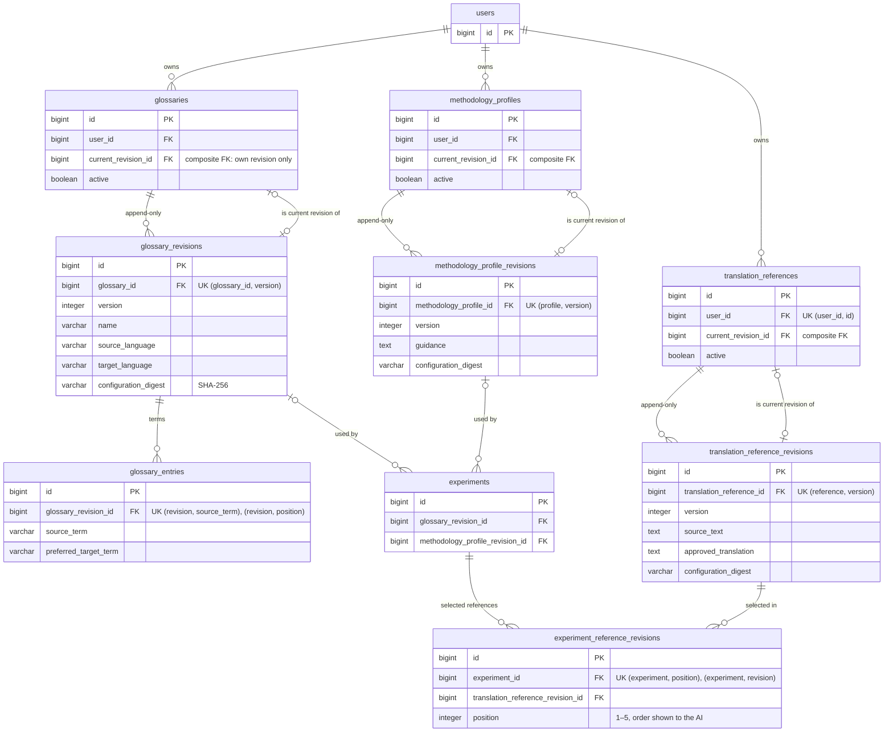

- `experiment_reference_revisions` is an ordered join table. A trigger accepts a row only for the owner's active, current reference revision with the project's language pair, and only before any candidate exists; another freezes the rows afterwards.
- Revision triggers assign gapless version numbers and block updates and deletes; a glossary's entry set is sealed when its revision is complete.
- Archiving sets `active = false`. Nothing in this group is deleted by the application (`ON DELETE RESTRICT`).

## 7. Automatic workflow

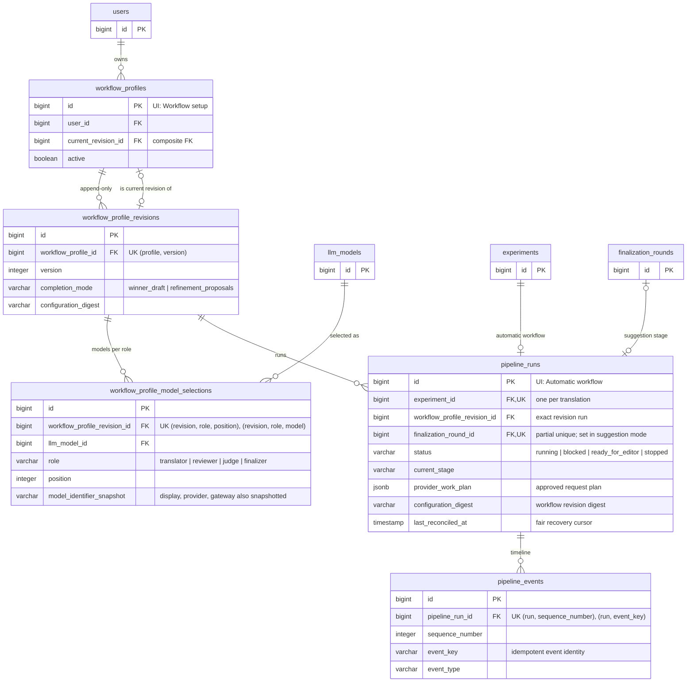

- `pipeline_events.event_key` is unique per run, so repeating an advancement step cannot add a duplicate event. Events and model selections are immutable.
- An ownership-lineage trigger checks that the translation and the workflow revision belong to the same user, and that a suggestion round belongs to the same translation.

## 8. AI attempt ledger

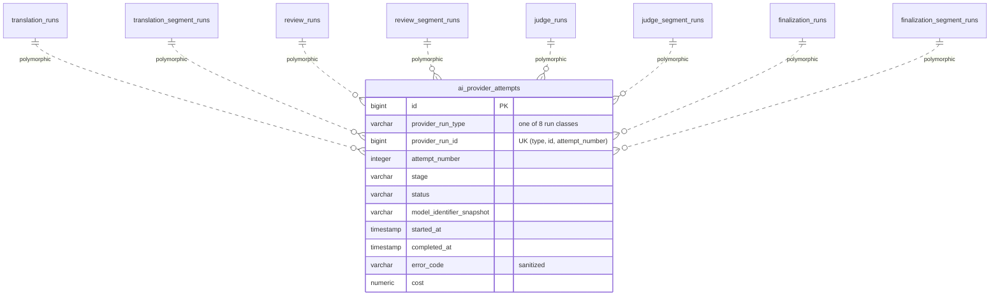

- This is an **execution-attempt** ledger: a row is written when a job claims a run, before the context-budget check and before any request is sent. An attempt is therefore not the same as an HTTP request to the provider, and the run's logical record (the parent run) is separate again.
- There is no ordinary foreign key across the eight target tables; `enforce_ai_provider_attempt_lineage` checks that the target row exists and that its type matches the stage, and each run table has a trigger that refuses deletion while attempts exist. An attempt's identity and routing snapshot never change, and completed or failed attempts cannot be updated or deleted.
- Duration comes from `started_at`/`completed_at`; there is no separate latency column. `cost` is what the provider reported, when it reported one.

## 9. Request coordination (temporary and replay state)

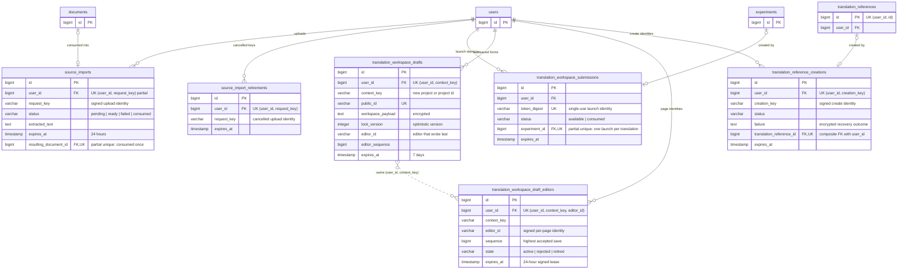

- Drafts and editors are related **logically**, not by a foreign key: they share `(user_id, context_key)`, and `translation_workspace_drafts.editor_id` names the editor that wrote last. An editor's watermark outlives the draft, so a retired page cannot resurrect a discarded draft.
- `draft_id` in the autosave API is the draft's `public_id`, not its primary key.
- Lifetimes and cleanup are in [reliability](reliability.md#5-bounded-cleanup-and-fairness) and [replay lifecycles](../replay_lifecycles.md). Consumed uploads and consumed launch identities are kept as provenance of the translation they created.

## 10. Files (Active Storage)

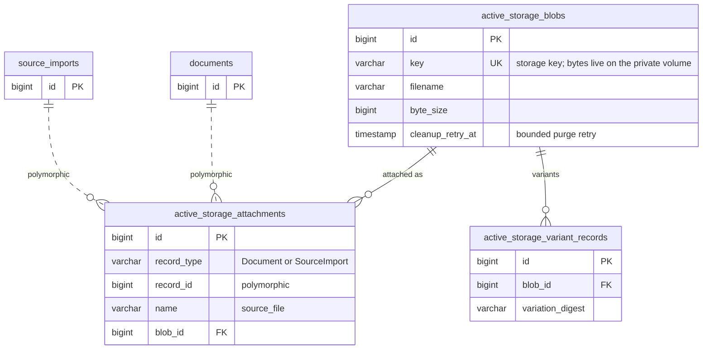

When an upload is consumed, the same blob is attached to the new `Document`; file bytes are not copied. Unattached blobs are removed by a daily bounded job; attached blobs are never touched.

## Shared execution columns

Every AI run table (`translation_runs`, `review_runs`, `judge_runs`, `finalization_runs`, and their four `*_segment_runs`) carries the same execution columns, omitted from the diagrams above:

| Columns | Purpose |
| --- | --- |
| `status`, `pending_since`, `started_at`, `completed_at` | Lifecycle; the watchdog uses `pending_since` and `last_claimed_at` to find stuck work |
| `scheduled_job_id`, `claimed_job_execution`, `execution_attempt`, `last_claimed_at` | Execution claim: only the recorded job and strictly newer retries may claim a run |
| `error_code`, `error_message` | Sanitized failure code and a fixed safe message (no provider bodies) |
| `provider_response_id`, `resolved_model_identifier` | What the provider reported serving |
| `prompt_tokens`, `completion_tokens`, `total_tokens`, `cached_tokens`, `reasoning_tokens`, `cost` | Reported usage; `cost_complete` and `telemetry_complete` (parent runs) mark whether totals are complete |
| `context_window_tokens_snapshot`, `max_output_tokens_snapshot`, `estimated_input_tokens`, `reserved_output_tokens`, `context_safety_margin_tokens`, `budget_policy_version` | Context-budget snapshot taken before the request; a CHECK guarantees the estimate fits the window |

## How history is protected

- **Foreign keys on every ordinary relationship.** 75 of 79 refuse to delete a referenced row (37 `ON DELETE RESTRICT`, 38 the default `NO ACTION`). The polymorphic `ai_provider_attempts` and Active Storage attachment links are checked by a trigger and by Rails respectively. Only sessions, Google links, drafts, and draft editors cascade when a user is deleted.
- **Composite ownership keys.** Nine composite foreign keys make "pointer to a child of the same parent" impossible to violate. Examples: a handle's `current_revision_id` must be one of its own revisions, a final translation's current version must be its own, and its seed must be the judging round's official winner in the same translation.
- **Triggers seal history.** Completed runs, rounds, evaluations, revisions, versions, plans, segments, events, and attempts cannot be updated or deleted; parents of lineage rows cannot be changed. Tests bypass them only deliberately, mainly through the explicit `mutate_historical_fixture` helper.
- **CHECK constraints** bound text lengths, scores (reviews 1–10, judgments 1–100), status/field combinations, digests and identity formats, and token snapshots (`estimated input + reserved output + safety margin ≤ context window`).
- **Unique and partial indexes** make the important "at most one" rules hold under concurrency: one review per translation, one judging per review, one automatic workflow per translation, one running suggestion round per final translation, one consumption per upload, one launch per submission identity.
- **Migrations are rehearsed.** Recent migrations that touch populated tables use short lock timeouts, separate `VALIDATE CONSTRAINT` steps, and concurrent index builds, and tests exercise their lock behavior.

## Encryption boundaries

Active Record encryption protects two columns: `translation_workspace_drafts.workspace_payload` (autosaved form content) and `translation_reference_creations.failure` (recovery outcomes). Other text — source documents, translations, glossaries, versions — is stored in plain PostgreSQL columns and is protected by database access control, private networking, and backups handled as sensitive data, not by application-level encryption.

## UI names and model names

| Users see | Model / table |
| --- | --- |
| Project | `Project` / `projects` |
| Document (source) | `Document` / `documents` |
| Translation | `Experiment` / `experiments` |
| Translation candidate | `TranslationRun` / `translation_runs` |
| Blind review | `ReviewRound`, `ReviewRun`, `ReviewEvaluation` |
| Judging | `JudgeRound`, `JudgeRun`, `JudgeEvaluation` |
| Final translation, version | `FinalTranslation`, `FinalTranslationVersion` |
| AI suggestions | `FinalizationRound`, `FinalizationRun` |
| Automatic workflow | `PipelineRun`, `PipelineEvent` |
| Workflow setup | `WorkflowProfile`, `WorkflowProfileRevision`, `WorkflowProfileModelSelection` |
| Glossary | `Glossary`, `GlossaryRevision`, `GlossaryEntry` |
| Methodology | `MethodologyProfile`, `MethodologyProfileRevision` |
| Reference | `TranslationReference`, `TranslationReferenceRevision` |
| Uploaded file before launch | `SourceImport` |
| Autosaved form | `TranslationWorkspaceDraft`, `TranslationWorkspaceDraftEditor` |
| Model | `LlmModel` |
