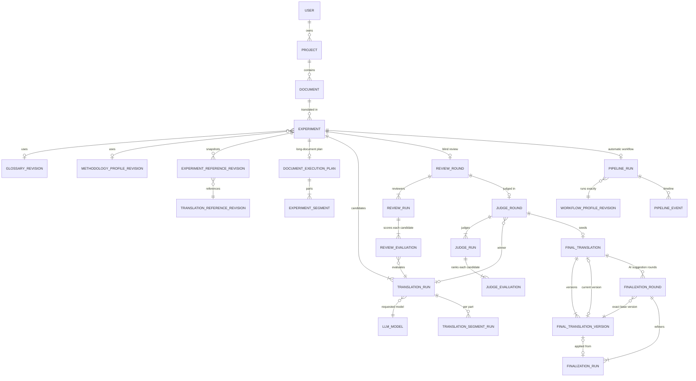
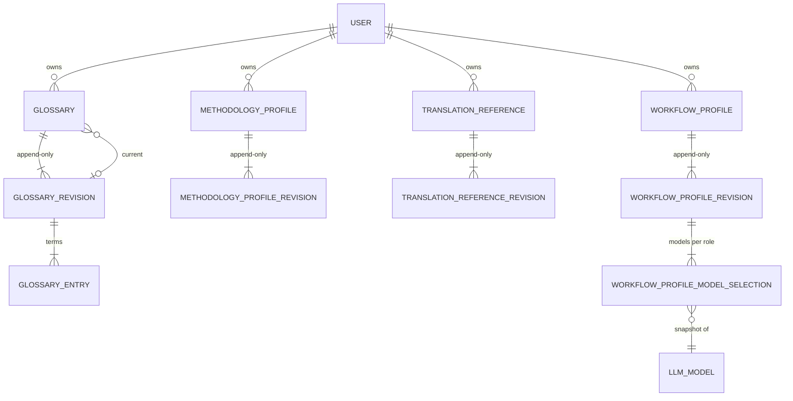
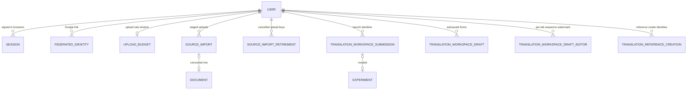

# Database design

PostgreSQL 17 is authoritative. The schema is kept as `db/structure.sql` (PostgreSQL's own `pg_dump` output) because the application relies on features a Ruby schema file cannot express: CHECK constraints, partial and expression indexes, and triggers that seal historical rows.

## UI names and model names

| Users see | Model / table |
| --- | --- |
| Project | `Project` / `projects` |
| Document (source) | `Document` / `documents` |
| Translation | `Experiment` / `experiments` |
| Translation candidate | `TranslationRun` |
| Blind review | `ReviewRound`, `ReviewRun`, `ReviewEvaluation` |
| Judging | `JudgeRound`, `JudgeRun`, `JudgeEvaluation` |
| Final translation, version | `FinalTranslation`, `FinalTranslationVersion` |
| AI suggestions | `FinalizationRound`, `FinalizationRun` |
| Automatic workflow | `PipelineRun`, `PipelineEvent` |
| Workflow setup | `WorkflowProfile`, `WorkflowProfileRevision`, `WorkflowProfileModelSelection` |
| Glossary | `Glossary`, `GlossaryRevision`, `GlossaryEntry` |
| Methodology | `MethodologyProfile`, `MethodologyProfileRevision` |
| Reference | `TranslationReference`, `TranslationReferenceRevision` |
| Uploaded source file (before launch) | `SourceImport` |
| Autosaved form | `TranslationWorkspaceDraft`, `TranslationWorkspaceDraftEditor` |
| Model | `LlmModel` |

## Core translation graph

`ReviewSegmentRun`, `JudgeSegmentRun`, and `FinalizationSegmentRun` mirror `TranslationSegmentRun` for long documents. Every provider call, including retries, is recorded as an `AiProviderAttempt` (polymorphic to the run it belongs to) with sanitized error codes, tokens, cost, and latency.

## Reusable guidance (versioned)

Editing any of these creates a new revision with a SHA-256 configuration digest. Earlier revisions are never rewritten; archiving hides a library item from new translations but keeps its history. Workflow model selections also snapshot the model's display name, provider, and identifier, so history remains readable if a model is later deactivated.

## Accounts and request-coordination state

These tables make retries safe; their lifetimes and cleanup are described in [reliability](reliability.md) and [replay lifecycles](../replay_lifecycles.md). `ConsumedNonce` records Google sign-in nonces so each can be used only once.

## How history is protected

- **Foreign keys on every ordinary relationship.** The polymorphic `ai_provider_attempts` link is protected by a lineage trigger instead. Durable translation history (projects, documents, translations, AI results, final versions) is never deleted by the application; libraries are archived instead.
- **Triggers seal terminal records.** Completed runs, evaluations, revisions, plans, and segments cannot be updated or deleted in ways that would rewrite history. Tests bypass them only deliberately, mainly through the explicit `mutate_historical_fixture` helper.
- **CHECK constraints** bound text lengths, scores, token snapshots (for example `estimated input + reserved output + safety margin ≤ context window`), status/field combinations, and identity formats.
- **Unique and partial indexes** enforce one draft per user and context, one review round per translation, one consumption per upload, and similar invariants that Rails validations alone cannot guarantee under concurrency.
- **Migrations are rehearsed.** Recent migrations that touch populated tables use short lock timeouts, separate `VALIDATE CONSTRAINT` steps, and concurrent index builds, and tests exercise their lock behavior. `test/config/database_schema_format_test.rb` fails if any constraint or index in `structure.sql` is not spelled exactly as PostgreSQL deparses it.

## Working with the schema

`db/structure.sql` is generated by PostgreSQL 17's `pg_dump` when a migration runs; never edit it by hand. Regenerate it by running the migration against a database prepared from the committed file, with a PostgreSQL 17 `pg_dump` on the `PATH` (an older `pg_dump` refuses a PostgreSQL 17 server). Never modify a merged migration; add a new one.
