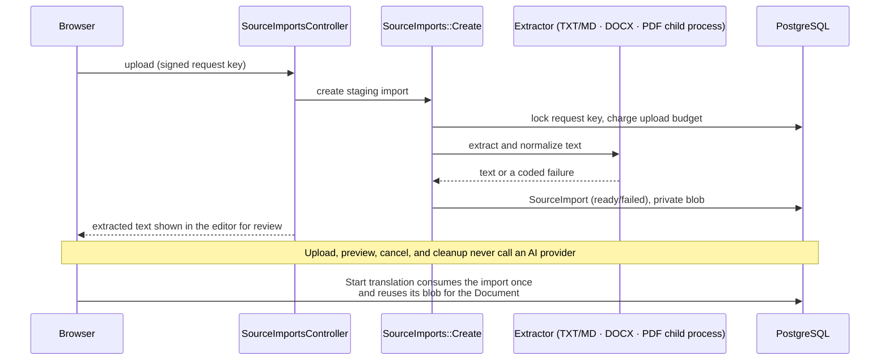

# Documents: import and export

## Supported sources

Owners can paste text or upload `.txt`, `.md`, `.docx`, and text `.pdf` files. Legacy `.doc`, `.docm`, RTF, HTML, ODT, images, scanned PDFs (OCR), and archives are intentionally unsupported.

## Upload flow

- Upload and extraction create an owner-scoped `SourceImport` staging record. The owner reviews and may edit the extracted text in the normal workspace.
- A successful launch locks and consumes the import once, creates the Project/Document/Translation graph atomically, records the source text and provenance, and reuses the stored file without copying bytes.
- Abandoned imports expire after 24 hours. Destroying one purges its file after the transaction commits. A cancelled upload's request key is retired so a late retry cannot resurrect it.
- Each account may send at most 10 file-carrying requests per fixed 5-minute window across the upload forms. A second PDF while the single PDF worker is busy waits up to 2 seconds and is then asked to retry (503 with `Retry-After`).

## Limits and normalization

- 10 MiB per file. Extracted text is limited to 100,000 characters (`Ai::UsageLimits::MAX_SOURCE_CHARACTERS`).
- The reference form accepts two files in one request, so the proxy accepts bodies up to 21 MiB (two 10 MiB files plus bounded multipart overhead).
- Original filenames are sanitized and limited to 255 characters while keeping the extension.
- TXT and Markdown must be valid UTF-8; a UTF-8 BOM is removed and line endings become LF. Markdown stays plain text.

## DOCX

Only genuine, macro-free WordprocessingML packages are accepted. The package declaration, main-document relationship, content types, internal relationship targets, and extension/MIME/magic-byte agreement are validated first. A bounded in-memory ZIP reader allows at most 500 entries, 50 MiB declared total expansion, 16 MiB across relevant XML, 8 MiB for the main document, 2 MiB per secondary text part, and 1 MiB per relationships part. Duplicate or ambiguous names, traversal variants, encrypted entries, macros, embedded objects, unsafe external relationships, and suspicious compression are rejected. XML parsing is strict, DTD-free, and network-disabled.

Visible text is converted deterministically: paragraphs become LF-separated lines; tabs and explicit breaks are kept; table cells use tabs and rows use line breaks; hyperlinks, content controls, inserted revisions, field results, and text boxes are kept; deleted, moved-away, and hidden runs are excluded; numbering becomes readable list labels; referenced footnotes, endnotes, and distinct headers/footers are appended once with labels. Layout, styles, and images are not reproduced.

## PDF

`SourceImports::PdfExtractor` runs `pdf-reader` in a separate, resource-limited child process: no environment or inherited files, its own process group, 256 MiB address space, 5-second CPU and wall-clock limits, at most 100 pages, no file writes or core dumps, and the highest OOM score so the kernel stops it before the web process. See [security](../security.md) for the residual risk.

## Export

Owners download the current draft or the finalized version as:

- **TXT** — exactly the stored UTF-8 text, no BOM, nothing added.
- **DOCX** — a clean, macro-free document generated only from the final text, preserving Unicode, paragraphs, blank lines, tabs, and whitespace, with a small app-generated style and safe core metadata. It never copies the uploaded package or any provider data. The generated subset round-trips through the importer to the same text.

Exports are generated on demand and not stored. Downloads of a reopened translation are labeled as drafts until it is finalized again.
