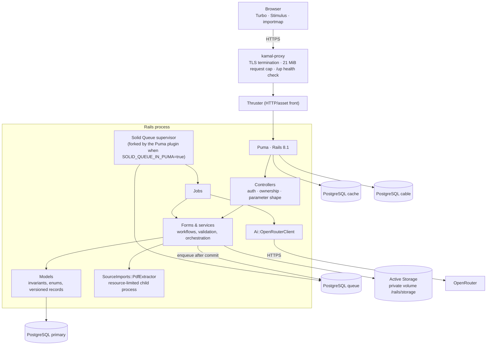

# Architecture overview

Three Heavens is one Rails 8.1 application. PostgreSQL 17 is the source of truth for application data and also backs the job queue, cache, and Action Cable. There is no Redis, no JavaScript bundler, and no separate single-page app; JavaScript loads through importmap, and Tailwind CSS is built by Rails tooling (`tailwindcss:watch` in development, asset precompilation in the Docker build).

## Runtime topology

In production all four databases are separate (`DATABASE_URL`, `QUEUE_DATABASE_URL`, `CACHE_DATABASE_URL`, `CABLE_DATABASE_URL`). Only the primary database and the storage volume are authoritative for backup; the queue is rebuilt empty during disaster recovery so old paid jobs are never replayed blindly (see [disaster recovery](../operations/disaster-recovery.md)).

## Layers and responsibilities

| Layer | Responsibility | Examples |
| --- | --- | --- |
| Controllers | HTTP transport, authentication, ownership lookups, request-shape validation, response choice | `TranslationWorkspacesController`, `TranslationWorkspaceDraftsController` |
| Form | Validate and launch a translation as one transaction | `TranslationWorkspace` |
| Services | Domain workflows, grouped by namespace | `TranslationExperiments::Start`, `BlindReviews::Start`, `Judging::Aggregate`, `Finalizations::ApplyProposal`, `Pipelines::Advance`, `SourceImports::Create` |
| Models | Durable state and invariants; PostgreSQL constraints and triggers back the important ones | `Experiment`, `TranslationRun`, `FinalTranslationVersion` |
| Jobs | Asynchronous AI work, workflow advancement, reconciliation, bounded cleanup | `TranslationRunJob`, `PipelineAdvanceJob`, `StaleAiWorkReconciliationJob` |
| Provider client | The only code that talks to OpenRouter: request building, timeouts, streamed size cap, error classification | `Ai::OpenRouterClient`, `OpenRouter::Catalog` |
| Operations services | Backup, restore verification, preflight, structured operational events | `Operations::Backup::BundleCreator`, `Operations::Restore::Verification`, `Operations::EventLogger` |

## Request path for a translation launch

1. The browser submits the workspace form with a signed, single-use submission identity.
2. `TranslationWorkspace#submit` claims the identity, locks it, validates every selection against the current owner-scoped records, and creates Project → Document → Experiment (and a `PipelineRun` in automatic mode) in one transaction.
3. AI runs are created as `pending` rows. Their job IDs are recorded, and jobs are enqueued only **after the transaction commits**.
4. A Solid Queue worker runs `TranslationRunJob`. The job claims its run under a row lock, builds the prompt, checks the model's context budget, calls `Ai::OpenRouterClient`, validates the output, and records the result on the attempt that claimed it.
5. A reconciliation service updates the parent round. In automatic mode `PipelineAdvanceJob` starts the next stage, and stops at the editor.

## Recurring jobs (production)

Defined in `config/recurring.yml`:

| Job | Schedule | Purpose |
| --- | --- | --- |
| `StaleAiWorkReconciliationJob` | every 15 min | Fail AI work that never started or lost its claim (default 120 min); never calls a provider |
| `PipelineReconciliationJob` | every 10 min | Re-advance running/blocked automatic workflows in bounded, least-recently-reconciled order |
| Source import, reference creation, workspace submission, draft, and session cleanup | hourly | Remove expired temporary state in batches |
| `ActiveStorageCleanupJob` | daily | Remove unattached blobs older than seven days, lock-and-recheck |
| Solid Queue finished-job clearing | hourly | Keep the queue database small |

## Health endpoints

- `/up` — process liveness: Rails booted. Used by kamal-proxy.
- `/ready` — readiness: the primary database answers `SELECT 1`. Returns only `ready` or `unavailable`, never calls OpenRouter, and never exposes database errors.

Queue, cache, and cable health appear on the admin-only Operations page as aggregate diagnostics.

## Related documents

- [Translation workflow and long documents](workflow.md)
- [Database design](database.md) and [data dictionary](data-dictionary.md)
- [Reliability and concurrency](reliability.md)
- [Documents: import and export](documents.md)
- [Security](../security.md)
- [Production configuration](../operations/configuration.md)
