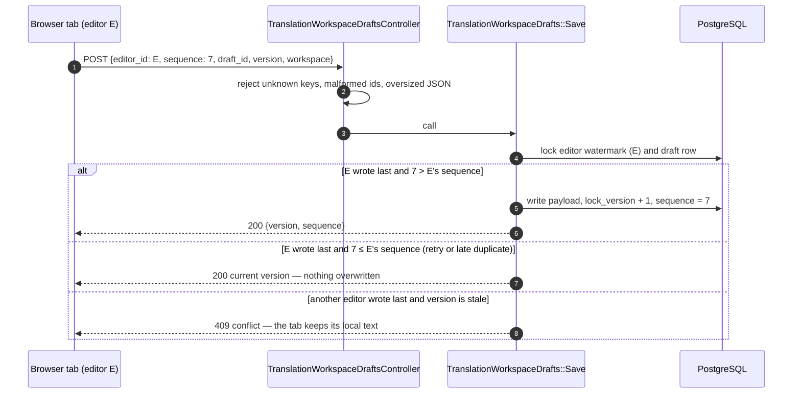
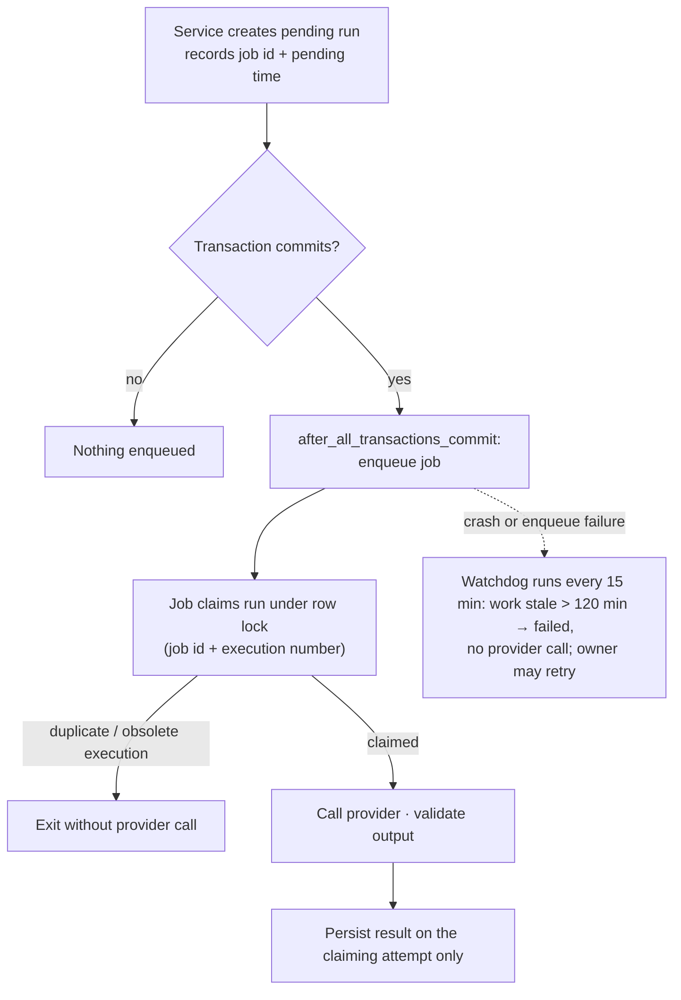

# Reliability and concurrency

Three Heavens assumes that networks drop responses, users double-click and open several tabs, processes crash between steps, and jobs run twice. Each section below names the failure, the mechanism, and where the code lives.

PostgreSQL is the coordination point throughout: row locks (`SELECT … FOR UPDATE`), advisory locks, unique indexes, and `SKIP LOCKED`. There is no second coordination store to keep consistent.

## 1. Autosaved drafts

The new-translation form autosaves to an encrypted server-side draft (`TranslationWorkspaceDraft`, `encrypts :workspace_payload`), one per user and project context. Drafts expire after seven days.

- **Editor identity.** Each page load is a new editor with a random, signed identity. Every save carries a strictly increasing sequence number; an unchanged, unacknowledged save is retried with the same number.
- **Lost response.** If a save commits but the response is lost, the retry has the same sequence; because this editor wrote last, it is acknowledged as a replay with the current version.
- **Late duplicates.** A delayed request from an older state has a lower sequence and is acknowledged without writing.
- **Another tab.** A different editor must name the current draft and `lock_version`; otherwise it receives HTTP 409 and keeps its local text until the user reloads.
- **Watermarks outlive drafts.** `TranslationWorkspaceDraftEditor` keeps each editor's last sequence after discard or launch, until its signed deadline, so an old tab cannot resurrect a discarded draft.
- **Admission limits.** At most 256 live editor identities per account, enforced under an owner lock before insertion.

Tests: `test/integration/translation_workspace_draft_test.rb`, `test/services/translation_workspace_drafts/save_concurrency_test.rb`, and the browser tests `translation_workspace_draft_test.rb` and `translation_workspace_history_test.rb` (Back/Forward, refresh, multiple tabs).

## 2. Idempotent launches

Every workspace form carries a signed, single-use submission identity (`TranslationWorkspaceSubmission`). `TranslationWorkspace#submit` claims it and holds a row lock while validating and creating the translation.

- A replayed or concurrent submit of the same form finds the identity already consumed and returns the existing translation or workflow ("This translation was already started").
- A form that fails validation stays retryable with the same identity.
- Unused identities expire after 24 hours and are removed in bounded cleanup batches.

Uploads (`SourceImport`) and reference creation (`TranslationReferenceCreation`) use the same pattern. A retry of a reference creation returns the original result, including a bounded, encrypted failure outcome, without a second extraction or upload charge.

## 3. AI jobs that run twice, late, or never

- State commits to the primary database **before** the job is enqueued in the separate queue database. The enqueue runs in an `after_all_transactions_commit` callback, even when the service is nested in a wider transaction.
- A definite enqueue failure becomes the generic `enqueue_failed` state; raw queue or database errors are never stored.
- Only the first execution and strictly newer built-in retries of the recorded job may claim a run. Duplicate executions, other jobs, and retries from an earlier manual recovery cycle exit harmlessly. A late result can update only the attempt that claimed the run.
- `StaleAiWorkReconciliationJob` (every 15 minutes) marks work that has not started, or is running without a fresh claim, for `AI_STALE_EXECUTION_THRESHOLD_MINUTES` (default 120, range 15–1440) as failed with `stale_pending` or `stale_execution`. It never sends a provider request. A job that arrives after recovery is obsolete. Operators can run `bin/rails ai:reconcile_stale`.
- Retrying failed work is always an explicit owner action with a cost warning. Completed sibling runs, anonymous labels, and the base versions of AI suggestions are preserved.

Tests: `test/jobs/ai_job_lineage_test.rb`, `test/services/ai/run_scheduler_test.rb`, `test/services/ai/stale_execution_reconciler_test.rb`.

## 4. Automatic workflows

- The approved request plan is stored at launch. For multi-part documents its digest is rechecked at submit, and a changed plan refuses the launch.
- `PipelineAdvanceJob` moves to the next stage only from the stage it expects, so duplicate advancement is a no-op.
- `PipelineReconciliationJob` (every 10 minutes) repairs missed advancement in a bounded batch, ordered by a least-recently-reconciled cursor with row locks, so a permanently blocked workflow cannot starve others.
- Terminal failures block the workflow with a plain reason. A successful explicit retry lets the already-approved workflow continue.

## 5. Bounded cleanup and fairness

Temporary state is deleted on a schedule, never by a request:

| State | Lifetime | Cleanup |
| --- | --- | --- |
| Staged uploads (`SourceImport`) and upload retirements | 24 hours / signed deadline | hourly; 100-row batches with a fixed cutoff and forward cursor, under the creator's action lock |
| Reference-creation identities | signed deadline | hourly; 100-row batches with a fixed cutoff and forward cursor |
| Launch identities | 24 hours | hourly; 100-row batches, re-enqueued while full batches remain |
| Drafts and draft editors | 7 days / signed deadline | hourly; 100-row batches, re-enqueued while full batches remain; editors use `SKIP LOCKED` |
| Sessions | 30 days | hourly; deleted in batches of 1,000 |
| Unattached Active Storage blobs | 7 days | daily, lock-and-recheck; attached blobs are never touched |

The upload and reference sweeps carry a fixed cutoff and a forward cursor through bounded successors and never restart themselves; rows skipped because they are locked are retried next hour. A failing blob purge records a retry deadline so it cannot monopolize later healthy candidates. Jobs log count-only events — never identities, text, or file content.

The detailed ledger, migration, and rollback notes are in [replay lifecycles](../replay_lifecycles.md); the adversarial failure-mode audit is in [PR #72 failure modes](../pr72_failure_modes.md).

## 6. Data you cannot lose

Durable records — projects, documents, translations, AI results, final translations, and every version — are intentionally retained; Three Heavens does not silently expire translation history. Backups cover the primary database and the private storage volume, and a restore drill verifies an isolated restore. See [backup and restore](../operations/backup-and-restore.md).

## What is verified, and how

| Claim | Evidence |
| --- | --- |
| Concurrent saves, launches, upload budgets, and reference creation behave correctly | Multi-process tests with barriers (`test/support/process_barrier.rb`) and concurrency tests |
| Replays and lost responses are resolved | Integration and browser tests for replay, crash, multi-tab, Back/Forward, and cancellation |
| Migrations respect lock budgets | `test/services/operations/replay_migration_lock_test.rb` |
| Backups restore | `bin/ops/restore-drill-local`, `test/services/operations/restore/local_drill_test.rb` |

These are test- and CI-verified behaviors. They have not been measured under production traffic.
