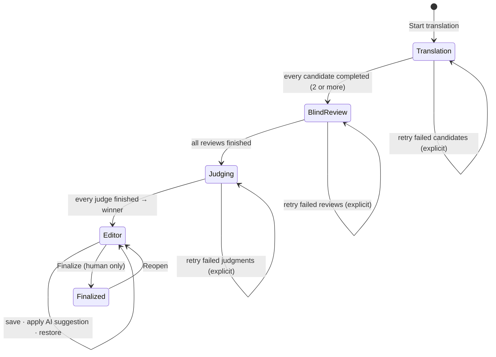
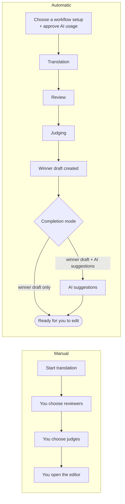

# Translation workflow

## Stages

| UI name | Code | What a run produces |
| --- | --- | --- |
| Translation | `Experiment` | The source, instructions, and the exact guidance versions used |
| Translation candidate | `TranslationRun` | One model's full translation |
| Blind review | `ReviewRound` → `ReviewRun` → `ReviewEvaluation` | Scores (1–10) for faithfulness, naturalness, terminology, instruction adherence, and an overall score, with strengths, issues, and corrections for each anonymous candidate |
| Judging | `JudgeRound` → `JudgeRun` → `JudgeEvaluation` | A rank and score (1–100) per candidate, a winner, a rationale, and a confidence |
| Final translation | `FinalTranslation` → `FinalTranslationVersion` | Versioned human-edited text; version 1 is the winner |
| AI suggestions | `FinalizationRound` → `FinalizationRun` | A proposed translation for one exact base version, with a change summary and terminology notes |
| Automatic workflow | `PipelineRun` + `PipelineEvent` | Stage progress and an approved request plan |
| Workflow setup | `WorkflowProfile` → `WorkflowProfileRevision` | Models per role and a completion mode |

## Blindness

`BlindReviews::Prompt` and `Judging::Prompt` send candidates under labels (`Candidate A`, `B`, …) assigned per run. Model names, providers, and identifiers are never included. The label-to-candidate mapping is stored in the evaluations and is shown only to the owner ("Written by (hidden from AI)").

## Choosing the winner

Each judge ranks every candidate. A candidate receives `N − rank + 1` ranking points (Borda count) from each judge. Candidates are ordered by total points, then by mean overall score, then by the stable `TranslationRun` ID. A round declares a winner only when **every** judge succeeded; a failed judge leaves the round without a winner until it is retried. For segmented documents, each judge's ranking is the source-length-weighted sum of its per-part rankings.

## Manual and automatic modes

Manual mode needs at least two completed candidates to continue to blind review and judging. Automatic mode never applies a suggestion, never changes draft text, and never finalizes. The owner can stop automation at any time. Stopping prevents future stages but cannot cancel a request already sent, deletes nothing, and still allows manual continuation.

### Approved request plan

Before an automatic launch the workspace shows, and the owner approves, a plan of `models × parts` initial requests per role and the maximum including built-in retries. The plan is stored on the `PipelineRun`. For multi-part documents its SHA-256 digest is compared at submit, and the launch is refused if the plan changed since the preview. Any retry after a terminal failure is a separate, explicit owner action with its own cost warning.

### Recovery

`PipelineReconciliationJob` scans a bounded batch every 10 minutes to repair missed advancement after crashes or queue failures. It uses a least-recently-reconciled cursor and row locks so permanently blocked workflows cannot starve newer ones. It processes only running or blocked automatic workflows. Operators can run the same bounded service with `bin/rails pipelines:reconcile`; the output contains aggregate counts only.

## Long documents

A document holds up to 100,000 characters. When a source exceeds the single-request target, Three Heavens derives an immutable, versioned list of lossless parts (`DocumentExecutionPlan` → `ExperimentSegment`), splitting at paragraph, line, sentence-like punctuation, and finally Unicode-safe hard boundaries. Rejoining the parts reproduces the source exactly.

- Each stage runs one request per model and part (`TranslationSegmentRun`, `ReviewSegmentRun`, `JudgeSegmentRun`, `FinalizationSegmentRun`). Only failed parts are retried.
- The parent runs remain the logical candidate/reviewer/judge records used by history, benchmarks, winner selection, and workflow advancement.
- Parent cost is the sum of known child costs. If any child cost is missing, the total is marked partial instead of treating the unknown as zero.
- Review scores are source-length-weighted means.
- A manual edit invalidates the part alignment for further segmented AI suggestions; manual editing, restoring, finalizing, and export remain available.

### Context budget

Administrators configure each model's context window and maximum output under Admin → Models. Every scheduled request stores the capability snapshot and a conservative estimate (`serialized-utf8-bytes-v2`): about one estimated token per UTF-8 byte of the fully serialized request, plus framing, the response schema, a stage output reserve, and a 1,024-token safety margin. It is deliberately conservative and does not claim to match any provider's tokenizer. Models without configured capabilities fall back to 16,384/4,096 tokens and only for sources of at most 8,000 characters. A plan that does not fit fails **before** any request is sent.

Every request sends an explicit completion limit. Responses are streamed through a 1 MiB ceiling before JSON parsing; translations or suggestions per part are limited to 20,000 characters and assembled documents to 100,000. Nothing is silently truncated.

OpenRouter account settings must not force the context-compression plugin in a way that prevents per-request overrides, because Three Heavens disables it for fidelity-critical work.
