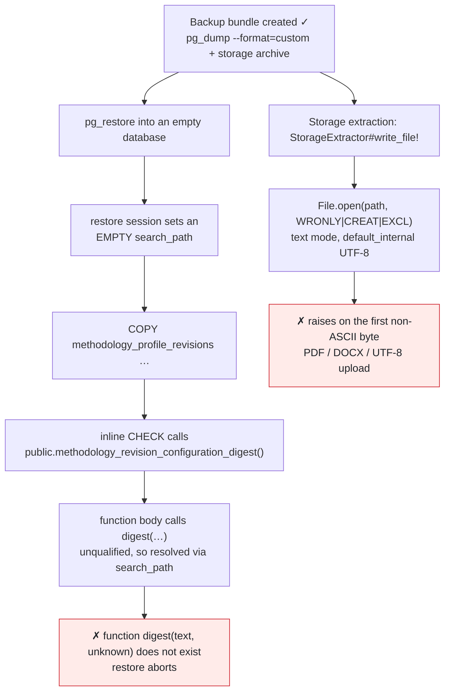
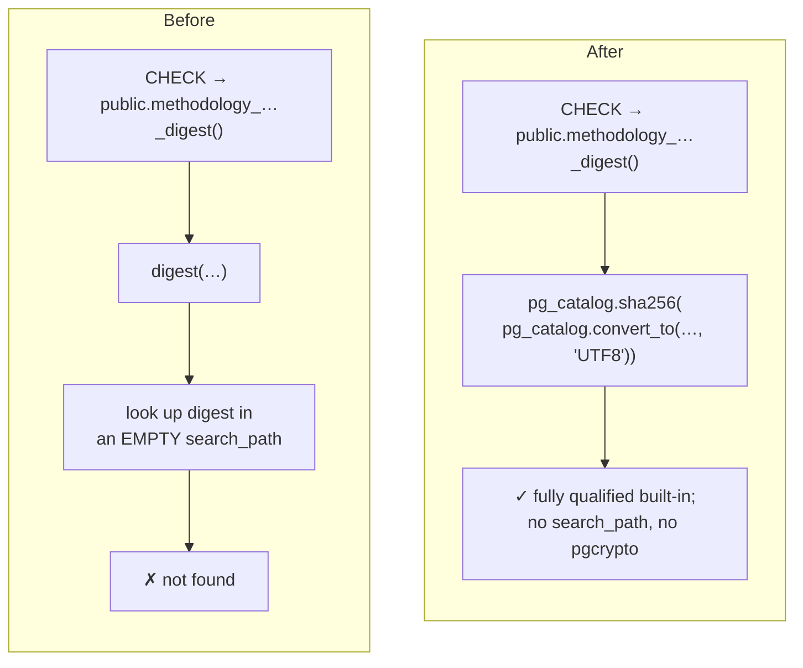
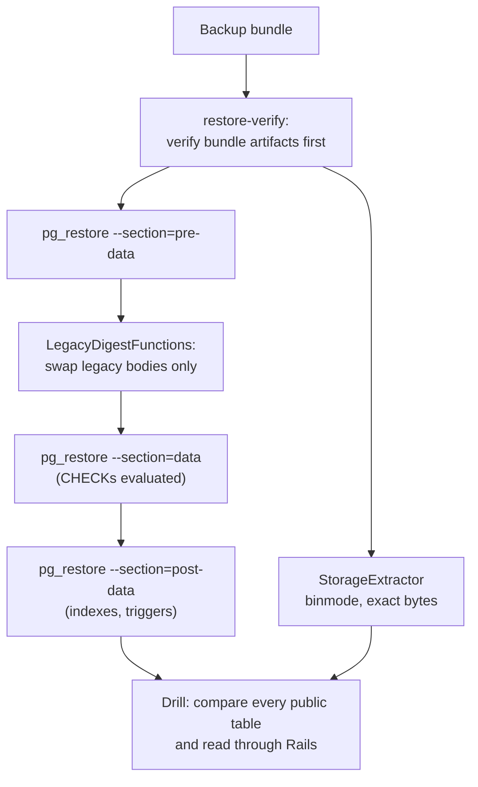

# Case 01 — A backup that could not be restored

[← All case studies](README.md) · Topics: reliability, data integrity, PostgreSQL · Evidence: [PR #64](https://github.com/XKeviNguyen/three_heavens/pull/64)

## Incident snapshot

| | |
| --- | --- |
| **Problem** | Backups were created successfully, but restoring one failed on two independent bugs:<br/>• PostgreSQL: `function digest(text, unknown) does not exist`<br/>• Storage: binary files could not be extracted |
| **Impact / risk** | Any database holding methodology-profile or translation-reference revisions, and any bundle with a real PDF, DOCX or UTF-8 upload, could not be restored. The backups existed, but recovery did not work. |
| **Classification** | P1 reproduced by a real `pg_restore` in PR #64's disposable restore drills; the storage bug was found by its data audit. **No production data was lost or restored.** Not a reported production incident. |
| **Fixed in** | [`cd2b4f5`](https://github.com/XKeviNguyen/three_heavens/commit/cd2b4f5742f057f0621cc97c9ab52dc3e8ef80bc) (database) and [`1484c52`](https://github.com/XKeviNguyen/three_heavens/commit/1484c522186f906f57940b510d1ce60dacc50d8a) (storage), merged 2026-09-29 |
| **Verification** | Restore-condition migration tests, an every-byte-value extraction test, and disposable restore drills comparing 46 tables row for row. |



*Two independent failures. A successful backup command told us nothing about either.*

## What went wrong

The release audit ran the documented restore against a disposable database. `pg_restore` aborted while loading data, as soon as it reached a table with a digest-checked revision.

Separately, PR #64's data audit found a second blocker, predating the PR. The storage extractor could not write any stored object containing a byte above 0x7F. Text-only fixtures had never contained one.

## Root cause — the actual code

### 1. A function that depended on the caller's `search_path`

Revision tables verify their own integrity with an inline `CHECK` that calls a SQL function
([`db/structure.sql` at `d014c2c`, L905-L914 and L2451](https://github.com/XKeviNguyen/three_heavens/blob/d014c2cdd65eb630a0a5a4ae3c76a30ef88c6f49/db/structure.sql#L905-L914)):

```sql
CREATE FUNCTION public.methodology_revision_configuration_digest(...) RETURNS text
    LANGUAGE sql IMMUTABLE STRICT
    AS $$
  SELECT encode(digest(            -- ← pgcrypto's digest(), not schema-qualified
    '{"source_language":' || to_json(source_language)::text || … || '}',
    'sha256'
  ), 'hex');
$$;

CONSTRAINT methodology_profile_revisions_payload_digest_check
  CHECK (configuration_digest = public.methodology_revision_configuration_digest(...))
```

The function was introduced in [`dde6203`](https://github.com/XKeviNguyen/three_heavens/commit/dde62030a518b43a766c985562f96cff617a141b) (PR #34). Its translation-reference twin came in [`1ffd8ec`](https://github.com/XKeviNguyen/three_heavens/commit/1ffd8ec14a170fd270dfb66f5fb87024ecd8f55b) (PR #37).

A dump sets an empty search path for the whole restore (see the dump header, [`structure.sql#L7`](https://github.com/XKeviNguyen/three_heavens/blob/d014c2cdd65eb630a0a5a4ae3c76a30ef88c6f49/db/structure.sql#L7)). `COPY` evaluates `CHECK` constraints row by row. Inside the function body, the unqualified name `digest` could no longer be found.

Qualifying the function call in the constraint would not have helped. The unqualified name was *inside* the function body.



The glossary digest function had the same unqualified call, but it runs from a *deferred trigger*. Triggers are created in the `post-data` section after the rows are loaded, so it was never evaluated during `COPY`. PR #64 redefined it together with the other two anyway.

### 2. Binary bytes written through a text-mode file

[`StorageExtractor#write_file!` at `d014c2c`, L122-L130](https://github.com/XKeviNguyen/three_heavens/blob/d014c2cdd65eb630a0a5a4ae3c76a30ef88c6f49/app/services/operations/restore/storage_extractor.rb#L122-L130):

```ruby
File.open(path, File::WRONLY | File::CREAT | File::EXCL, 0o600) do |output|  # ← text mode
  while (chunk = entry.read(1024 * 1024)).present?
    output.write(chunk)     # ← binary chunk transcoded to Rails' default_internal (UTF-8) → raises
  end
```

The extractor came in with the operations tooling ([`d81ebfe`](https://github.com/XKeviNguyen/three_heavens/commit/d81ebfe1a123ed511dae09b92b6cc5cb0b250286), PR #22). The archiver *wrote* in binary mode; the extractor did not *read back* in binary mode. Per PR #64 the write raised an error rather than silently corrupting data.

### Why the existing drill missed both

The original drill seeded storage with the ASCII string `"synthetic restore drill source bytes\n"`
([`local_drill.rb#L119` at `d014c2c`](https://github.com/XKeviNguyen/three_heavens/blob/d014c2cdd65eb630a0a5a4ae3c76a30ef88c6f49/app/services/operations/restore/local_drill.rb#L119)). It created no methodology or reference revisions. **Unrepresentative fixtures can't find either bug.**

## How the fix works

| Layer | Change | File |
| --- | --- | --- |
| Schema | Redefine all three digest functions with `pg_catalog.sha256(pg_catalog.convert_to(x, 'UTF8'))` and schema-qualified tables | [migration `20260929120000`](https://github.com/XKeviNguyen/three_heavens/blob/9a2476fcdcd896c51540b7316d9378d030a1288e/db/migrate/20260929120000_make_configuration_digests_restore_safe.rb#L14-L27) |
| Existing data | Re-verify every stored digest **before** committing, because replacing a function does not re-run existing `CHECK`s | [`verify_stored_digests!`](https://github.com/XKeviNguyen/three_heavens/blob/9a2476fcdcd896c51540b7316d9378d030a1288e/db/migrate/20260929120000_make_configuration_digests_restore_safe.rb#L126-L142) |
| Old backups | Restore `pre-data`, then swap any legacy function body, then load `data`, then `post-data` | [`Verification#restore_database!`](https://github.com/XKeviNguyen/three_heavens/blob/9a2476fcdcd896c51540b7316d9378d030a1288e/app/services/operations/restore/verification.rb#L101-L110), [`LegacyDigestFunctions`](https://github.com/XKeviNguyen/three_heavens/blob/9a2476fcdcd896c51540b7316d9378d030a1288e/app/services/operations/restore/legacy_digest_functions.rb#L14) |
| Storage | `output.binmode` before writing | [`storage_extractor.rb#L122-L130`](https://github.com/XKeviNguyen/three_heavens/blob/9a2476fcdcd896c51540b7316d9378d030a1288e/app/services/operations/restore/storage_extractor.rb#L122-L130) |
| Drill | Seed digest-checked rows, a federated identity, preferences, a staged import, an encrypted draft and binary objects. Compare every public table. Read records back through Rails. | [`local_drill.rb`](https://github.com/XKeviNguyen/three_heavens/blob/9a2476fcdcd896c51540b7316d9378d030a1288e/app/services/operations/restore/local_drill.rb) |

**Why not just set `search_path` in the function or during restore?** PR #64 removed the dependency entirely. Nothing on the restore path resolves a name through the ambient `search_path` or depends on which schema pgcrypto lives in. PR #64 reports the replacement is byte-identical to `digest(x, 'sha256')` and to the Ruby digests, checked on Unicode, emoji, combining marks, backslashes and 200 KB of text.

Backups taken before the fix, including every V1.0 bundle, still contain the old function bodies. The sectioned restore repairs exactly those bodies (identified by the marker `encode(digest(`) between schema and data, so old backups stay restorable.

### Recovery pipeline after the fix



## Before vs after: what was verified

| Data | Before | After | Evidence |
| --- | --- | --- | --- |
| Rows with digest `CHECK`s under `search_path = ''` | ✗ `digest(...) does not exist` | ✓ reload | migration test `#L27` / `#L42` |
| Unicode, emoji, combining marks, backslashes, 200 KB text | Digest via pgcrypto | Same digest via `pg_catalog.sha256` | PR #64 equivalence checks |
| Every byte value 0x00–0xFF in a stored object | ✗ raises on bytes ≥ 0x80 | ✓ byte-identical | extractor test `#L27` |
| Real PDF and DOCX | ✗ | ✓ "0 critical, 0 missing" | PR #64 drill |
| Whole database | ✗ aborts | ✓ 46 tables identical row for row | PR #64 drill |
| A V1.0 bundle through V1.1 tooling | ✗ | ✓ 44 tables identical | PR #64 rehearsal |

## Reproduction and regression tests

- [`make_configuration_digests_restore_safe_test.rb`](https://github.com/XKeviNguyen/three_heavens/blob/9a2476fcdcd896c51540b7316d9378d030a1288e/test/migrations/make_configuration_digests_restore_safe_test.rb#L27-L58) recreates restore conditions in a transaction. It builds a temporary copy of each checked table with its `CHECK` constraints and sets `SET LOCAL search_path TO ''`.
  - **`#L27`**: rows with Vietnamese, emoji, backslash and Japanese text reload.
  - **`#L42`**: runs the migration `down` and asserts the **old** function bodies fail with exactly `function digest(text, unknown) does not exist`. The failure on the original code is encoded as a test.
  - **`#L60`**: the migration refuses to run if any stored digest would stop matching.
- [`storage_extractor_test.rb#L27`](https://github.com/XKeviNguyen/three_heavens/blob/9a2476fcdcd896c51540b7316d9378d030a1288e/test/services/operations/restore/storage_extractor_test.rb#L27-L43) builds a 1,075,200-byte object (`(0..255).map(&:chr).join.b * 4200`, larger than the 1 MiB read chunk), archives it with the real archiver, extracts it, and compares the bytes exactly.
- [`verification_test.rb#L15`](https://github.com/XKeviNguyen/three_heavens/blob/9a2476fcdcd896c51540b7316d9378d030a1288e/test/services/operations/restore/verification_test.rb#L15-L71) asserts the step order `pre-data → legacy upgrade → data → post-data`.

Recorded results (PR #64):
- Disposable drills on PostgreSQL 17.11: 0 critical, 0 warnings, 46 tables identical row for row.
- A V1.0 → V1.1 rehearsal from a detached `v1.0.0` checkout.
- `bin/rails test`: 876 runs, 0 failures.
- The PR states that the original failure was reproduced with a real `pg_restore` against the pre-fix schema.

## Trade-offs and remaining limitations

- **A backup is not proof of recovery.** These results come from disposable drills, not from restoring production.
- `restore-verify` is now the only supported primary restore. A plain `pg_restore` of a pre-V1.1 bundle still fails without the legacy-body swap.
- PR #64 lists as not checked: the restore target's database encoding. Some trigger functions still reference unqualified tables; they are not on the restore path.
- Restored objects were originally counted as present if a regular file existed at the right path. Commit [`a752c0e`](https://github.com/XKeviNguyen/three_heavens/commit/a752c0eaf5f7c959e4ff05595bf336f58bd50f45) later added length and MD5 checks against `active_storage_blobs`.

## Lessons learned

- **Only a tested restore proves a backup.** Restore into an isolated target with representative data, including non-ASCII text, binary files and every table that has constraints, and compare the result with the source.
- **Database functions used by constraints must not depend on ambient state.** Qualify every name, or use built-ins from `pg_catalog`.
- **Binary data needs binary I/O end to end.** One text-mode hop breaks it.
- **Changing a function does not re-validate stored rows.** Check existing data explicitly before switching.

## Interview explanation

> Our backups ran fine, but a release-audit drill showed we couldn't restore them. Some tables had CHECK constraints calling a SQL function that used pgcrypto's `digest()` unqualified. A dump's restore session sets an empty `search_path`, and COPY evaluates CHECKs as rows load, so the function couldn't resolve `digest` and the restore aborted. Separately, our storage extractor wrote files in text mode, so with Rails' UTF-8 default encoding it raised on the first non-ASCII byte of any PDF. The drill had missed both because it used ASCII fixtures and no digest-checked rows. We redefined the functions with `pg_catalog.sha256` so nothing depends on `search_path`, re-verified every stored digest before switching, and made restores run schema, then legacy-function repair, then data, so old backups still work. Binary mode fixed the extractor. A migration test reproduces the original error under an empty search path, and a round trip of every possible byte value covers storage. Drills now compare all 46 tables row for row. The lesson: a backup you haven't restored isn't a backup.

## Sources

- PR: [#64 — Fix V1.1 recovery, autosave, and idempotency blockers](https://github.com/XKeviNguyen/three_heavens/pull/64) (section "1. P1: real `pg_restore` failure")
- Commits: [`cd2b4f5`](https://github.com/XKeviNguyen/three_heavens/commit/cd2b4f5742f057f0621cc97c9ab52dc3e8ef80bc), [`1484c52`](https://github.com/XKeviNguyen/three_heavens/commit/1484c522186f906f57940b510d1ce60dacc50d8a)
- Operations runbook: [backup and restore](../operations/backup-and-restore.md)
