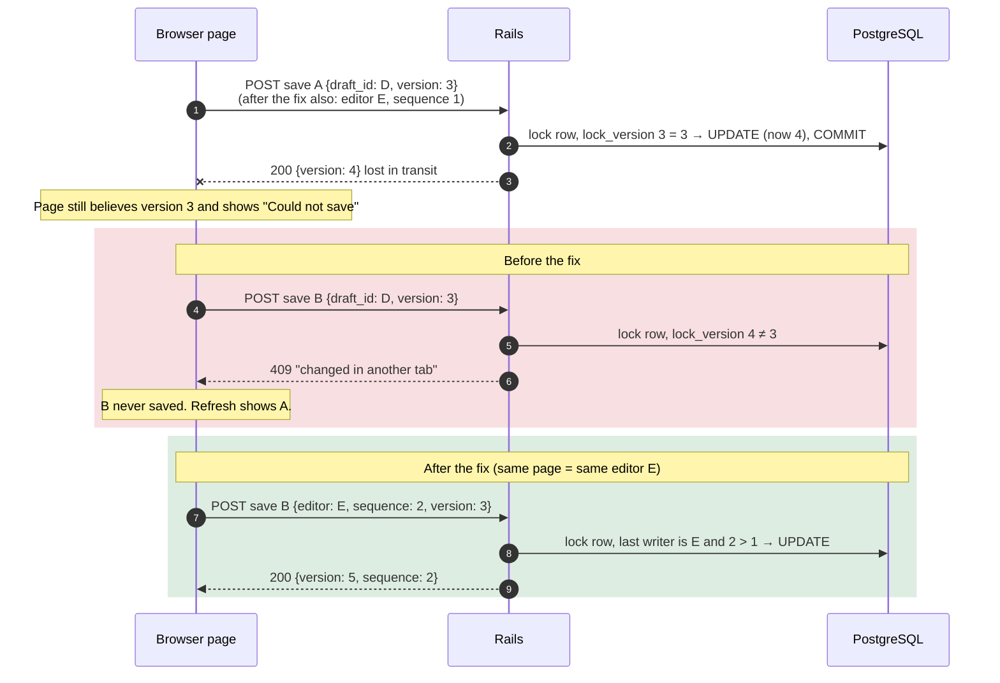
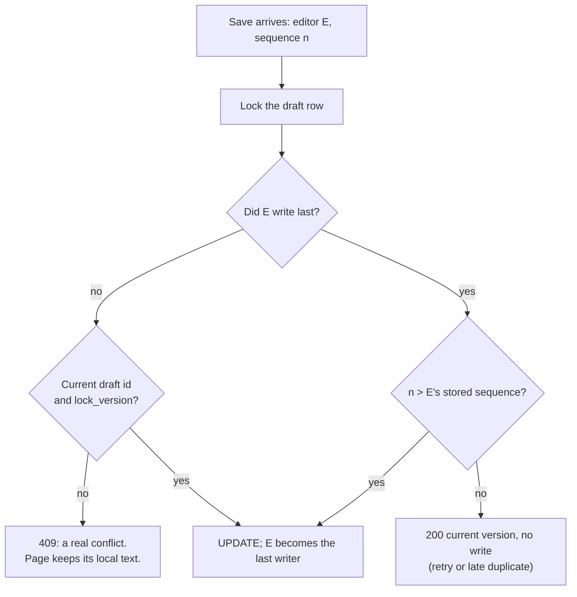

# Case 02 — A lost autosave response made the next edit look like a conflict

[← All case studies](README.md) · Topics: data consistency, idempotency, concurrency · Evidence: [PR #64](https://github.com/XKeviNguyen/three_heavens/pull/64)

## Incident snapshot

| | |
| --- | --- |
| **Problem** | Autosave A committed on the server but its response never reached the browser. The next edit, B, was then refused as a conflict with the page's **own** earlier save. |
| **Impact / risk** | Silent data loss: a refresh showed A, and B was gone. The UI blamed "a newer draft in another tab" when there was no other tab. |
| **Classification** | P1 among PR #64's confirmed audit findings, reproduced with a browser test that drops a committed response. Not a reported production incident. |
| **Fixed in** | [`00fe595`](https://github.com/XKeviNguyen/three_heavens/commit/00fe5952ca534ed270401ce40acb8c93abc5cdf2) (editor identity and sequence) and [`dc3c612`](https://github.com/XKeviNguyen/three_heavens/commit/dc3c6122125c0247b5cb738125fd80db551e409b) (client gaps from the flow audit), merged 2026-09-29 |
| **Verification** | A browser test and an integration test that, per PR #64, fail on the old code and pass on the new, plus duplicate, cross-tab and reconnect tests. |



*Two things look identical to the server: "this page is behind on its own save" and "another tab wrote first". Before the fix, it could not tell them apart.*

## What went wrong

The draft row had one concurrency control: Rails optimistic locking via `lock_version`.

1. The browser sent the version it last saw, and the server accepted a write only if that matched.
2. When save A committed but the response was lost (a network drop, a closed laptop lid), the page kept the old version.
3. Every later save from that page then failed the version check and returned **HTTP 409** with *"Could not save · newer draft in another tab"*.

A **first** save could fail the same way. A created the row, but its response was lost, so the page still had no draft id. B then hit the "a draft already exists" branch and got a 409.

## Root cause — the actual code

The server compared versions without knowing who wrote last
([`translation_workspace_drafts_controller.rb#L14-L25` at `d014c2c`](https://github.com/XKeviNguyen/three_heavens/blob/d014c2cdd65eb630a0a5a4ae3c76a30ef88c6f49/app/controllers/translation_workspace_drafts_controller.rb#L14-L25)):

```ruby
if supplied_id.present?
  draft = current_user.translation_workspace_drafts.current.find_by!(public_id: supplied_id, context_key:)
  draft.with_lock do
    return render_conflict(draft) unless draft.lock_version == supplied_version.to_i  # ← any stale version = 409
    draft.update!(…)
  end
else
  return render_conflict if current_user.translation_workspace_drafts.current.exists?(context_key:)  # ← lost first save = 409
  # …create
end
```

The client advanced its version **only from a received response**
([`workspace_guard_controller.js#L65-L112` at `d014c2c`](https://github.com/XKeviNguyen/three_heavens/blob/d014c2cdd65eb630a0a5a4ae3c76a30ef88c6f49/app/javascript/controllers/workspace_guard_controller.js#L65-L112)). It sent `draft_id` and `version`, but nothing that identified the page.

**The violated assumption:** a missing response means the write did not happen. A network timeout tells you the outcome is *unknown*, not that the write *failed*. With no notion of writer identity, a page that was merely behind on its own save looked exactly like a competing tab.

This design dates from the original autosave feature ([`7f04732`](https://github.com/XKeviNguyen/three_heavens/commit/7f04732177e9af16d5fdd2980328e0aa20ff50f7), PR #57).

## How the fix works

Each page becomes an **editor** with an identity, and each snapshot it saves gets a **sequence number**. The server records which editor wrote last, and up to which sequence
([`save.rb#L57-L74` at `9a2476f`](https://github.com/XKeviNguyen/three_heavens/blob/9a2476fcdcd896c51540b7316d9378d030a1288e/app/services/translation_workspace_drafts/save.rb#L57-L74), [`writable_by?`](https://github.com/XKeviNguyen/three_heavens/blob/9a2476fcdcd896c51540b7316d9378d030a1288e/app/models/translation_workspace_draft.rb#L97-L100)):

```ruby
def save_locked
  draft = user.translation_workspace_drafts.lock.find_by(context_key:)       # ← SELECT … FOR UPDATE
  # …expired-draft handling and first-save create…
  return Result.new(draft:, conflict: true) unless draft.writable_by?(editor_id:, public_id: draft_id, version:)
  return saved(draft) if editor_id && draft.editor_id == editor_id && sequence <= draft.editor_sequence  # ← replay
  draft.update!(written_attributes)                                           # ← newer edit from the last writer
  saved(draft)
end

# TranslationWorkspaceDraft
def writable_by?(editor_id:, public_id:, version:)
  (editor_id.present? && self.editor_id == editor_id) ||   # ← the same page may follow its own save
    (self.public_id == public_id && lock_version == version) # anyone else needs the current version
end
```



What changed on each side:

- **Server.**
  - The draft row stores `editor_id` and `editor_sequence`, with database `CHECK` constraints.
  - The rules run under a row lock.
  - Concurrent *first* saves have no row to lock. The unique index serializes them (see [Case 11](11-two-tab-first-save-uniqueness-race.md)).
- **Client, after `dc3c612`.**
  - Saves are serialized, one at a time.
  - An unchanged, unacknowledged snapshot is retried with the **same** sequence after 2, 5, 15 and 30 seconds, and again on the browser's `online` event.
  - 4xx responses are final.
  - The page stays dirty while an outcome is unknown.
  - Discard is terminal for the page.
- **Turbo cache.** The workspace opts out of Turbo's snapshot cache, because a cached copy carries an identity from before its last save. See [Case 09](09-back-forward-turbo-history-races.md).

**Idempotency and optimistic concurrency complement each other here.** The sequence makes one editor's retries and late duplicates harmless. The version check still stops a *different* editor from overwriting newer work.

## Before vs after

| Situation | Before | After |
| --- | --- | --- |
| A commits, response lost, then edit B | 409; B lost after refresh | B saved (same editor, higher sequence) |
| A's response lost, A retried unchanged | 409 | 200, acknowledged without a second write |
| Late duplicate of an older snapshot | 409 (version mismatch) | 200, nothing overwritten |
| A second tab with a stale version | 409 | 409, keeps its local text until reload |

## Reproduction and regression tests

PR #64 states that these two fail on the old code and pass on the new:

- **Browser:** [`translation_workspace_draft_test.rb#L159`](https://github.com/XKeviNguyen/three_heavens/blob/9a2476fcdcd896c51540b7316d9378d030a1288e/test/system/translation_workspace_draft_test.rb#L159-L174), *an autosave committed without a delivered response never loses the next edit*.
  - A `fetch` wrapper lets the real request commit, reads the whole response, then throws `TypeError("Failed to fetch")`.
  - Asserts: "Could not save" appears and the database holds A. B then shows "Saved", survives a refresh, and exactly one draft exists.
- **Integration:** [`translation_workspace_draft_test.rb#L304`](https://github.com/XKeviNguyen/three_heavens/blob/9a2476fcdcd896c51540b7316d9378d030a1288e/test/integration/translation_workspace_draft_test.rb#L304-L322), *a committed save whose response was lost never refuses or regresses the next edit*.

Related coverage in the same PR:
- Integration: an update whose response was lost (`#L324`); replayed or late duplicates (`#L343`); another tab cannot overwrite (`#L363`).
- System: retry after a lost response (`#L236`); offline edits saved after reconnecting (`#L277`).
- Concurrency: the threaded first-save tests in `save_concurrency_test.rb`.

Recorded gate (PR #64, whole PR): `bin/rails test` 876 runs, 0 failures; `PARALLEL_WORKERS=4 bin/rails test:system` 72 runs, 0 failures.

## Trade-offs and remaining limitations

- **Superseded details.** PR #64 generated the editor id in the browser (`randomHex(16)`, 128 bits, held in memory), and accepted saves without an identity under plain version checks. [PR #72](https://github.com/XKeviNguyen/three_heavens/pull/72) replaced both:
  - Editor ids are server-issued, signed, and bound to the account and context.
  - The sequence is kept in the DOM, so it survives a reconnect.
  - Unsigned saves are refused.
  - A ledger remembers editor outcomes after the draft is gone. See [Case 10](10-retry-after-discard-and-rejected-editor.md).
- **Deferred in PR #64:**
  - No feedback after a lost *launch* response.
  - A lost response during a language-switch flush silently cancels the switch.
  - A second navigation click during a flush is ignored.
  - About 90k control characters exceed the 500 KB draft cap once escaped.
- Retries are bounded. After the last delay the page stays dirty and waits for the next edit or an `online` event; it does not retry forever.

## Lessons learned

- **A timeout means "unknown", not "failed".** Design every write so a retry is safe, and let the server recognise a replay.
- **Separate "same writer, later edit" from "different writer".** Writer identity plus a monotonic sequence makes that distinction cheap and exact.
- **Test the lost acknowledgement explicitly.** Let the request commit, then drop the response. Happy-path round trips never exercise this.

## Interview explanation

> Our workspace autosaved a draft with optimistic locking: the browser sent the `lock_version` it last saw. If a save committed but the response was lost, the page kept the old version, so its very next save was refused with a 409, "changed in another tab", even though it was the same tab. Refreshing showed the earlier text and the newer edit was gone. The root problem was that the server couldn't distinguish "this page is behind on its own write" from "another writer got in first". We gave each page an editor identity and a monotonically increasing sequence per snapshot. Under a row lock, the server lets the last writer continue with a higher sequence, acknowledges equal or lower sequences as replays without writing, and still requires the current version from any other editor. The client serializes saves and retries unchanged snapshots with the same sequence. A browser test commits a save, discards the response, and proves the next edit survives a refresh. The lesson: a timeout means unknown, not failed.

## Sources

- PR: [#64 — Fix V1.1 recovery, autosave, and idempotency blockers](https://github.com/XKeviNguyen/three_heavens/pull/64) (section "2. P1: autosave data loss after a lost response")
- Commits: [`00fe595`](https://github.com/XKeviNguyen/three_heavens/commit/00fe5952ca534ed270401ce40acb8c93abc5cdf2), [`dc3c612`](https://github.com/XKeviNguyen/three_heavens/commit/dc3c6122125c0247b5cb738125fd80db551e409b)
- Architecture notes: [reliability — autosaved drafts](../architecture/reliability.md)
