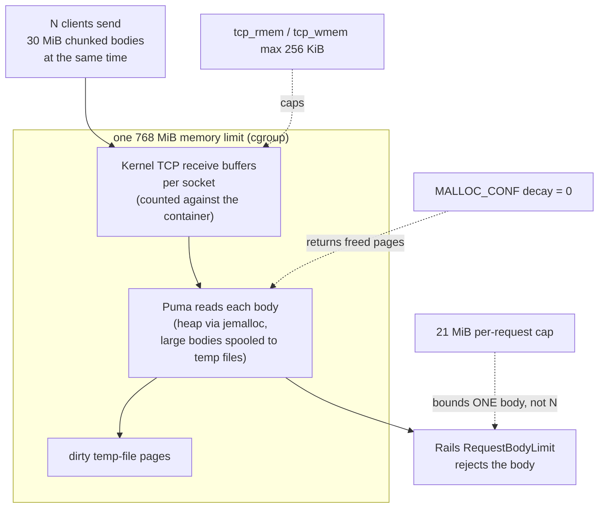

# Case 03 — A per-request limit did not stop many requests from exhausting memory

[← All case studies](README.md) · Topics: performance, resource limits, security · Evidence: [PR #68](https://github.com/XKeviNguyen/three_heavens/pull/68)

## Incident snapshot

| | |
| --- | --- |
| **Problem** | 80 simultaneous signed-out requests with 30 MiB chunked bodies got Puma OOM-killed in the production image under a 768 MiB, no-swap memory limit. |
| **Impact / risk** | Container-level resilience: with requests sent straight to the app container, concurrent signed-out uploads could kill it even though every single body was capped. In production, kamal-proxy's 21 MiB limit sits in front, and the repo's [edge-proxy evaluation](../operations/edge-proxy-evaluation.md) records it answering 413 to 30 MiB chunked bodies, so production exposure to this exact traffic shape was not demonstrated. The fix is defence in depth. |
| **Classification** | Release-audit P1, reproduced with a breaker harness against the production image. **Not a reported outage of the public site.** |
| **Fixed in** | [`3726b8b`](https://github.com/XKeviNguyen/three_heavens/commit/3726b8b61b7226061d73339cf6ac94ab4f7d92fa), merged 2026-10-02. Two configuration changes. |
| **Verification** | Harness floods of 80 and 200 requests, slow senders, disconnects and malformed framing all survived. A deployment-contract test pins both controls. |


*All values from PR #68; the top bar was measured at the moment of the kill, which is why it exceeds the limit. The two panels used different chunk sizes (64 KiB vs 1 KiB), and the after-fix figure is process memory only, so treat them as two separate observations rather than a like-for-like comparison.*

## What went wrong

The app already rejected oversized bodies. [`RequestBodyLimit`](https://github.com/XKeviNguyen/three_heavens/blob/b393bd28d2187052c307766df3d50890858e7c2f/app/middleware/request_body_limit.rb#L4-L19) allows at most 21 MiB (2 × 10 MiB files + 1 MiB multipart overhead), and 512 KiB on the draft JSON path that the harness hit.

Yet 80 bodies sent at once still killed the process. **Each request was bounded, but the total was not.**

## Root cause — where the memory went

PR #68 measured the container at the moment of the kill:

| Layer | At the kill | Grows with | Controlled by the 21 MiB cap? |
| --- | --- | --- | --- |
| Process memory (Puma, jemalloc) | 404 MiB | in-flight bodies; likely also freed pages that jemalloc keeps (not split out in the PR) | No |
| Kernel socket buffers | 268 MiB | open connections × per-socket buffer size (several MiB by default) | No |
| Dirty temp-file pages | 120 MiB | bodies spooled to disk but not yet written back | No |
| **Total** | **792 MiB** | | over the **768 MiB** limit |

PR #68's explanation: "Puma reads every connection's body at once, before the application runs." Rejection happens inside Rails, *after* the bytes have already cost memory in all three layers. Puma's internals were not re-traced for this write-up. The PR also ruled out Thruster as the cause.



*All three layers sit inside one memory limit. Dotted arrows show what each control acts on. The existing control acted too late and per request, not on the total.*

## How the fix works

Two configuration changes, one per growing layer:

```dockerfile
# Dockerfile (after, L23-L31): jemalloc returns freed pages at once
ENV …
    LD_PRELOAD="/usr/local/lib/libjemalloc.so" \
    MALLOC_CONF="dirty_decay_ms:0,muzzy_decay_ms:0"
```

```yaml
# config/deploy.yml (after, L20-L32): cap per-socket buffers in this container's network namespace
servers:
  web:
    options:
      sysctl:
        - net.ipv4.tcp_rmem=4096 65536 262144   # ← min / default / max = 256 KiB
        - net.ipv4.tcp_wmem=4096 65536 262144
```

([Dockerfile](https://github.com/XKeviNguyen/three_heavens/blob/e48cfa2f2372b464c5981c5f86a4f2b10c487d3c/Dockerfile#L23-L31) · [deploy.yml](https://github.com/XKeviNguyen/three_heavens/blob/e48cfa2f2372b464c5981c5f86a4f2b10c487d3c/config/deploy.yml#L20-L32))

- **jemalloc decay 0.** By default jemalloc keeps recently freed pages resident for reuse. The fix commit's Dockerfile comment says chunked bodies on many connections "otherwise keep hundreds of MiB of freed memory resident". PR #68 does not break the 404 MiB down further, and the recorded before-run disabled only the sysctls, so whether `MALLOC_CONF` was active during that measurement is not recorded.
- **Socket buffer cap.** Linux auto-tunes TCP buffers up to several MiB per connection. Capping the maximum at 256 KiB bounds kernel memory per connection. PR #68 measured about 0.6 MiB of socket memory per connection afterwards.
- **Both were required.** PR #68: "With only one of these, 200 simultaneous requests were still OOM-killed." The PR does not say which single control was tested.

**Why not just lower the body limit?** It was already 512 KiB on the path used, and lowering it does nothing about *N* connections each holding buffers. **Why not only tune the allocator?** Kernel socket memory is outside the allocator entirely.

In production, kamal-proxy also buffers requests with `max_request_body: 22_020_096` (21 MiB) in front of the container. The harness targeted the container directly to test the app's own resilience.

## Before vs after

| Scenario (production image, 768 MiB no-swap, bridge network) | Before | After |
| --- | --- | --- |
| 80 × 30 MiB chunked, 64 KiB chunks | OOM-killed (reproduced with `SYSCTLS=none`) | No OOM, same Puma process |
| 200 × 30 MiB chunked, one control only | — | OOM-killed |
| 200 × 30 MiB chunked, both controls | — | No OOM |
| 10 waves of 80, 1 KiB chunks | — | Puma memory after each wave 168–238 MiB; no leaked FDs, threads or temp files |
| Legitimate `/login` during floods | — | 15/15 and 70/70 OK |
| Content-Length flood, slow senders, mid-body disconnects, malformed framing | — | No OOM, all hostile requests rejected |

"—" means PR #68 records no measurement for that cell. Besides these, PR #68 records about 0.6 MiB of socket memory per connection afterwards and its test-gate counts; no timings or baseline idle memory are reported.

## Reproduction and regression tests

- **Harness:** [`script/breakers/chunked_request_memory.rb`](https://github.com/XKeviNguyen/three_heavens/blob/e48cfa2f2372b464c5981c5f86a4f2b10c487d3c/script/breakers/chunked_request_memory.rb).
  - It runs the production image under `--memory 768m --memory-swap 768m`, with ports published on 127.0.0.1 only.
  - Scenarios include `c80big` (80 × 30 MiB, 64 KiB chunks), `c200` (200 × 30 MiB, 64 KiB chunks), `c80` (1 KiB chunks), `slow`, `disconnect`, `malformed`, and `wavesN`, which repeats `c80`.
  - `SYSCTLS=none` removes the socket limits. `EXTRA_ENV="MALLOC_CONF="` restores jemalloc's default retention.
  - It is a manual breaker run against a disposable container, never against production.
- **Contract test:** [`production_deployment_contract_test.rb#L109`](https://github.com/XKeviNguyen/three_heavens/blob/e48cfa2f2372b464c5981c5f86a4f2b10c487d3c/test/config/production_deployment_contract_test.rb#L109-L117), *the web container caps socket buffers and returns freed memory promptly*.
  - It renders `deploy.yml` through Kamal and asserts the exact `--sysctl` pairs.
  - It matches the Dockerfile for `LD_PRELOAD` and `MALLOC_CONF`.
  - PR #68 states it fails on the old configuration.
  - This guards the configuration, not the load behaviour. Load evidence comes only from the harness.

Recorded gate (PR #68): 941 tests, 88 system tests, RuboCop, Brakeman, Bundler Audit and Importmap Audit all green.

## Trade-offs and remaining limitations

These come from PR #68 and `docs/operations/production-deploy.md`:

- Memory still grows with connection count, about 0.6 MiB per connection. It was measured safe up to 200 connections. Thousands of connections need limits at the edge proxy.
- The sysctls are per network namespace. Later docs note that a `--network host` container does not start with them.
- Under sustained floods some rejected requests end as a 502 or a reset instead of a clean 413.
- The `deploy.yml` comment says the 256 KiB cap leaves ample throughput for upstream calls, and PR #68 reports normal page latency unchanged within noise. No high-bandwidth benchmark is recorded.
- Later work tightened body limits further. Commit [`d12beec`](https://github.com/XKeviNguyen/three_heavens/commit/d12beece1108ecfd0142b3bfba6b6f25ec2582a7) gave ordinary requests a 64 KiB default, with larger tiers (2 MiB, and 21 MiB for the two upload forms) only where needed.

## Lessons learned

- **A per-request limit is not a concurrency limit.** Budget the *aggregate*: requests in flight × per-request cost, across every layer.
- **Count memory the container is charged for, not just the heap.** Kernel socket buffers and dirty page cache count against the cgroup.
- **Measure before tuning.** About a third of the memory at the kill was in kernel socket buffers, which no allocator setting touches; PR #68 confirmed that either control alone still failed at 200 connections.

## Interview explanation

> A breaker test sent 80 simultaneous 30 MiB chunked uploads to our production image under a 768 MiB container limit, and Puma was OOM-killed. We already had a 21 MiB per-request cap, but it runs in Rails after Puma has read the body, and it limits one request, not eighty. Measuring at the kill showed 404 MiB of process memory, 268 MiB of kernel socket buffers and 120 MiB of dirty temp-file pages. So the fix had to bound two different layers. jemalloc's decay settings to zero returned freed pages immediately, and per-container TCP buffer sysctls capped each socket at 256 KiB. With only one control, 200 connections still OOMed; with both, 80 and 200 survived and Puma stayed at 168–238 MiB across ten waves. A contract test pins both settings. The remaining limit is that memory still scales with connection count, so very large floods belong at the edge proxy. The lesson: per-request limits don't bound aggregate resource use.

## Sources

- PR: [#68 — Bound memory for many simultaneous request bodies](https://github.com/XKeviNguyen/three_heavens/pull/68)
- Corrective commit: [`3726b8b`](https://github.com/XKeviNguyen/three_heavens/commit/3726b8b61b7226061d73339cf6ac94ab4f7d92fa)
- Runbook: [production deploy, step 10](../operations/production-deploy.md)
