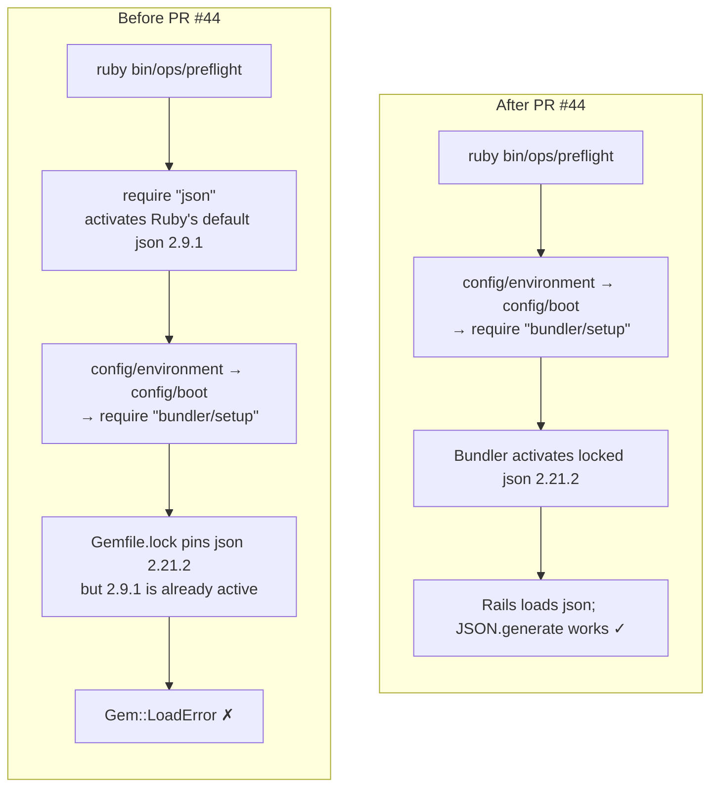

# Case 04 — One `require` line broke the production preflight

[← All case studies](README.md) · Topics: dependencies, boot order, release reliability · Evidence: [PR #44](https://github.com/XKeviNguyen/three_heavens/pull/44)

## Incident snapshot

| | |
| --- | --- |
| **Problem** | `bin/ops/preflight`, the production readiness check, failed with `Gem::LoadError` in the production image. |
| **Impact / risk** | A release gate that cannot run blocks safe deploys, or tempts people to skip it. |
| **Classification** | Production-image failure found during a local release rehearsal. Not a reported production incident: the defect was in the operational check, not the running app. |
| **Fixed in** | [`191ac11`](https://github.com/XKeviNguyen/three_heavens/commit/191ac118152890fddd77c76c344df3827efd32dd) (a 2-line deletion), merged 2026-09-12 |
| **Verification** | A fresh-process regression test, plus a production Docker build in which all 13 critical preflight checks were healthy. |



*A gem's first activation wins. Whatever loads before `bundler/setup` bypasses the lockfile.*

## What went wrong

Preflight is a small executable that boots Rails in production mode and reports whether critical dependencies are healthy. In the production image it stopped before reaching any check.

The PR does not record the exact error text, only that the boot raised `Gem::LoadError`.

## Root cause — the actual code

The script loaded `json` itself, on line 3, before booting Rails
([`bin/ops/preflight#L1-L8` at `6553751^1`](https://github.com/XKeviNguyen/three_heavens/blob/adc17337650db5b5bf99b2a06c1539f72f4e9c84/bin/ops/preflight#L1-L8)):

```ruby
#!/usr/bin/env ruby

require "json"                                  # ← activates whatever json RubyGems finds first

begin
  json = ARGV.delete("--json")
  ENV["RAILS_ENV"] ||= "production"
  require_relative "../../config/environment"   # ← → config/boot → bundler/setup (too late)
```

The conflict needed two facts at once:

- **`json` is both a Ruby default gem and a lockfile dependency.** Ruby 3.4 ships json 2.9.1. [`Gemfile.lock`](https://github.com/XKeviNguyen/three_heavens/blob/adc17337650db5b5bf99b2a06c1539f72f4e9c84/Gemfile.lock#L147) pinned 2.21.2.
- **Bundler enforces the lockfile only from `bundler/setup` onward.** That runs inside `config/boot.rb`. By then the process had already activated 2.9.1, and RubyGems cannot activate a second version of the same gem in one process.

**The violated assumption:** that loading a standard-library-like gem early is harmless. In a clean production process nothing has loaded Bundler yet. In development and test, the process is usually already under Bundler, which plausibly explains why the line went unnoticed (an inference; the PR does not say). It had been there since the script was created in [PR #22](https://github.com/XKeviNguyen/three_heavens/pull/22) (commit [`d81ebfe`](https://github.com/XKeviNguyen/three_heavens/commit/d81ebfe1a123ed511dae09b92b6cc5cb0b250286)).

## How the fix works

The fix deletes the early `require "json"`
([after, `#L1-L6`](https://github.com/XKeviNguyen/three_heavens/blob/6553751c667a36b26dabda847d06beb747ce7fa2/bin/ops/preflight#L1-L6)). `JSON.generate` still works because Rails loads `json` under Bundler during boot. The text and `--json` output formats are unchanged.

Alternatives such as pinning json to the default version or relaxing the lockfile were not used. They would have changed dependencies to work around a boot-order bug in one script. PR #44 changed no dependency.

## Before vs after

| | Before | After |
| --- | --- | --- |
| First gem activation | `json` 2.9.1 (Ruby default) | `bundler/setup` |
| Active `json` version | 2.9.1, conflicting with the lockfile | 2.21.2, as locked |
| Preflight in production image | `Gem::LoadError` before any check | 13/13 critical checks healthy |
| Developer machine under Bundler | Passes (masks the bug) | Passes |

## Reproduction and regression test

[`test/integration/preflight_executable_test.rb#L7-L57`](https://github.com/XKeviNguyen/three_heavens/blob/6553751c667a36b26dabda847d06beb747ce7fa2/test/integration/preflight_executable_test.rb#L7-L57), *boots through Bundler before emitting JSON*.

How it works:

- **A fresh process outside Bundler.** `Bundler.with_unbundled_env` plus `Open3.capture3(RbConfig.ruby, "-e", boot_guard, "bin/ops/preflight", "--json")`. The script really runs in a new Ruby process that has not inherited the test process's loaded gems.
- **A boot guard.** It redefines `Kernel#require` so that requiring `"json"` raises `Gem::LoadError` unless the *locked* json version is already active. Any pre-Bundler `require "json"` therefore fails immediately, wherever it is.
- **Assertions.** No `Gem::LoadError` in the output; a JSON result line exists; it contains the `required_environment` check; and the exit status agrees with the reported health.

The guard is a deterministic stand-in for the real default-gem conflict, so the test does not depend on which json versions a machine has installed. PR #44 does not explicitly record a failing run against the original script. By construction, the original line 3 trips the guard.

Recorded results (PR #44):
- Focused preflight tests: 4 runs, 28 assertions, 0 failures.
- `bin/rails test`: 610 runs, 0 failures.
- Production image: Docker build passed, `db:prepare` passed, all 13 critical preflight checks healthy with four databases, `/up` 200, `/ready` 200.

## Trade-offs and remaining limitations

- The test guards `json` specifically. Another default gem required before Bundler in a different script would need its own check.
- No later commit has changed `bin/ops/preflight` or this test (checked up to `develop` [`c39a15c`](https://github.com/XKeviNguyen/three_heavens/blob/c39a15c1dfdda7718658865ae00f4ce07d4eec01/bin/ops/preflight)).

## Lessons learned

- **Boot order is part of correctness.** In any executable that boots the app, nothing should load gems before `bundler/setup`.
- **Test executables in a fresh process.** Tests that run inside an already-bundled process inherit its activated gems and cannot see this class of bug.
- **Prefer the smallest fix that restores the invariant.** Here that meant deleting a line, not changing dependencies.

## Interview explanation

> Our production preflight script failed in the Docker image with a `Gem::LoadError`. It required `json` on its third line, before loading the Rails environment, so RubyGems activated Ruby's bundled json 2.9.1. When Rails' boot then ran `bundler/setup`, the lockfile demanded 2.21.2. A process can't activate two versions of one gem, so boot failed. It never showed up locally because dev and test processes are already running under Bundler. The fix was to delete that early require: Rails loads json correctly once Bundler is set up. The regression test runs the script in a fresh, unbundled Ruby process with a guard that fails if json is required before the locked version is active. The lesson is that boot order is part of correctness, and executables need fresh-process tests.

## Sources

- PR: [#44 — Fix production preflight Bundler boot order](https://github.com/XKeviNguyen/three_heavens/pull/44)
- Corrective commit: [`191ac11`](https://github.com/XKeviNguyen/three_heavens/commit/191ac118152890fddd77c76c344df3827efd32dd)
- Introduced in: [`d81ebfe`](https://github.com/XKeviNguyen/three_heavens/commit/d81ebfe1a123ed511dae09b92b6cc5cb0b250286) ([PR #22](https://github.com/XKeviNguyen/three_heavens/pull/22))
