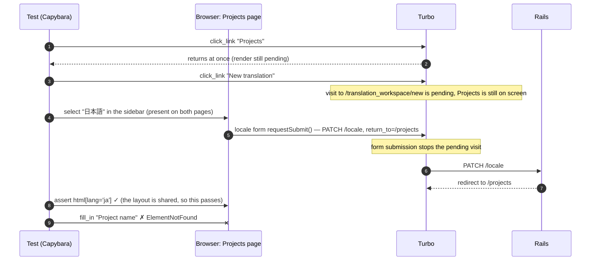

# Case 05 — A red CI build that was a test race, not a product bug

[← All case studies](README.md) · Topics: CI, deterministic testing, async UI · Evidence: [PR #70](https://github.com/XKeviNguyen/three_heavens/pull/70)

## Incident snapshot

| | |
| --- | --- |
| **Problem** | After PR #69 merged, `develop` CI failed in `system-test` with `Capybara::ElementNotFound: Unable to find field "Project name"`. |
| **Impact / risk** | A red integration branch blocks every later merge. Misdiagnosing it as an app regression would have changed production code for no reason. |
| **Classification** | Real CI failure ([run 37000764625](https://github.com/XKeviNguyen/three_heavens/actions/runs/37000764625), commit `286ba85`, seed 11303, 2 workers). PR #70 classifies it as a test synchronization race, not a product regression. Not a reported production incident. |
| **Fixed in** | Three test-only commits, merged 2026-10-03. **No application code changed.** |
| **Verification** | Repeated local reproduction before and after each fix, plus full system suites at 2 and 4 workers (see chart). |



*The failing interleaving reconstructed in PR #70 from Turbo event logs of a 20× same-process reproduction. The workspace page never loads.*

## What went wrong

The failing test was `rendering and preference navigation write no launch rows and a double launch starts once`. Its failure screenshot showed the **Projects** page, signed in, in English, with the dark theme. That ruled out a sign-out caused by PR #69's session changes.

The error appeared at the first step that needed something only the workspace page has (`fill_in "Project name"`, line 366). Every earlier assertion checked shared layout state, so they passed on the wrong page.

## Root cause — the actual code

The race needed three ingredients:

1. **Turbo link clicks return before the destination renders.** Capybara's `click_link` does not wait for a Turbo visit to finish.
2. **The language selector is on every authenticated page.**
   - [`_locale_selector.html.erb`](https://github.com/XKeviNguyen/three_heavens/blob/8c5d79cfe785b2edfbd09dd2c2f262483cdaf91b/app/views/shared/_locale_selector.html.erb#L2-L5) is rendered inside `aside#app-sidebar` in the [application layout](https://github.com/XKeviNguyen/three_heavens/blob/8c5d79cfe785b2edfbd09dd2c2f262483cdaf91b/app/views/layouts/application.html.erb#L76).
   - Its hidden `return_to` field holds the path of the page the form was rendered on.
3. **Choosing a language submits a form immediately.** [`locale_select_controller.js`](https://github.com/XKeviNguyen/three_heavens/blob/8c5d79cfe785b2edfbd09dd2c2f262483cdaf91b/app/javascript/controllers/locale_select_controller.js#L14-L28) calls `this.element.requestSubmit()`.

The test code before the fix ([`translation_workspace_draft_test.rb#L352-L359` at `286ba85`](https://github.com/XKeviNguyen/three_heavens/blob/286ba85b951a6d466b8ddfa6b153b5466193af30/test/system/translation_workspace_draft_test.rb#L352-L359)):

```ruby
visit new_translation_workspace_path
2.times { refresh }
click_link "Projects"            # ← Turbo visit starts, call returns immediately
click_link "New translation"     # ← second visit queued, Projects still displayed
within("aside#app-sidebar") { select "日本語", from: "Interface language" }  # ← form on the OLD page
assert_selector "html[lang='ja']"                                             # ← passes on either page
```

When the select fired on the still-displayed Projects page, its form submission cancelled the pending visit. PR #70 attributes this to Turbo's `Navigator#submitForm → stop()`; the Turbo source was not re-inspected for this write-up. The server then redirected to `return_to=/projects`.

**The violated assumption:** "the click happened, so the page changed". A click only *starts* a navigation.

PR #70 also checked the regression hypothesis directly. The same test failed 3/20 on `e48cfa2`, the commit before PR #69, with an unchanged test body.

### Two more races of the same kind

Verifying at CI parallelism surfaced two more pre-existing races, each fixed in its own commit:

| Test | Premature signal | Why it lied |
| --- | --- | --- |
| Lost-response discard ([before, `#L304-L306`](https://github.com/XKeviNguyen/three_heavens/blob/286ba85b951a6d466b8ddfa6b153b5466193af30/test/system/translation_workspace_draft_test.rb#L304-L306)) | `assert_current_path new_translation_workspace_path` | Discard reloads the *same URL*, so the path matched before the old page was replaced. |
| Dark appearance with scripts disabled ([before, `appearance_and_locale_test.rb#L145-L153`](https://github.com/XKeviNguyen/three_heavens/blob/286ba85b951a6d466b8ddfa6b153b5466193af30/test/system/appearance_and_locale_test.rb#L145-L153)) | `html[data-appearance='dark']` | Dark is painted at once, but the preference cookie is saved by a background `fetch`. The scripts-disabled visit could run before the cookie existed. |

## How the fix works

Each fix waits for **a state that only exists after the intended transition has finished**:

```ruby
# ff5af86 — wait for each destination before touching the shared sidebar
click_link "Projects"
assert_selector "h1", text: "Projects"        # ← Projects has rendered
click_link "New translation"
assert_field "Project name"                   # ← workspace-only field
within("aside#app-sidebar") { select "日本語", from: "Interface language" }

# bb85b57 — same URL, so wait for the reset form instead of the path
assert_current_path new_translation_workspace_path
assert_field "Project name", with: ""

# 969b366 — wait for the app's own completion event, exposed as a DOM attribute
page.execute_script("document.addEventListener('appearance:saved', (event) => { document.documentElement.dataset.testAppearanceSaved = event.detail.appearance })")
click_button "Dark"
assert_selector "html[data-appearance='dark'][data-test-appearance-saved='dark']"
```

The third fix uses the existing `appearance:saved` event. [`appearance_controller.js`](https://github.com/XKeviNguyen/three_heavens/blob/8c5d79cfe785b2edfbd09dd2c2f262483cdaf91b/app/javascript/controllers/appearance_controller.js#L56-L67) dispatches it only after the POST succeeds and returns a valid revision. Exposing it as an attribute lets Capybara's retrying `assert_selector` wait for it.

**No `sleep`, no retry loop, and no global wait-time increase.** A sleep guesses how long rendering takes: it is slow when the guess is generous and flaky when it is not. A state-based wait finishes as soon as the real condition holds and fails with a meaningful message when it never does.

## Before vs after


*Counts copied from PR #70. These are local reproductions under deliberate CPU contention (Ruby 3.4.10, PostgreSQL 17.11, Chromium 141), not CI rates. The 3/20 run was on `e48cfa2`, before PR #69.*

## Reproduction and regression tests

The fixes modify three existing tests rather than adding new ones:

- [`translation_workspace_draft_test.rb#L354`](https://github.com/XKeviNguyen/three_heavens/blob/8c5d79cfe785b2edfbd09dd2c2f262483cdaf91b/test/system/translation_workspace_draft_test.rb#L354-L364): the double-launch and preference navigation test (the CI failure).
- [`translation_workspace_draft_test.rb#L293`](https://github.com/XKeviNguyen/three_heavens/blob/8c5d79cfe785b2edfbd09dd2c2f262483cdaf91b/test/system/translation_workspace_draft_test.rb#L293-L309): a retry after a lost response resolves the save without another edit.
- [`appearance_and_locale_test.rb#L145`](https://github.com/XKeviNguyen/three_heavens/blob/8c5d79cfe785b2edfbd09dd2c2f262483cdaf91b/test/system/appearance_and_locale_test.rb#L145-L160): a saved Dark preference paints dark with scripts disabled.

Recorded results (PR #70):
- The three fixed tests ran 10× each with seed 11303.
- The full system suite ran 3× at `PARALLEL_WORKERS=2` and 2× at `PARALLEL_WORKERS=4`. Each run was 88 runs with 0 failures.
- `bin/rails test`: 970 runs, 0 failures.

The CI log and screenshot artifact could not be downloaded at the time. The diagnosis rests on local screenshots and Turbo event logs.

## Trade-offs and remaining limitations

- The product behaviour is unchanged. Choosing a language during a pending visit still cancels that visit, which is arguably correct for a real user's explicit action.
- A reviewer flagged `appearance_and_locale_test.rb:86-95` (click Dark, then refresh) as the same theoretical race (P3). It had 0 failures in 60 runs under contention, so it was left unchanged for lack of evidence.
- Under artificial 4-core saturation, one first-test sign-in timed out. This was seen only under overload.
- A later, *separate* browser-test race in the same family (Forward-then-reload and a transient Turbo progress bar) was fixed in [PR #81](https://github.com/XKeviNguyen/three_heavens/pull/81). See [Case 09](09-back-forward-turbo-history-races.md).

## Lessons learned

- **First decide whether the product or the test is wrong.** Here a screenshot, an event log, and a run on the pre-PR commit settled it before any app code was touched.
- **Wait for state, not for actions.** A click, a URL, or a shared layout element is not proof that the intended page is ready. Wait for something only the destination has.
- **Elements on every page are a trap.** They let a test act on the page it is leaving.

## Interview explanation

> A post-merge CI run failed because a system test couldn't find the "Project name" field. The screenshot showed the Projects page, still signed in, so we treated it as a possible test race rather than an auth regression, and reproduced it on the commit before the suspected PR. The test clicked two Turbo links and then immediately changed the language in a sidebar that exists on every page. Turbo clicks return before the new page renders, so the language form submitted from the old Projects page. That cancelled the pending visit, and the redirect went back to Projects. The fix was test-only: wait for the Projects heading, then for the workspace-only field, before using the sidebar. The same audit found two more "premature signal" races, which we fixed by waiting for the reset form and for the app's own `appearance:saved` event. There were no sleeps. Failure rates went from up to 6 in 20 to 0 in 40 or more. The lesson is to synchronize on state that only exists once the work is done.

## Sources

- PR: [#70 — Fix system-test synchronization races behind the post-merge develop failure](https://github.com/XKeviNguyen/three_heavens/pull/70)
- Commits: [`ff5af86`](https://github.com/XKeviNguyen/three_heavens/commit/ff5af86cb58e7928b0002094bebf300dcc61981b) (sidebar), [`bb85b57`](https://github.com/XKeviNguyen/three_heavens/commit/bb85b578104212c5f913165597f0d8e508e5eef3) (discard), [`969b366`](https://github.com/XKeviNguyen/three_heavens/commit/969b366bbf5697f016947b2c2df7a73889180f56) (appearance)
- Failing CI run: [37000764625](https://github.com/XKeviNguyen/three_heavens/actions/runs/37000764625)
