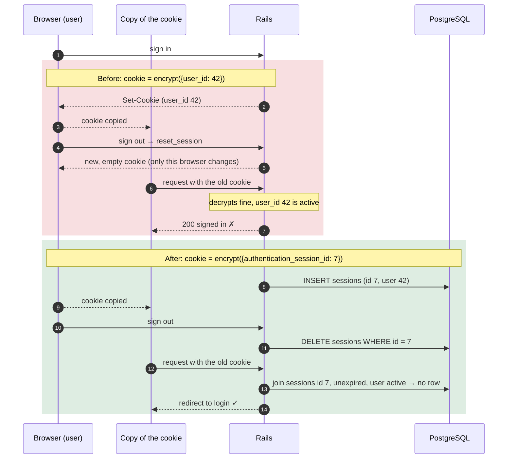
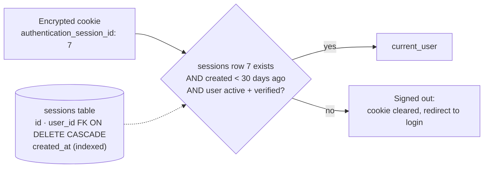
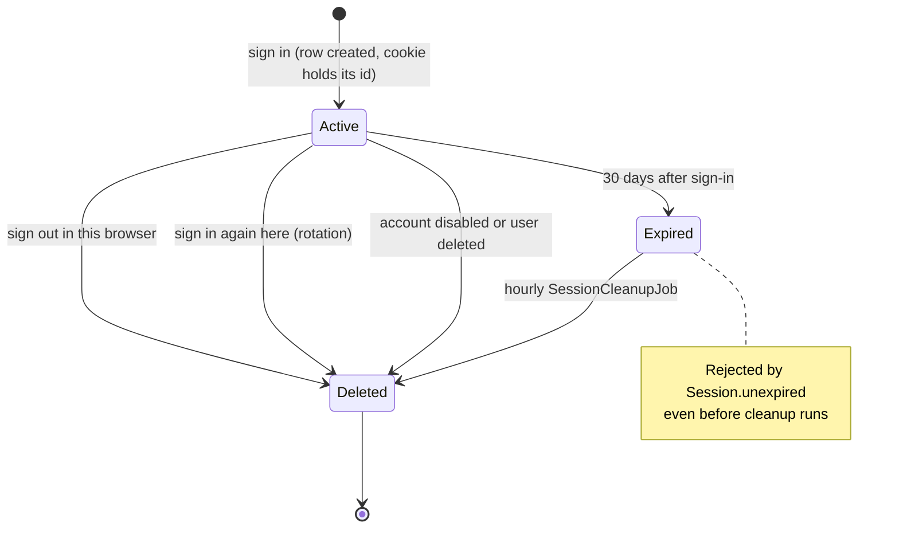

# Case 06 — Signing out did not revoke a copied session cookie

[← All case studies](README.md) · Topics: security, authentication, revocation · Evidence: [PR #69](https://github.com/XKeviNguyen/three_heavens/pull/69)

## Incident snapshot

| | |
| --- | --- |
| **Problem** | A session cookie copied *before* sign-out still authenticated *after* sign-out. |
| **Impact / risk** | Sign-out did not end access for anyone holding an earlier copy of the cookie (for example from a shared or compromised device). A disabled account's old cookies would work again if it was re-enabled. |
| **Classification** | Security finding fixed during V1.1 auth stabilization. **No exploitation or compromised account is known or claimed.** Not a reported production incident. |
| **Fixed in** | [`600973a`](https://github.com/XKeviNguyen/three_heavens/commit/600973a19924f2e35ad98160fafd2f1f7a995fd7) (server-side sessions) and [`6c382c3`](https://github.com/XKeviNguyen/three_heavens/commit/6c382c3ba0ce0749543c18eaafeb054427cefde5) (lifetime, cleanup, Google flow), merged 2026-10-02 |
| **Verification** | A 12-test integration file whose core tests replay a copied cookie through a separate client session. |



## What went wrong

The application used Rails' default **cookie store**. The whole session lives inside one encrypted, signed cookie, and the server keeps no record of it.

Signing out called `reset_session`. That issues a fresh cookie *to the browser making the request*, but it cannot reach any other copy. An earlier copy still decrypts correctly and still says "user 42".

## Root cause — the actual code

At `e48cfa2`, the parent of PR #69's merge, the server trusted whatever user id the cookie contained
([`application_controller.rb#L104-L107`](https://github.com/XKeviNguyen/three_heavens/blob/e48cfa2f2372b464c5981c5f86a4f2b10c487d3c/app/controllers/application_controller.rb#L104-L107),
[`#L157-L169`](https://github.com/XKeviNguyen/three_heavens/blob/e48cfa2f2372b464c5981c5f86a4f2b10c487d3c/app/controllers/application_controller.rb#L157-L169)):

```ruby
def current_user
  return @current_user if defined?(@current_user)

  @current_user = User.active.where.not(email_verified_at: nil).find_by(id: session[:user_id])
end

def start_authenticated_session!(user, …)
  # …
  reset_session
  session[:user_id] = user.id      # ← authority = the cookie's contents
end

def end_authenticated_session!
  reset_session                    # ← replaces THIS browser's cookie only
  # …
end
```

**The violated assumption:** that encrypting a cookie makes it revocable. Encryption and signing stop *tampering*. They do nothing about a *valid copy*. Without server-side state, there is nothing to delete. The cookie had no server-enforced expiry either: the session store set no `expire_after`.

The existing test, *logout clears authentication*, only checked the same browser, which is the one case that always worked.

## How the fix works

Authority moves from the cookie's contents to a **server-side row** that the cookie merely points to.



The mechanism ([`application_controller.rb#L115-L120`](https://github.com/XKeviNguyen/three_heavens/blob/286ba85b951a6d466b8ddfa6b153b5466193af30/app/controllers/application_controller.rb#L115-L120), [`#L173-L196`](https://github.com/XKeviNguyen/three_heavens/blob/286ba85b951a6d466b8ddfa6b153b5466193af30/app/controllers/application_controller.rb#L173-L196)):

```ruby
def current_user
  return @current_user if defined?(@current_user)

  @current_user = User.active.where.not(email_verified_at: nil).joins(:sessions).merge(Session.unexpired)
                      .find_by(sessions: { id: session[:authentication_session_id] })
end

def start_authenticated_session!(user, …)
  # …
  delete_server_session                                          # ← old row dies with the old cookie
  reset_session
  session[:authentication_session_id] = user.sessions.create!.id
end

def end_authenticated_session!
  delete_server_session                                          # ← DELETE this browser's row only
  reset_session
  # …
end
```

Supporting pieces:

- [`Session`](https://github.com/XKeviNguyen/three_heavens/blob/286ba85b951a6d466b8ddfa6b153b5466193af30/app/models/session.rb): `LIFETIME = 30.days`, measured from sign-in.
- [Migration](https://github.com/XKeviNguyen/three_heavens/blob/286ba85b951a6d466b8ddfa6b153b5466193af30/db/migrate/20261002090000_create_sessions.rb): a foreign key with `ON DELETE CASCADE`, plus an index on `created_at` for cleanup.
- [`User`](https://github.com/XKeviNguyen/three_heavens/blob/286ba85b951a6d466b8ddfa6b153b5466193af30/app/models/user.rb#L53-L55): disabling an account deletes all of its sessions, so re-enabling it does not revive them.
- `SessionCleanupJob` runs hourly (minute 57 in `config/recurring.yml`) and deletes expired rows in batches.
- **Google sign-in.** Google's callback is a cross-site POST, so a `SameSite=Lax` session cookie does not arrive with it, and the old row could not be found to revoke. The callback now stores a short-lived pending sign-in and redirects (303) to a same-site `GET /auth/google/complete`, which rotates the session. Codex review flagged this as P1 on the first commit ("Revoke the prior row on cross-site Google sign-in"), and it was fixed in `6c382c3`, whose message attributes the remaining gaps to independent security, flow and adversarial reviews.

### Session lifecycle



### What stays valid on other devices

Signing out ends **only this browser's row**. A phone or second computer signed in to the same account keeps its own row and stays signed in. That is tested, and intentional. There is **no "sign out of all devices"** action and **no idle timeout**; both are listed as not implemented in PR #69.

## Before vs after

| Event | Before | After |
| --- | --- | --- |
| Copied cookie used after sign-out | Authenticates | Redirected to login; the row is gone |
| Sign in again in the same browser | New cookie; the old copy still works | Old row deleted; the old copy is dead |
| Account disabled | Blocked while disabled, but every old cookie works again on re-enable | Rows deleted, and not revived on re-enable |
| Session age | No server-side limit | At most 30 days from sign-in |
| Other devices after one sign-out | Signed in | Signed in (by design) |

## Reproduction and regression tests

[`test/integration/session_invalidation_test.rb`](https://github.com/XKeviNguyen/three_heavens/blob/286ba85b951a6d466b8ddfa6b153b5466193af30/test/integration/session_invalidation_test.rb) models the real threat. Its helpers replay a **copied** cookie through a separate `open_session` client, not the browser that signed out.

- [`#L9`](https://github.com/XKeviNguyen/three_heavens/blob/286ba85b951a6d466b8ddfa6b153b5466193af30/test/integration/session_invalidation_test.rb#L9-L20) — a cookie copied before sign-out stops authenticating after sign-out, and no `sessions` row remains.
- `#L22` — signing out one browser leaves the account's other browsers signed in.
- `#L42` — signing in again rotates the cookie and ends the replaced server session.
- `#L64` — a disabled account's sessions end and do not return when it is re-enabled.
- `#L77` — the lifetime boundary, at `LIFETIME` ± 1 minute.
- `#L85`–`#L146` — the Google completion flow: replacement, single use, expiry, inactive accounts.
- `#L156` — a pre-V1.1 `user_id` cookie does not authenticate and is cleared.
- `#L167` — the cleanup job deletes only expired sessions.

Recorded results (PR #69): 970 runs, 0 failures; 88 system tests; migrate, rollback and migrate again all succeeded. The PR does not record these tests being run against the old code. The old design has no `sessions` table, so the copied-cookie test could not pass on it.

## Trade-offs and remaining limitations

- **Stateless vs stateful.** Every authenticated request now does a database lookup. That is the cost of being able to revoke.
- **Limitations listed by PR #69:**
  - No idle timeout and no "sign out other devices".
  - The `SameSite=Lax` cookie arriving on Google's 303 hop was not verified in a real browser.
  - A concurrent sign-in and sign-out can leave an orphan row, bounded by the 30-day lifetime.
  - Bypassing callbacks with `update_all` when disabling a user skips the session purge.
- **Superseded parts.**
  - The pending-sign-in "single use" originally relied on `Rails.cache.write(unless_exist: true)`, which PR #69 itself flagged as not strictly atomic. That became [Case 13](13-single-use-tokens-and-non-atomic-cache-writes.md).
  - A later commit, [`de212e2`](https://github.com/XKeviNguyen/three_heavens/commit/de212e2c1d69d455d04674925e48e5b339d517c8), closed a race between signing in and a concurrent account disable.

## Lessons learned

- **Encryption protects integrity, not revocability.** If logout or disabling an account must end access, authority needs server-side state, or another revocation mechanism such as a per-user generation counter.
- **Test the attacker's copy, not the user's browser.** The original logout test exercised the one path that always worked.
- **Be explicit about scope.** "Sign out" here means *this device*, and the docs and tests say so.

## Interview explanation

> We used Rails' encrypted cookie store with the user id inside the cookie. Signing out called `reset_session`, which only gives the current browser a new cookie, so a copy taken before logout still decrypted to a valid user id. Encryption stops tampering, not reuse. We moved to server-side sessions: each sign-in creates a row, and the cookie holds only that row's id. Every request joins the row, checks it is under 30 days old, and checks the account is active. Sign-out deletes that row, sign-in rotates it, and disabling an account deletes all of them, with an hourly job purging expired rows. Google's cross-site callback doesn't carry our session cookie, so we added a same-site completion step to rotate it correctly. The tests replay a copied cookie from a separate client after sign-out. The trade-off is a database lookup per request, which buys real revocation. Signing out is per device by design. The lesson: encryption stops tampering, not reuse, so revocation needs server-side state.

## Sources

- PR: [#69 — V1.1 security/auth stabilization](https://github.com/XKeviNguyen/three_heavens/pull/69) (this case covers its session half; per-account login throttling is a separate concern in the same PR)
- Commits: [`600973a`](https://github.com/XKeviNguyen/three_heavens/commit/600973a19924f2e35ad98160fafd2f1f7a995fd7), [`6c382c3`](https://github.com/XKeviNguyen/three_heavens/commit/6c382c3ba0ce0749543c18eaafeb054427cefde5)
- `session[:user_id]` authentication introduced in [`f05d213`](https://github.com/XKeviNguyen/three_heavens/commit/f05d213548d140f9d6f4d8cae6214b256a679ac4)
- Before: [`e48cfa2`](https://github.com/XKeviNguyen/three_heavens/blob/e48cfa2f2372b464c5981c5f86a4f2b10c487d3c/app/controllers/application_controller.rb#L104-L107) · After: [`286ba85`](https://github.com/XKeviNguyen/three_heavens/blob/286ba85b951a6d466b8ddfa6b153b5466193af30/app/controllers/application_controller.rb#L115-L120)
