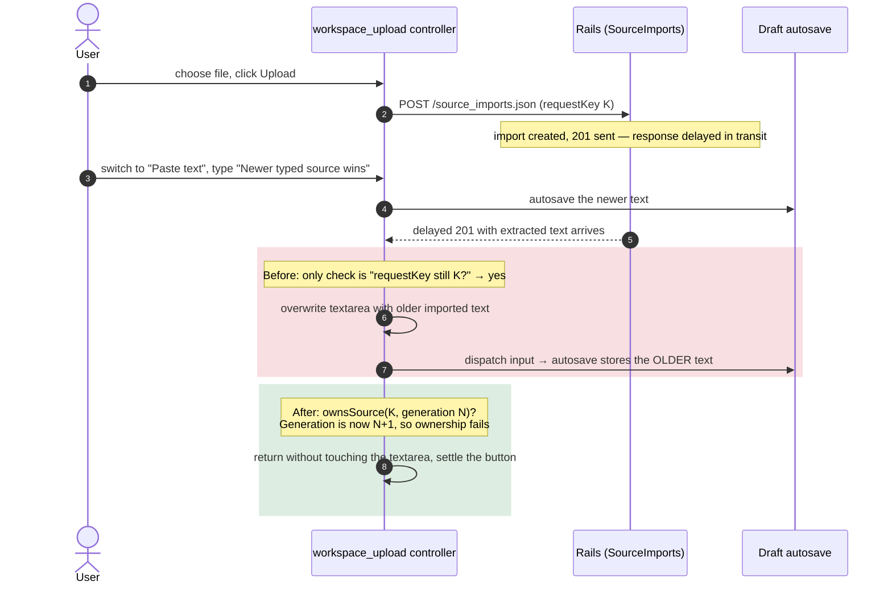
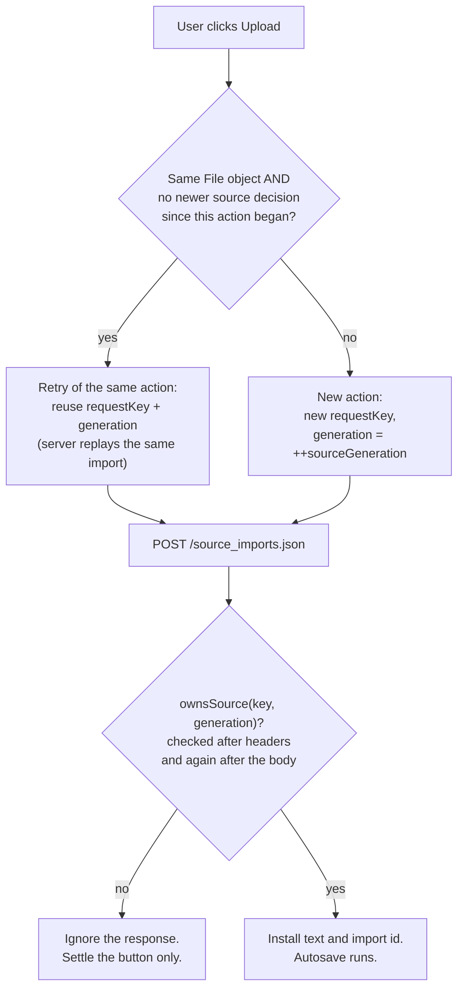

# Case 07 — An older upload response overwrote newer typed text

[← All case studies](README.md) · Topics: async UI state, concurrency, data loss · Evidence: [PR #77](https://github.com/XKeviNguyen/three_heavens/pull/77)

## Incident snapshot

| | |
| --- | --- |
| **Problem** | A delayed upload response could replace source text the user had typed *after* starting the upload, and autosave would then store the older text. |
| **Impact / risk** | Silent loss of the user's newest source text: it was gone from the textarea, the encrypted server draft, and the page after a refresh. |
| **Classification** | Release-audit finding FLOW-IMPORT-001 (P2) in the [V1.1.0 audit](../releases/v1.1.0-audit.md), reproduced with a held-response browser test. Not a reported production incident. |
| **Fixed in** | [`1527884`](https://github.com/XKeviNguyen/three_heavens/commit/1527884d8054294e50912fa718bf9ceeaeec0d09) and [`dc95d82`](https://github.com/XKeviNguyen/three_heavens/commit/dc95d820f07237839f349f9a5a485438724b66b5), merged 2026-10-08. Browser-only change; no server code changed. |
| **Verification** | A 15-test ownership matrix (156 assertions). The audit reports 10 failures and 2 errors on the original code. |



*Two overlapping timelines: the request started under source generation N, and the user's edit moved it to N+1 before the response landed.*

## What went wrong

A user can start a file import and keep working while the server extracts text. The audit reproduction:

1. Type an initial source.
2. Start a TXT upload. Its response is held back.
3. Switch to Paste text and type "Newer typed source wins".
4. Release the response.

The textarea, the encrypted draft, and the refreshed page all ended up holding the **imported (older) text**. Expected: `"Newer typed source wins"`. Actual: `"Imported source from older action"`.

The violated invariant, in the audit's words: **"newest authoritative user action wins"**.

## Root cause — the actual code

Before the fix, the response handler had one guard
([`workspace_upload_controller.js#L17-L58` at `9e77914`](https://github.com/XKeviNguyen/three_heavens/blob/9e77914bbd462c1df9274564f3e196ccfaef4369/app/javascript/controllers/workspace_upload_controller.js#L17-L58)):

```js
if (this.uploadedFile !== file) {                       // ← a new File object = new action
  this.uploadedFile = file
  this.requestKey = `${this.replayLeaseValue}.${randomHex(16)}`
}
const requestKey = this.requestKey
// … await fetch(…)
const result = await response.json().catch(() => ({}))
if (this.requestKey !== requestKey) return              // ← the only check before adopting the response
// …
this.field("source_text").value = result.extracted_text // overwrite whatever is there now
this.element.querySelector("[data-source-mode-target='pasteTab']").click()
this.element.dispatchEvent(new Event("input", { bubbles: true }))  // ← → autosave
```

`requestKey` is a **replay identity**: it lets the server deduplicate retries of the same upload (see [Case 12](12-upload-response-loss-and-atomic-quota.md)). It changed only when a different `File` was chosen (or was cleared by `remove()`). Typing, switching tabs, or editing the source never changed it, so a stale response still matched.

The handler conflated two questions:

- *"Is this response for the request I sent?"* (transport identity)
- *"Is that request still what the user wants?"* (ownership)

## How the fix works

[`1527884`](https://github.com/XKeviNguyen/three_heavens/commit/1527884d8054294e50912fa718bf9ceeaeec0d09) adds a **source generation** that every superseding user decision advances. A response is adopted only if both identities still match
([after, `#L17-L33`](https://github.com/XKeviNguyen/three_heavens/blob/ff3c38608a7f2ed8cc6bc2de4ab872f6c4bab7e0/app/javascript/controllers/workspace_upload_controller.js#L17-L33)):

```js
changed(event) {                                   // ← input/change on #workspace-source
  if (event.target === this.field("document_title")) {
    this.titleGeneration += 1                      // ← title edits protect the title only
  } else if (event.target === this.field("source_text") || event.target === this.fileTarget) {
    this.invalidateSource()                        // ← typing or choosing a file supersedes
  }
}

invalidateSource() { this.sourceGeneration += 1; /* clear message, re-enable button */ }

ownsSource(requestKey, generation) {
  return this.element.isConnected && this.requestKey === requestKey && this.sourceGeneration === generation
}
```

The check runs **twice** ([`#L68-L70`](https://github.com/XKeviNguyen/three_heavens/blob/ff3c38608a7f2ed8cc6bc2de4ab872f6c4bab7e0/app/javascript/controllers/workspace_upload_controller.js#L63-L70)): once when the response headers arrive, and again after `await response.json()`. The user can act while the body is still being read.

Supporting changes:

- **A real mode change supersedes; a no-op click does not.**
  - [`source_mode_controller.js#toggle`](https://github.com/XKeviNguyen/three_heavens/blob/ff3c38608a7f2ed8cc6bc2de4ab872f6c4bab7e0/app/javascript/controllers/source_mode_controller.js#L14-L20) dispatches `workspace-source:changed` only when the visible mode actually changes.
  - This was the second commit, [`dc95d82`](https://github.com/XKeviNguyen/three_heavens/commit/dc95d820f07237839f349f9a5a485438724b66b5). The first fix had made a click on the already-selected tab cancel a legitimate pending upload.
- **Installing the import does not supersede itself.** Success calls `toggle(true, { notify: false })` instead of clicking the Paste tab ([`#L89-L91`](https://github.com/XKeviNguyen/three_heavens/blob/ff3c38608a7f2ed8cc6bc2de4ab872f6c4bab7e0/app/javascript/controllers/workspace_upload_controller.js#L89-L91)).
- **Removal and disconnection supersede.** `remove()` and `disconnect()` both call `invalidateSource()`.
- **Settlement still runs.** `finally` always calls `settle()`. A superseded request also clears a stale "extracting…" message.

### A new action vs a transport retry



*Re-uploading the same file after typing is a **new** action with a new key. Clicking Upload twice without changing anything is the **same** action, so the server deduplicates it.*

## Before vs after

| Scenario (all from the regression matrix) | Before | After |
| --- | --- | --- |
| Type new text while an upload is held | Older import overwrites it and is autosaved | Newer text kept; response ignored |
| Switch to Paste while an upload is held | Import still installs | Superseded |
| Two uploads whose responses arrive in reverse order | The older response is ignored only if a different `File` changed the key | The newer action always wins |
| Click the already-active tab | No ownership state existed | No-op (nothing superseded) |
| Same-file retry after a lost response | Same key (correct) | Same key and generation (unchanged) |
| Same file uploaded again after typing | Same key → server replays the old import | New key → a genuinely new import |

## Reproduction and regression tests

[`test/system/source_import_ownership_test.rb`](https://github.com/XKeviNguyen/three_heavens/blob/ff3c38608a7f2ed8cc6bc2de4ab872f6c4bab7e0/test/system/source_import_ownership_test.rb) has 15 browser tests.

**How a response is held.** The `install_upload_barrier` helper ([`#L261-L291`](https://github.com/XKeviNguyen/three_heavens/blob/ff3c38608a7f2ed8cc6bc2de4ab872f6c4bab7e0/test/system/source_import_ownership_test.rb#L261-L291)) wraps `window.fetch` for `/source_imports.json` only:
- It performs the **real** request and reads the full response, so the server has genuinely committed the import.
- It then waits on a promise the test resolves.
- It can also simulate a dropped response, or pause after the body is read.

Key tests:
- [`#L88`](https://github.com/XKeviNguyen/three_heavens/blob/ff3c38608a7f2ed8cc6bc2de4ab872f6c4bab7e0/test/system/source_import_ownership_test.rb#L88-L103) — *a held upload cannot overwrite newer source in the encrypted draft or after refresh*. This is the original FLOW-IMPORT-001. It also asserts that the raw database payload is encrypted.
- [`#L115`](https://github.com/XKeviNguyen/three_heavens/blob/ff3c38608a7f2ed8cc6bc2de4ab872f6c4bab7e0/test/system/source_import_ownership_test.rb#L115-L124) — typing alone supersedes an upload, without a mode change.
- [`#L126`](https://github.com/XKeviNguyen/three_heavens/blob/ff3c38608a7f2ed8cc6bc2de4ab872f6c4bab7e0/test/system/source_import_ownership_test.rb#L126-L136) — ownership is checked again after reading the response body.
- [`#L138`](https://github.com/XKeviNguyen/three_heavens/blob/ff3c38608a7f2ed8cc6bc2de4ab872f6c4bab7e0/test/system/source_import_ownership_test.rb#L138-L149) — a newer upload wins when responses arrive in reverse order.
- [`#L68`](https://github.com/XKeviNguyen/three_heavens/blob/ff3c38608a7f2ed8cc6bc2de4ab872f6c4bab7e0/test/system/source_import_ownership_test.rb#L68-L86) and [`#L210`](https://github.com/XKeviNguyen/three_heavens/blob/ff3c38608a7f2ed8cc6bc2de4ab872f6c4bab7e0/test/system/source_import_ownership_test.rb#L210-L227) — a same-file transport retry keeps its identity, and an explicit retry after supersession starts a new authorized action.

Recorded results:
- **PR #77:** 15 tests and 156 assertions passed. Rails suite: 1,187 tests. System suite: 191 tests at both 4 and 8 workers. All five CI jobs were green on the PR head.
- **V1.1.0 audit:** the PR's 15-test file gave **10 failures and 2 errors** on the original `9e77914`, and passed on `ff3c386` under three seeds.

## Trade-offs and remaining limitations

- Ownership is **per page instance**. A second tab is a different editor and is handled by the draft-conflict rules ([Case 02](02-autosave-lost-response.md)), not by this generation counter.
- Imports that are superseded and never adopted stay on the server until the existing expiry and bounded cleanup remove them.
- The fix is in the browser controllers only. PR #77 made no server-side change.

## Lessons learned

- **Completion order is not authority.** An async result must prove it still belongs to the current state before it mutates that state.
- **Separate replay identity from ownership.** The key that makes a retry safe on the server is the wrong signal for "is this still wanted?".
- **Re-check after every `await`.** Any suspension point is a window where the user can act.

## Interview explanation

> Users could start a file import and then keep typing. The upload response handler only checked that its request key was still current. That key is a replay identity for server-side deduplication, and typing never changed it. So a delayed response would overwrite the newer text and trigger autosave, and the older text survived a refresh. We reproduced it in a browser test that wraps `fetch`, lets the real request commit, and holds the response. The fix added a source generation that every superseding decision bumps: typing, choosing a file, a real mode change, removal, or disconnect. A response is adopted only if both the key and the generation still match, checked before and after reading the body. We were careful that a retry of the same action keeps its identity, while a deliberate re-upload after an edit gets a new one. On the original code the 15-test matrix had 10 failures and 2 errors. The lesson is that "is this my response?" and "is my request still wanted?" are different questions.

## Sources

- PR: [#77 — Fix source ownership across asynchronous workspace imports](https://github.com/XKeviNguyen/three_heavens/pull/77)
- Audit finding: [`docs/releases/v1.1.0-audit.md`](../releases/v1.1.0-audit.md) (FLOW-IMPORT-001)
- Before: [`9e77914`](https://github.com/XKeviNguyen/three_heavens/blob/9e77914bbd462c1df9274564f3e196ccfaef4369/app/javascript/controllers/workspace_upload_controller.js) · After: [`ff3c386`](https://github.com/XKeviNguyen/three_heavens/blob/ff3c38608a7f2ed8cc6bc2de4ab872f6c4bab7e0/app/javascript/controllers/workspace_upload_controller.js)
