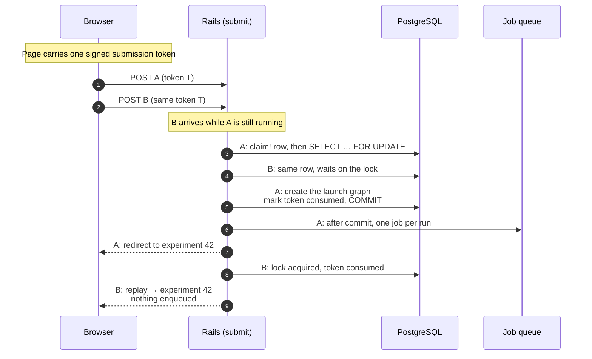
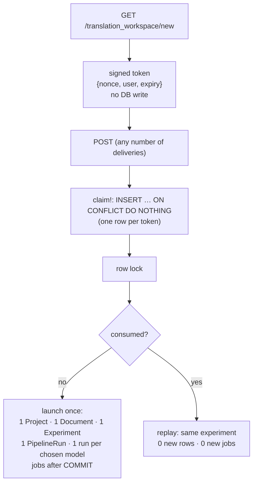

# Case 08 — Making "Start translation" launch paid AI work once

[← All case studies](README.md) · Topics: concurrency, idempotency, cost safety · Evidence: [PR #21](https://github.com/XKeviNguyen/three_heavens/pull/21), [PR #64](https://github.com/XKeviNguyen/three_heavens/pull/64)

## Incident snapshot

| | |
| --- | --- |
| **Problem** | Before PR #21, every POST of the workspace form built a whole new Project, Document, Experiment and set of AI runs. A double click, a resubmit or a retry after a timeout would launch paid model work again. |
| **Impact / risk** | Duplicate provider spend and duplicate results. |
| **Classification** | **Design hardening, not an observed incident.** PR #21 introduced one-time submission identities as hardening of the new automatic pipelines (PR #20). It records no reproduced duplicate and no real duplicate charge. PR #64 then fixed a side effect PR #21 had added: every page render wrote a database row. |
| **Fixed in** | [`1becdf5`](https://github.com/XKeviNguyen/three_heavens/commit/1becdf586409531418fb4f9976bac38cb8bdabff) (PR #21, 2026-08-29) and [`857eda8`](https://github.com/XKeviNguyen/three_heavens/commit/857eda8e20a733ded9186c0871f121c61158c260) (PR #64, 2026-09-29) |
| **Verification** | Threaded concurrency test (two simultaneous submits → one graph, one replay); browser double Start; GET-is-read-only test. No real provider request was made. |



*The guarantee lives at the database row that represents the user's intent, not in the browser.*

## What went wrong

At PR #20's merge, `TranslationWorkspace#submit` had no notion of "this launch already happened" ([`translation_workspace.rb#L34-L58` at `dcfa6a2`](https://github.com/XKeviNguyen/three_heavens/blob/dcfa6a24554821965281f870e356d952b4f1d181/app/forms/translation_workspace.rb#L34-L58)):

```ruby
def submit
  return false unless valid?

  ActiveRecord::Base.transaction do
    project.save!                       # ← every delivery: a new Project…
    # …
    document.save!                      # ← …a new Document…
    experiment.save!                    # ← …a new Experiment…
    if automatic_mode?
      @pipeline_run = Pipelines::Start.call(…)               # ← …a new PipelineRun
    else
      @start_service.call(experiment: experiment, llm_models: @llm_models)  # ← …new paid runs
    end
  end
```

Two deliveries meant two independent graphs. Each of their runs got its own job id, so the worker-side execution claim, which deduplicates jobs *per run*, accepted both.

The only accidental guard was a used source import: it was locked, so a second launch from the same import failed. A launch from pasted text had nothing stopping it. The Start button was disabled only when no models were available, but **no button state could make this safe anyway**. Network retries, a second tab and the Back button all bypass the UI.

## Root cause

**The server had no identity for the user's intent.** Every request was a new intent by definition. The fix had to come from the server's authoritative data, not from client behaviour.

## How the fix works

### PR #21: a one-time submission identity, serialized by a row lock

Every workspace form carries a submission token. `submit` looks up its row, locks it, and either launches or replays
([`translation_workspace.rb#L36-L70` at `74ac8fc`](https://github.com/XKeviNguyen/three_heavens/blob/74ac8fc1f6de10c675891608c1c4d7a7bbede159/app/forms/translation_workspace.rb#L36-L70)):

```ruby
def submit
  submission = TranslationWorkspaceSubmission.find_owned_by_token!(user: user, token: submission_token)
  submission.with_lock do                                  # ← SELECT … FOR UPDATE
    next replay!(submission) if submission.consumed?       # ← same token again → same result
    # …expired? valid?
    project.save!
    # …lock and consume the source import, if any
    document.save!
    experiment.save!
    # …start the pipeline or the manual runs (rows created as pending)
    submission.update!(status: :consumed, consumed_at: Time.current, experiment: experiment)
    true
  end
```

- **Owner-scoped, opaque, digested.** The lookup is `user.translation_workspace_submissions.find_by!(token_digest:)`, so another user's token is simply not found. Only the SHA-256 digest is stored.
- **Database backstops** ([migration](https://github.com/XKeviNguyen/three_heavens/blob/74ac8fc1f6de10c675891608c1c4d7a7bbede159/db/migrate/20260830090000_harden_automatic_pipeline_launch_and_reconciliation.rb)):
  - a unique token digest;
  - a partial unique index on `experiment_id`;
  - lifecycle `CHECK`s requiring that an available row has no experiment and a consumed one has both experiment and timestamp.
- **Jobs enqueue only after commit.** `Ai::RunScheduler` uses `after_all_transactions_commit`. A rolled-back launch enqueues nothing, and a replay never reaches the scheduler.

### PR #64: a GET must not write

PR #21 minted each token by inserting a row inside the form object's constructor. PR #64 recorded the side effect: "every render of the workspace inserted a `translation_workspace_submissions` row". That covered GET, refresh, re-renders and preference redirects.

[`857eda8`](https://github.com/XKeviNguyen/three_heavens/commit/857eda8e20a733ded9186c0871f121c61158c260) made the token a **signed, stateless** value with a nonce, the user id and an expiry. The row is created only at the first POST ([`claim!`](https://github.com/XKeviNguyen/three_heavens/blob/9a2476fcdcd896c51540b7316d9378d030a1288e/app/models/translation_workspace_submission.rb#L44-L60)), using `INSERT … ON CONFLICT DO NOTHING` on the digest. Concurrent first POSTs therefore converge on one row before the lock.



## What "exactly once" means here, and what it doesn't

| Layer | Guaranteed? | Mechanism |
| --- | --- | --- |
| One launch graph per user intent (token) | **Yes** | Row lock, consumed state, unique `experiment_id`, lifecycle `CHECK` |
| Repeated deliveries return the same result | **Yes**, within the token's 24-hour lifetime | `replay!` |
| HTTP delivered exactly once | **No** | Duplicates still arrive; they are deduplicated |
| Each provider call made exactly once | **No** | One job per run, and a duplicate job for the same run is rejected by the execution claim. But provider calls retry on retryable errors (`retry_on Ai::OpenRouterClient::RetryableError` in `TranslationRunJob`). Provider-side idempotency is not established. |

This is a **business-level exactly-once effect**: one logical launch, however many times the request arrives.

### Partial failures

| Failure | Outcome |
| --- | --- |
| Validation or setup error inside the lock | Rollback. The token stays `available`; the user fixes the input and retries with the same token. |
| Enqueue fails after commit | Token consumed; run marked `enqueue_failed`. A replay returns the same experiment and does **not** re-enqueue. Retrying is an explicit owner action. |
| Process dies between commit and enqueue | The run stays `pending` with no job. The stale-work reconciler later fails it ("The owner may retry it explicitly"). This is by design; the launch path has no test for it. |
| Launch committed, response lost | Exactly-once holds, but the page gets no feedback. PR #64 lists this as a deferred P3. |

## Reproduction and regression tests

- **Concurrency:** [`concurrency_test.rb#L48` at PR #21](https://github.com/XKeviNguyen/three_heavens/blob/74ac8fc1f6de10c675891608c1c4d7a7bbede159/test/services/translation_workspace_submissions/concurrency_test.rb#L48-L62), *two simultaneous automatic submissions with one token launch and schedule exactly once*.
  - Two real threads are released together.
  - Asserts: exactly one result is a replay. Created rows are `[Project 1, Document 1, Experiment 1, PipelineRun 1, TranslationRun 2]`, where the 2 runs are the two chosen models. Exactly 2 `TranslationRunJob`s are enqueued, one experiment id is returned, and one consumed submission exists.
- **Duplicate POST and replay:** [`translation_workspace_submission_test.rb#L28` at PR #21](https://github.com/XKeviNguyen/three_heavens/blob/74ac8fc1f6de10c675891608c1c4d7a7bbede159/test/integration/translation_workspace_submission_test.rb#L28), *manual duplicate post and successful replay return one experiment and one paid schedule*. The same file covers foreign, expired and malformed tokens, and retry after a validation failure.
- **GET writes nothing:** [`#L33` at PR #64](https://github.com/XKeviNguyen/three_heavens/blob/9a2476fcdcd896c51540b7316d9378d030a1288e/test/integration/translation_workspace_submission_test.rb#L33). 20 GETs yield 20 distinct tokens and 0 new rows, across refresh, option re-renders, locale and appearance changes.
- **Browser double Start:** [`translation_workspace_draft_test.rb#L295` at PR #64](https://github.com/XKeviNguyen/three_heavens/blob/9a2476fcdcd896c51540b7316d9378d030a1288e/test/system/translation_workspace_draft_test.rb#L295-L333).
  - It calls `form.requestSubmit(launch)` twice in the same tick.
  - Asserts: one new Experiment, one consumed submission, and `AiProviderAttempt.count == 0`.
  - The browser test does not perform jobs, so "0 provider attempts" means no provider call had happened, not that duplicates were suppressed. The integration and concurrency tests assert the job counts.

Recorded results:
- **PR #21:** focused suite 28 tests, 0 failures; full Rails suite 414 tests; system suite 10 tests; "No real provider request was made".
- **PR #64:** 876 runs, 0 failures. Its "fail on the old code" statement covers the response-loss proofs as a group, not each test individually.

## Trade-offs and remaining limitations

- The token lives 24 hours. After that a resubmit is refused, and the user reloads to get a new one.
- Replays ignore changed parameters. A test submits a different project name on replay and asserts the original is kept. A user who wants a different launch needs a new page.
- PR #72 later added a bounded per-account ceiling on resident submission rows (256). The lock-and-replay mechanism is unchanged.
- The lost-launch-response UX gap remains a documented follow-up.

## Lessons learned

- **Exactly-once is a server-side invariant, not a UI affordance.** Disabling a button reduces accidents; only the server can make duplicates harmless.
- **Bind the user's intent to a durable identity and serialize on it.** Then make every repeat return the original outcome.
- **Schedule paid side effects after commit.** A rolled-back decision must not have already spent money.
- **Keep GETs read-only.** Minting identities lazily, signed and stateless, avoids write amplification.

## Interview explanation

> Launching a translation creates a project, document and experiment, then schedules paid model calls. Originally each POST built a fresh graph, so a double click, a resubmit or a retry after a timeout would launch and pay twice. Button disabling can't fix that, because retries and other tabs bypass it. We made each form carry a one-time submission token. The server claims a row for it, takes a row lock, and either launches, marking the token consumed in the same transaction, or replays the original experiment. Jobs are enqueued only after the commit, so a rollback never spends anything. Unique and CHECK constraints back the invariant. Later we noticed every page render inserted a token row, so we switched to signed stateless tokens and create the row on first POST with `ON CONFLICT DO NOTHING`. A threaded test fires two submits with one token and asserts exactly one graph, one replay and the expected job count. To be precise, this is business-level exactly-once: HTTP can still duplicate, and individual provider calls can be retried on retryable errors. The lesson: exactly-once is a server-side contract on the user's intent, not a UI feature.

## Sources

- PRs: [#21 — Harden automatic pipeline launch and recovery](https://github.com/XKeviNguyen/three_heavens/pull/21), [#64](https://github.com/XKeviNguyen/three_heavens/pull/64) (section "Submission-token write amplification")
- Commits: [`1becdf5`](https://github.com/XKeviNguyen/three_heavens/commit/1becdf586409531418fb4f9976bac38cb8bdabff), [`857eda8`](https://github.com/XKeviNguyen/three_heavens/commit/857eda8e20a733ded9186c0871f121c61158c260)
- Architecture notes: [reliability — idempotent launches](../architecture/reliability.md)
