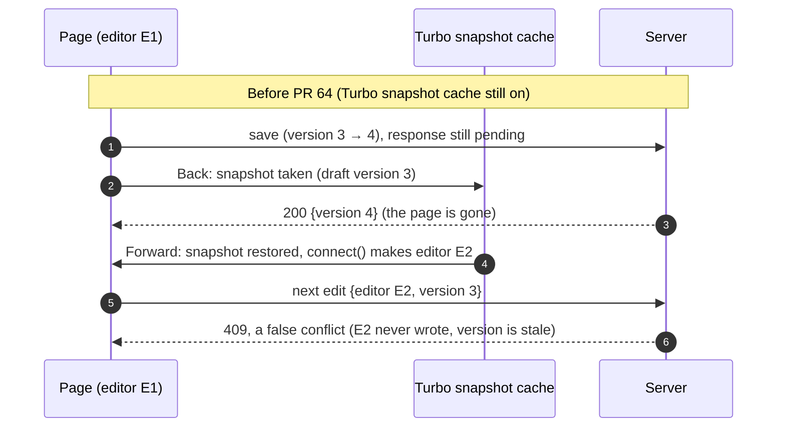
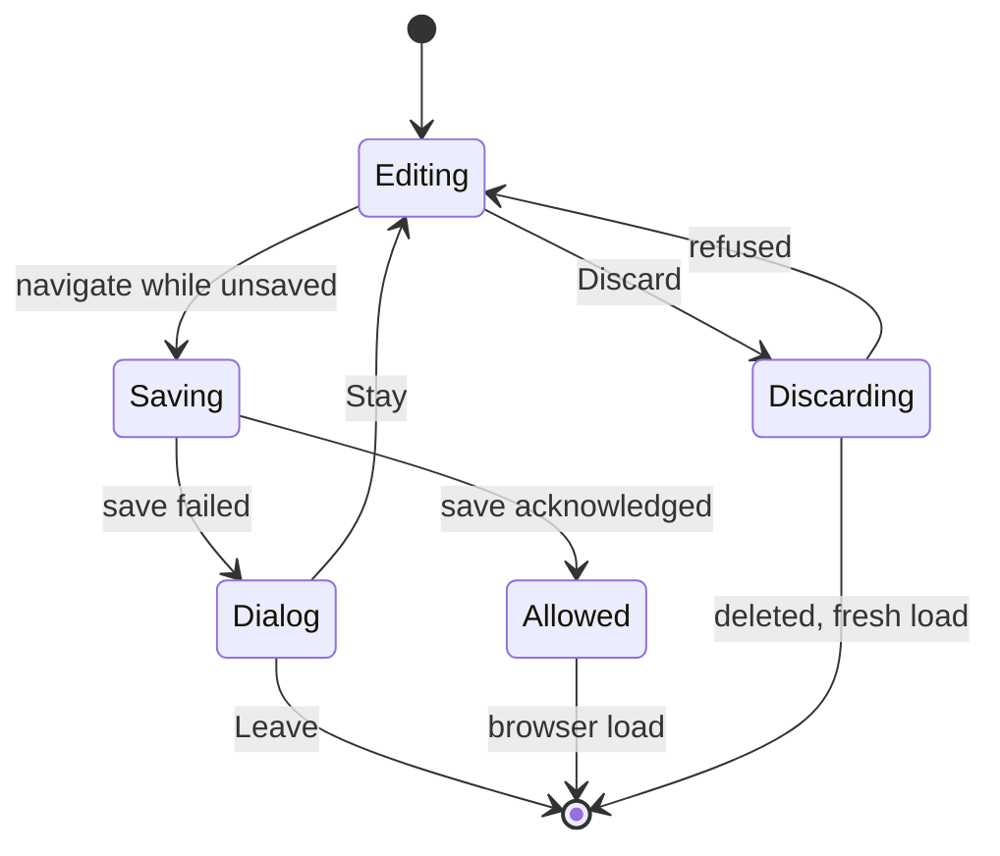

# Case 09 — Back and Forward while a save is still in flight

[← All case studies](README.md) · Topics: UX state, async navigation, autosave · Evidence: [PR #64](https://github.com/XKeviNguyen/three_heavens/pull/64), [PR #72](https://github.com/XKeviNguyen/three_heavens/pull/72)

## Incident snapshot

| | |
| --- | --- |
| **Problem** | Browser history navigation raced the autosave and Turbo's own history handling. The page could:<br/>• restore a stale editor that produced false conflicts<br/>• render a response that predated the latest save<br/>• corrupt the history stack<br/>• leave a deleted draft on screen after a fragment navigation |
| **Impact / risk** | Users navigate before background saves finish. Each failure could show the wrong draft, lose Forward history, or make later edits fail. |
| **Classification** | Release-audit and review findings, fixed in two steps (PR #64, then PR #72). The PR #72 history failures are described in its commit messages and Codex review comments; its body records no baseline failure table. Not a reported production incident. |
| **Fixed in** | PR #64: [`dc3c612`](https://github.com/XKeviNguyen/three_heavens/commit/dc3c6122125c0247b5cb738125fd80db551e409b), cache exemption.<br/>PR #72: [`b3b3394`](https://github.com/XKeviNguyen/three_heavens/commit/b3b339480ee2d3b0fa52fbe5c20eda2dcadfe724), traversal claiming; [`702a7c7`](https://github.com/XKeviNguyen/three_heavens/commit/702a7c7c314643c2507e5376552712cdabf60878), history restore; [`b51d5ad`](https://github.com/XKeviNguyen/three_heavens/commit/b51d5ad7d87c74b318f962d812397398b699febc), fragment reloads. |
| **Verification** | A 60-run history system-test file (58 tests, two of them run twice), plus Back/Forward tests in the draft suite. |


*One tested interleaving: [`translation_workspace_draft_test.rb#L348-L409`](https://github.com/XKeviNguyen/three_heavens/blob/0a82540f32e86f88883b4ef47275fee5c3a26131/test/system/translation_workspace_draft_test.rb#L348-L409) at PR #72's merge, run with the response delivered and with it lost.*

## What went wrong

Five things change on their own timelines while a user presses Back:

| Layer | What it holds | Source of truth? |
| --- | --- | --- |
| Browser URL / history entry | where the user *is* | No |
| Turbo snapshot or fetched page | what the page *shows* | No |
| Editor identity + sequence in the page | who is writing, and how far | Only for this page |
| Acknowledged save | what the page *knows* was stored | Lags the server |
| PostgreSQL draft row | what *is* stored | **Yes** |

Each defect below came from one layer being treated as proof about another.

## Root cause — the actual code

### 1. A Turbo snapshot resurrected an old identity (fixed in PR #64)

On Back, Turbo caches a snapshot of the page. That snapshot could be taken before the last save was acknowledged. On Forward, Turbo restored it, and Stimulus ran `connect()` again ([`workspace_guard_controller.js#L18-L22` at `9a2476f`](https://github.com/XKeviNguyen/three_heavens/blob/9a2476fcdcd896c51540b7316d9378d030a1288e/app/javascript/controllers/workspace_guard_controller.js#L18-L22)):

```js
connect() {
  this.editorId = randomHex(16)   // ← a NEW editor for the restored page…
  this.sequence = 0               // ← …carrying the snapshot's OLD draft id and version
```

The restored page was neither the draft's last writer nor holding the current version. Every later edit therefore failed `writable_by?` and became a **false conflict** (commit `dc3c612`).



Fix: `<% turbo_exempts_page_from_cache %>` in [`new.html.erb`](https://github.com/XKeviNguyen/three_heavens/blob/9a2476fcdcd896c51540b7316d9378d030a1288e/app/views/translation_workspaces/new.html.erb#L2-L3). The page always comes from the server with the current draft.

### 2. The guard objected too late (fixed in PR #72)

Until PR #72 the guard intercepted history navigation at `turbo:before-render`
([`#L215-L236` at `8e09b9c`](https://github.com/XKeviNguyen/three_heavens/blob/8e09b9c1862daa9ff6c689cafd04f5ad021691fc/app/javascript/controllers/workspace_guard_controller.js#L215-L236)):

```js
onBeforeRender(event) {
  if (… || window.location.href === this.currentUrl) return   // ← Forward to the same URL slips through
  event.preventDefault()
  // …
}
// on a failed save:
if (action === "render") window.history.pushState(this.currentHistoryState, "", this.currentUrl)  // ← a NEW entry
```

There were three problems:

- **The hook ran too late.** By `before-render`, Turbo had already answered `popstate`: it had moved its history index, merged the destination's `<head>`, and recorded the snapshot location. Blocking the render could not undo those steps.
- **The URL check let stale renders through.** Forward back to the workspace URL skipped the check entirely. Reading the code together with commit `b3b3394`'s message ("stale responses merge head, record the old location"), a response fetched *before* the save was acknowledged could render an obsolete identity. No test records that exact outcome.
- **A refused Back used `pushState`.** That created a new history entry and discarded the user's Forward history.

### 3. Fragment-only navigation does not load a page (fixed at the end of PR #72)

After a discard, the guard reset the page with `window.location.assign(resetUrl)`, on `develop` before PR #72 and still at PR #72's intermediate commit `f4892f0`. Codex review of that commit found the gap. If the user was on `/translation_workspace/new#main-content`, assigning `/translation_workspace/new` changes only the fragment. No new document loads, so **the deleted draft stayed on screen** on a frozen page. Reloading the current URL instead would drop the requested fragment, which the same review also flagged.

## How the fix works

**Claim the traversal before Turbo sees it.** [`history_traversal.js`](https://github.com/XKeviNguyen/three_heavens/blob/0a82540f32e86f88883b4ef47275fee5c3a26131/app/javascript/history_traversal.js) is imported before Turbo starts and listens in the capture phase:

```js
window.addEventListener("popstate", event => {
  const traversal = new CustomEvent("history:traverse", { cancelable: true })
  if (!window.dispatchEvent(traversal)) event.stopImmediatePropagation()  // ← Turbo never runs
}, true)
```

The guard's [`onTraverse`](https://github.com/XKeviNguyen/three_heavens/blob/0a82540f32e86f88883b4ef47275fee5c3a26131/app/javascript/controllers/workspace_guard_controller.js#L302-L329) cancels the event while a save is pending and calls `navigateAfterSave`. When that save is acknowledged, the page goes inert and does a **browser reload** of the entry the user reached. A cancelled traversal returns to the workspace's own entry with `history.go(-offset)` instead of `pushState`.

**Force a real load for same-document URLs** ([`load()`, `#L603-L610`](https://github.com/XKeviNguyen/three_heavens/blob/0a82540f32e86f88883b4ef47275fee5c3a26131/app/javascript/controllers/workspace_guard_controller.js#L603-L610)):

```js
// Assigning a URL that differs only by its fragment would keep this page,
// so set the requested URL on this entry and reload.
load(url) {
  if (new URL(url, window.location.href).href.split("#")[0] === window.location.href.split("#")[0]) {
    window.history.replaceState(window.history.state, "", url)
    window.location.reload()
  } else window.location.assign(url)
}
```

The page is also excluded from Turbo's cache (PR #64). The browser's own back-forward cache (bfcache) is not covered by that exemption. [`onPageShow`](https://github.com/XKeviNguyen/three_heavens/blob/0a82540f32e86f88883b4ef47275fee5c3a26131/app/javascript/controllers/workspace_guard_controller.js#L445-L452) reloads a bfcache-restored page unless it still guards unsaved edits; those are kept so their saves either succeed or report the conflict.



| Transition | What the code does |
| --- | --- |
| navigate while unsaved | `onTraverse` / link guard cancels the navigation; Turbo never sees a claimed traversal |
| newer Back/Forward | the in-flight navigation's destination is replaced: the latest one wins |
| save acknowledged | `phase: "allowed"`, the page goes inert, then a browser load of the entry reached |
| save failed | `restoreHistory` returns to the workspace entry and opens the leave dialog |
| Stay / Leave | Stay resumes autosave; Leave follows the destination |
| Discard | DELETE; on success `load()` the reset URL (fragment preserved); if refused, restore history and resume |

*Phase names follow the code: `navigation.phase` is `"saving"` or `"allowed"`, and `discarding` is a flag.*

## Before vs after

| Interleaving | Before | After |
| --- | --- | --- |
| Back → Forward around a save (PR #64 era) | Snapshot restored with a stale identity; later edits got a false 409 | Never cached; the page is always fetched with the current draft |
| Back → Forward while the save is unresolved | Turbo handled `popstate` first; an old response could render | Both traversals claimed; 0 Turbo renders; reload after the acknowledgement |
| … and the response is lost | — | Leave dialog; Stay keeps the text; the save succeeds on reconnect |
| Refused Back | `pushState` dropped Forward history | `history.go(-offset)` returns to the workspace entry |
| Discard on a `#fragment` entry | Same document kept; the deleted draft stayed visible | Fresh empty document at the requested URL |

## Reproduction and regression tests

[`translation_workspace_history_test.rb`](https://github.com/XKeviNguyen/three_heavens/blob/0a82540f32e86f88883b4ef47275fee5c3a26131/test/system/translation_workspace_history_test.rb) was added in `b3b3394`. It has 58 tests; two run twice, with and without a cleared cache, for 60 runs. PR #72 reports a "focused history suite" of **60 tests / 489 assertions**, which matches this file's run count. The assertion count was not re-run for this write-up. Representative tests:

| Tested history | Test |
| --- | --- |
| Back → Forward, clean | [`#L349-L367`](https://github.com/XKeviNguyen/three_heavens/blob/0a82540f32e86f88883b4ef47275fee5c3a26131/test/system/translation_workspace_history_test.rb#L349-L367) clean Back and Forward stay in the same document |
| Back → Forward while a save is unresolved, delivered or lost | [draft test `#L348-L409`](https://github.com/XKeviNguyen/three_heavens/blob/0a82540f32e86f88883b4ef47275fee5c3a26131/test/system/translation_workspace_draft_test.rb#L348-L409) (the timeline above) |
| Rapid navigation with the guard active | [`#L204`](https://github.com/XKeviNguyen/three_heavens/blob/0a82540f32e86f88883b4ef47275fee5c3a26131/test/system/translation_workspace_history_test.rb#L204-L228) Back and Forward churn during a delayed acknowledgement follows only the latest traversal. Four traversals; asserts no Turbo events and no page requests until it settles. |
| Stay / Leave | [`#L49`](https://github.com/XKeviNguyen/three_heavens/blob/0a82540f32e86f88883b4ef47275fee5c3a26131/test/system/translation_workspace_history_test.rb#L49-L64) Leave after a refused Back; [`#L21`](https://github.com/XKeviNguyen/three_heavens/blob/0a82540f32e86f88883b4ef47275fee5c3a26131/test/system/translation_workspace_history_test.rb#L20-L47) a Back claimed after a failed save leaves no stale state |
| Stale responses | [`#L309`](https://github.com/XKeviNguyen/three_heavens/blob/0a82540f32e86f88883b4ef47275fee5c3a26131/test/system/translation_workspace_history_test.rb#L309-L332) of two history visits, the older response arriving last never renders |
| Discard / reset with a fragment | [`#L147`](https://github.com/XKeviNguyen/three_heavens/blob/0a82540f32e86f88883b4ef47275fee5c3a26131/test/system/translation_workspace_history_test.rb#L147-L185) discard after a claimed Back to a fragment loads a fresh empty document; [`#L187`](https://github.com/XKeviNguyen/three_heavens/blob/0a82540f32e86f88883b4ef47275fee5c3a26131/test/system/translation_workspace_history_test.rb#L187-L202) discard at the same URL |
| bfcache | [`#L369`](https://github.com/XKeviNguyen/three_heavens/blob/0a82540f32e86f88883b4ef47275fee5c3a26131/test/system/translation_workspace_history_test.rb#L369-L385) a workspace restored from the back-forward cache shows the current draft |

The fragment test holds `controller.load`. It checks that the database is already empty before the load is released, then checks for a new editor id, an empty field, no hash, and a page that is no longer inert.

Recorded results: PR #72 ran a final `bin/ci` with 1,186 Rails tests and 176 system tests, and exact-head CI was green on all five jobs. [PR #81](https://github.com/XKeviNguyen/three_heavens/pull/81) later made the PR #64 *Back then Forward* test wait for the replacement document (`assert_document_replaced`). That was a test synchronization fix, related to [Case 05](05-turbo-system-test-races.md).

## Trade-offs and remaining limitations

- **The matrix covers named interleavings, not every ordering.** Rapid navigation is tested with four traversals. No claim is made about arbitrary sequences or counts of Back/Forward presses.
- Testing ran in Chrome (PR #81 names Chrome 154). Behaviour in other browsers is not established. The capture-phase ordering relied on in `history_traversal.js` is documented in its own comment as Chrome behaviour.
- Reloading after an acknowledged save costs a full page load. That trade buys certainty that the page shows server state.
- One of PR #64's deferred items remains: a second navigation click during a flush is ignored.

## Lessons learned

- **Browser navigation is concurrent state, not routing.** History, rendering, saving and acknowledgement each run on their own timeline.
- **Intercept at the earliest point that can still say no.** A hook after the framework has acted can only partially undo it.
- **A URL is not a document.** Fragment-only changes don't load anything. Force a real load when the server must be consulted.
- **The database is the source of truth.** When in doubt, reload from it rather than trusting a cached or late copy.

## Interview explanation

> Our translation workspace autosaves, and people press Back and Forward before saves finish. First, Turbo's page cache could restore a copy taken before the last save was acknowledged. The restored page acted as a new editor holding an old draft version, so every later edit hit a false conflict. We stopped caching that page. Second, our guard objected too late: by the time it saw the navigation, Turbo had already moved its history position, and our refusal threw away the user's Forward history. Now a small listener intercepts the browser's history event before Turbo sees it. While a save is pending, the guard holds the navigation, waits for the acknowledgement, then does a real page load of where the user was going, or offers Stay or Leave if the save failed. Review also caught that changing only a URL fragment doesn't load a new page, so discards now force a reload. We test named sequences, like Back then Forward with a held or lost response, not every possible ordering. The lesson: browser navigation is concurrent state, so intercept it before the framework acts.

## Sources

- PRs: [#64](https://github.com/XKeviNguyen/three_heavens/pull/64) (cache exemption), [#72](https://github.com/XKeviNguyen/three_heavens/pull/72) (traversal claiming, history restore, fragment loads), [#81](https://github.com/XKeviNguyen/three_heavens/pull/81) (test synchronization)
- Current code at `develop` [`c39a15c`](https://github.com/XKeviNguyen/three_heavens/blob/c39a15c1dfdda7718658865ae00f4ce07d4eec01/app/javascript/history_traversal.js) is unchanged from PR #72's merge.
