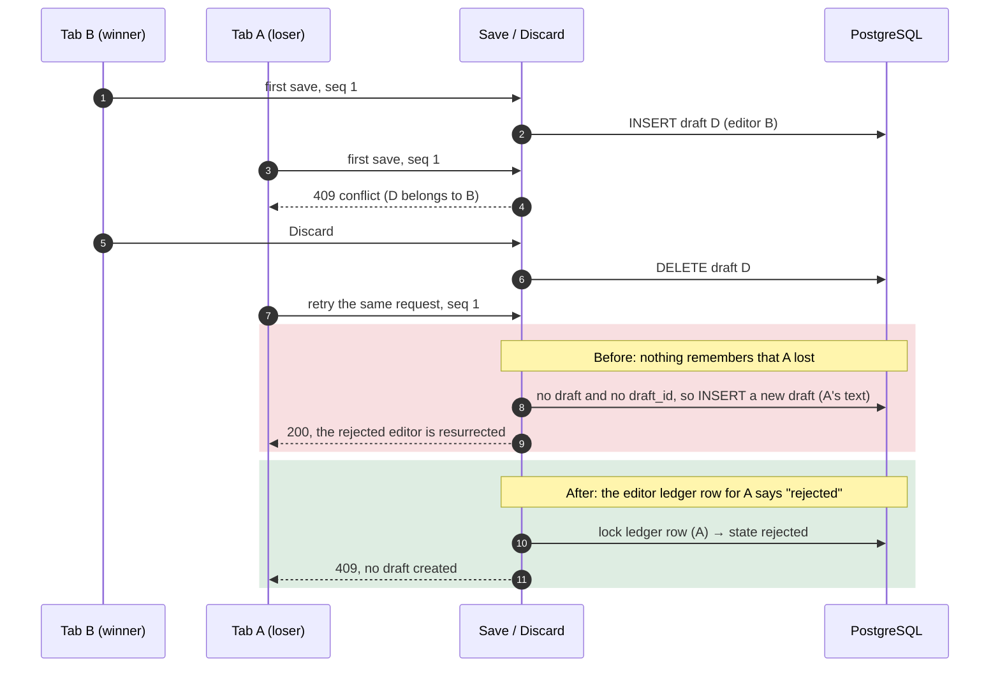
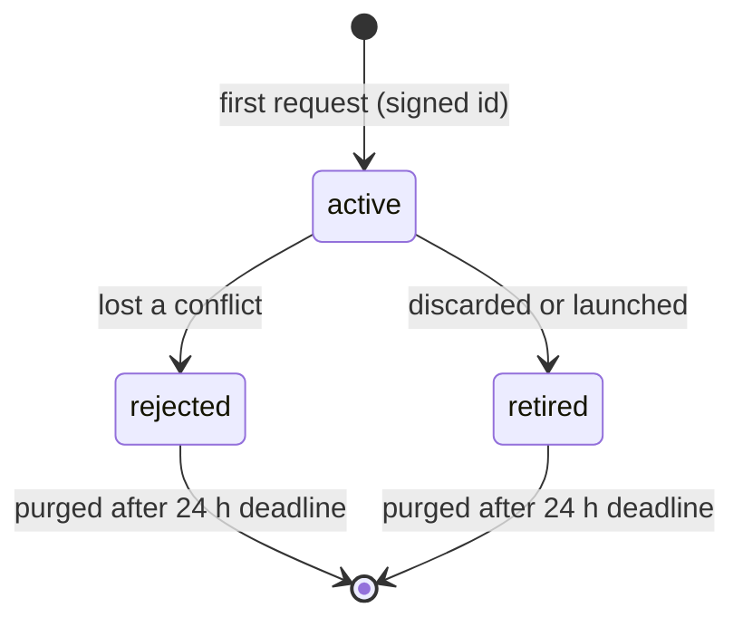

# Case 10 — Deleting the winner's draft brought the loser back to life

[← All case studies](README.md) · Topics: data consistency, replay safety, negative knowledge · Evidence: [PR #72](https://github.com/XKeviNguyen/three_heavens/pull/72)

## Incident snapshot

| | |
| --- | --- |
| **Problem** | Editor B's first save won and editor A's was rejected. After B discarded the draft, **retrying A's exact rejected request created a new draft**. |
| **Impact / risk** | Text the user had been told was *not* saved could reappear as the current draft, overriding the user's decision to discard. |
| **Classification** | P2 in PR #72's [failure-mode audit](../pr72_failure_modes.md), reproduced at the PR's reviewed baseline `7d31de7` (which already had a first editor ledger but no rejected state) and flagged there by Codex review. On `develop` before PR #72 (`8e09b9c`) the same retry creates a draft directly, as the code below shows. Not a reported production incident. |
| **Fixed in** | PR #72, merged 2026-10-07. Key commits: [`e16c2d3`](https://github.com/XKeviNguyen/three_heavens/commit/e16c2d342e01ea6d5339c823230013c7c32d5241) (editor ledger), [`8373740`](https://github.com/XKeviNguyen/three_heavens/commit/8373740ed82da9d258fcf8c93a9cfc2784ff93cc) (24-hour lease), [`da810e2`](https://github.com/XKeviNguyen/three_heavens/commit/da810e25540193e1c2aae05d0dcae5f0014a10e0) (rejected outcome, signed ids), [`9a65f7f`](https://github.com/XKeviNguyen/three_heavens/commit/9a65f7ff12d793931e6d8bfa1c62844f88975834) (`active / rejected / retired` states) |
| **Verification** | Multi-process concurrency tests and adversarial integration tests: the loser stays rejected after the winner's draft is discarded, launched or cleaned up. |



## What went wrong

The scenario recorded in PR #72 and [`docs/pr72_failure_modes.md`](../pr72_failure_modes.md):

> B saves; A sequence 1 conflicts; B discards; exact A sequence 1 retry creates a draft.

Retrying an exact request is normal. The loser's 409 response can itself be lost, and the client retries unacknowledged saves (see [Case 02](02-autosave-lost-response.md)). So this was a reachable path, not a contrived one.

## Root cause — the actual code

Before PR #72, everything the server knew about editors lived **on the draft row** (`editor_id`, `editor_sequence`). There was no editor table. [`save.rb#L58-L73` at `8e09b9c`](https://github.com/XKeviNguyen/three_heavens/blob/8e09b9c1862daa9ff6c689cafd04f5ad021691fc/app/services/translation_workspace_drafts/save.rb#L58-L73):

```ruby
def save_locked
  draft = user.translation_workspace_drafts.lock.find_by(context_key:)
  # …
  if draft.nil?
    raise ActiveRecord::RecordNotFound, "The saved draft no longer exists" if draft_id
    return saved(user.translation_workspace_drafts.create!(context_key:, **written_attributes))  # ← anyone may create
  end
  return Result.new(draft:, conflict: true) unless draft.writable_by?(editor_id:, public_id: draft_id, version:)
  # …
end
```

When B discarded, the row was destroyed, and with it the only evidence that A had lost. A's retry then looked like an ordinary first save.

**The violated assumption:** an absent row means nothing happened. This is **negative knowledge**: the fact that A was *refused* is information too. If it lives only on a row that someone else can delete, deleting that row silently grants A permission it never had.

The same gap let a page's own delayed save recreate a draft after that page had discarded it.

## How the fix works

PR #72 adds an **editor ledger**, `translation_workspace_draft_editors`, that outlives drafts ([migration `20261005110000`](https://github.com/XKeviNguyen/three_heavens/blob/0a82540f32e86f88883b4ef47275fee5c3a26131/db/migrate/20261005110000_create_translation_workspace_draft_editors.rb)). Each row records an editor, a sequence watermark, a state, and a signed expiry 24 hours from issue.



- **`active`**: saves are accepted and the sequence watermark rises.
- **`rejected`**: every later save → 409 at any sequence, and discard → 409. This survives the winner's discard, launch or expiry.
- **`retired`**: a save → 409. A discard replay → 204, or 409 if a newer draft exists.
- After the signed deadline, the identity itself is refused (`Expired` → 409), so purging the row cannot reopen the hole.

`Save` locks the ledger row **before** the draft and refuses any non-active editor
([`save.rb#L58-L82`, `#L109-L112` at `0a82540`](https://github.com/XKeviNguyen/three_heavens/blob/0a82540f32e86f88883b4ef47275fee5c3a26131/app/services/translation_workspace_drafts/save.rb#L58-L112)):

```ruby
@editor = TranslationWorkspaceDraftEditor.lock_for(user:, context_key:, editor_id:)
draft = user.translation_workspace_drafts.lock.find_by(context_key:)
return Result.new(draft:, conflict: true) if @editor && !@editor.active?          # ← rejected or retired
# …
return Result.new(draft: nil, conflict: true) if @editor && sequence <= @editor.sequence  # ← old first-save replay
# …
def rejected(draft)
  @editor.update!(sequence: [ @editor.sequence, sequence ].max, state: :rejected) if @editor
  Result.new(draft:, conflict: true)
end
```

[`Discard`](https://github.com/XKeviNguyen/three_heavens/blob/0a82540f32e86f88883b4ef47275fee5c3a26131/app/services/translation_workspace_drafts/discard.rb#L3-L28) uses the same lock order (editor, then draft). A successful discard marks the editor `retired`. A retry of that discard returns 204 unless a newer draft now exists, in which case it returns 409.

Supporting rules:

- **Signed identity.**
  - Editor ids are now issued by the server, signed, and bound to the account and context (`ReplayIdentity`).
  - Unsigned requests are refused.
  - At most 256 resident editor identities per account; beyond that the server returns 429.
- **Bounded memory.**
  - The negative knowledge is kept for the nonrenewable 24-hour admission lease, not forever.
  - After expiry, the signed deadline itself rejects the old request with `Expired → 409`, so purging the row does not reopen the hole.

### Replay decision table (after PR #72)

| Editor state | Draft | Request | Result |
| --- | --- | --- | --- |
| `rejected` | any | save, any sequence | 409; draft unchanged |
| `rejected` | any | discard | 409 |
| `retired` | none | discard replay | 204 |
| `retired` | newer draft from another page | discard replay | 409; the newer draft is kept |
| `retired` | any | save | 409 |
| `active` | none | first-save replay with sequence ≤ watermark | 409; no draft created |
| *(none)* — a fresh page | none | first save | 200; creates the draft |

## Before vs after

| Scenario | Before | After |
| --- | --- | --- |
| Loser retries sequence 1 after the winner discards | Creates a draft | 409 |
| Loser retries with sequence 2 or 100 | Creates a draft | 409 |
| Winner's draft launched or expired, then the loser retries | Creates a draft | 409 |
| The user reloads the loser's tab (a new signed editor) | Can save | Can save (a genuinely new action) |

## Reproduction and regression tests

- **Two processes:** [`replay_adversarial_concurrency_test.rb#L105`](https://github.com/XKeviNguyen/three_heavens/blob/0a82540f32e86f88883b4ef47275fee5c3a26131/test/models/replay_adversarial_concurrency_test.rb#L105), *independent first-save loser remains rejected after the winner is discarded*.
  - Two OS processes are synchronized through a pipe barrier.
  - The winner commits sequence 1 and the loser's sequence 1 conflicts. Then the winner discards.
  - The loser's sequences 1 and 100, sent from two processes, are both conflicts, and no draft exists.
- **Three ways of removing the winner:** [`replay_adversarial_test.rb#L94`](https://github.com/XKeviNguyen/three_heavens/blob/0a82540f32e86f88883b4ef47275fee5c3a26131/test/integration/replay_adversarial_test.rb#L94), *losing and stale discard editors remain rejected after discard, launch or content cleanup*. The loser's sequences 1, 2 and 100 all conflict, and the draft count stays 0.
- **Lost discard response:** [`translation_workspace_draft_test.rb#L486`](https://github.com/XKeviNguyen/three_heavens/blob/0a82540f32e86f88883b4ef47275fee5c3a26131/test/integration/translation_workspace_draft_test.rb#L486) (integration) and [system `#L24`](https://github.com/XKeviNguyen/three_heavens/blob/0a82540f32e86f88883b4ef47275fee5c3a26131/test/system/translation_workspace_draft_test.rb#L24). A repeated DELETE returns 204, old-page saves are refused, and a fresh page works.

Recorded results (PR #72): a clean-head focused adversarial, concurrency and migration run passed **17 tests / 153 assertions**, and a final `bin/ci` passed. PR #72 records its baseline reproduction for the scenario, not a fail-before run per test. The ledger these tests use does not exist on `8e09b9c`, so they cannot run there unchanged.

## Related findings in the same PR

- **Retrying a lost *successful discard* did not return 409 before PR #72.** On `8e09b9c` such a retry got 404, which the client treats as success, or 204. The 409 existed only in the intermediate PR #72 commit `da810e2` and was fixed by `9a65f7f` within the same PR. PR #72 lists it as a same-class review finding.
- **A cancelled import with a lost response could leave stale client provenance before PR #72.** The upload controller threw on the 404 that a retried, already-committed DELETE returns. PR #72 fixed it, and it is tested in [`source_import_replay_test.rb#L14`](https://github.com/XKeviNguyen/three_heavens/blob/0a82540f32e86f88883b4ef47275fee5c3a26131/test/system/source_import_replay_test.rb#L14).

## Trade-offs and remaining limitations

- **Bounded, not permanent, idempotency.** From [`docs/replay_lifecycles.md`](../replay_lifecycles.md): "After admission expiry, every outcome rejects the old request and requires a new submission."
- An account can hold at most 256 resident editor identities. Beyond that a new page gets 429 until older identities expire.
- Rolling back the migration fails deliberately once signed identities exist.
- PR #72 notes: cleanup progress requires workers running with capacity above arrivals.

## Lessons learned

- **Remember denials, not only successes.** If a refusal is stored only on a row that another actor can delete, the refusal disappears with it.
- **Give replay state its own lifetime.** Keep it in a ledger whose retention is set by the replay window, not by the business row's lifecycle.
- **Bound the memory explicitly.** A signed deadline lets you purge old state without reopening the hole.

## Interview explanation

> Two tabs raced to make the first save of a draft: B won, and A got a 409. Then B discarded the draft. When A retried exactly the same request, which happens normally after a lost response, the server created a new draft from A's rejected text. The only record of who had written lived on the draft row, and deleting the draft deleted the knowledge that A had lost. We call that negative knowledge. We added an editor ledger that outlives drafts. Each editor is `active`, `rejected` or `retired`, with a sequence watermark, and is locked before the draft. Any save from a rejected or retired editor is a conflict at any sequence, and a retried discard replays as success unless a newer draft exists. Editor ids became server-signed, with a 24-hour deadline, so purging old rows can't reopen the hole. Tests run the race across two OS processes and remove the winner by discard, launch and cleanup. The lesson: idempotency has to remember refusals as well as successes.

## Sources

- PR: [#72 — Fix V1.1 replay admission, recovery, and cleanup fairness](https://github.com/XKeviNguyen/three_heavens/pull/72)
- Design notes: [`docs/replay_lifecycles.md`](../replay_lifecycles.md), [`docs/pr72_failure_modes.md`](../pr72_failure_modes.md)
- Before: [`8e09b9c`](https://github.com/XKeviNguyen/three_heavens/blob/8e09b9c1862daa9ff6c689cafd04f5ad021691fc/app/services/translation_workspace_drafts/save.rb#L58-L73) · After: [`0a82540`](https://github.com/XKeviNguyen/three_heavens/blob/0a82540f32e86f88883b4ef47275fee5c3a26131/app/services/translation_workspace_drafts/save.rb#L58-L112)
