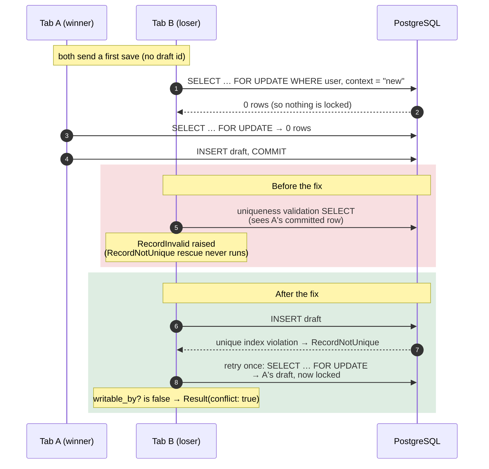

# Case 11 — Two tabs, one first save: a validation that raced the unique index

[← All case studies](README.md) · Topics: concurrency, data consistency · Evidence: [PR #66](https://github.com/XKeviNguyen/three_heavens/pull/66)

## Incident snapshot

| | |
| --- | --- |
| **Problem** | Two tabs saving the *first* draft at the same moment could raise `ActiveRecord::RecordInvalid: Context key has already been taken` instead of returning a clean conflict. |
| **Impact / risk** | An internal race escaped the autosave service as an exception. No data was lost: PostgreSQL's unique index still allowed only one draft. |
| **Classification** | CI failure (item "L-1 / CI", one of five release blockers in PR #66), reproduced deterministically. Not a reported production incident. |
| **Fixed in** | [`14376c1`](https://github.com/XKeviNguyen/three_heavens/commit/14376c11aadbca4cd23e0f75b7ac9693f92d914d), merged 2026-09-30 |
| **Verification** | A deterministic interleaving test and a 100-iteration threaded race test in the service test suite. |



*The same interleaving before and after PR #66. Step 2 is the crux: locking a row that does not exist yet locks nothing.*

## What went wrong

The workspace autosaves one encrypted draft per user and context. When two tabs make their first save together, exactly one should create the draft. The other should receive a *conflict* result and keep its local text.

Instead, CI saw the losing save fail with `ActiveRecord::RecordInvalid ("Context key has already been taken")`. That error was not part of the service's contract.

## Root cause — the actual code

Two layers each believed they enforced "one draft per user and context":

1. The model had an application-level uniqueness validation
   ([`translation_workspace_draft.rb#L29` at `d84d8f7`](https://github.com/XKeviNguyen/three_heavens/blob/d84d8f7457eb15642e1500bf673762d020c9df3a/app/models/translation_workspace_draft.rb#L29)):

   ```ruby
   # Before PR #66: a SELECT that runs inside create!, before the INSERT
   validates :context_key, presence: true, uniqueness: { scope: :user_id }, length: { maximum: 80 }
   ```

2. The database had a unique index, `index_translation_workspace_drafts_on_user_id_and_context_key`
   ([migration](https://github.com/XKeviNguyen/three_heavens/blob/0b1ec741550bb0258f34201fe498a32ab52da4bb/db/migrate/20260924090000_create_translation_workspace_drafts.rb#L14)).
   The service already recovered when that index rejected an insert
   ([`save.rb#L41-L50`](https://github.com/XKeviNguyen/three_heavens/blob/d84d8f7457eb15642e1500bf673762d020c9df3a/app/services/translation_workspace_drafts/save.rb#L41-L50)):

   ```ruby
   def call
     attempts = 0
     begin
       TranslationWorkspaceDraft.transaction(requires_new: true) { save_locked }
     rescue ActiveRecord::RecordNotUnique      # ← only this exception was expected
       attempts += 1
       retry if attempts == 1                  # ← second pass finds the winner's row
       raise
     end
   end
   ```

`save_locked` begins with `lock.find_by(context_key:)`
([`#L57-L67`](https://github.com/XKeviNguyen/three_heavens/blob/d84d8f7457eb15642e1500bf673762d020c9df3a/app/services/translation_workspace_drafts/save.rb#L57-L67)).
On a first save there is no row, so `FOR UPDATE` locks nothing and both requests continue to `create!`.

The violated assumption was that a collision would always surface as `RecordNotUnique`. If the winner commits after the loser's empty lookup but before the loser's validation query runs, the *validation* sees the winner's row. It raises `RecordInvalid` before any `INSERT` reaches the index, so the recovery path is skipped.

## How the fix works

Commit [`14376c1`](https://github.com/XKeviNguyen/three_heavens/commit/14376c11aadbca4cd23e0f75b7ac9693f92d914d) **removed the application-level uniqueness check**. The unique index is now the only uniqueness authority
([`translation_workspace_draft.rb#L28-L34` at `0b1ec74`](https://github.com/XKeviNguyen/three_heavens/blob/0b1ec741550bb0258f34201fe498a32ab52da4bb/app/models/translation_workspace_draft.rb#L28-L34)):

```ruby
validates :public_id, presence: true, uniqueness: true
# One draft per user and context is enforced only by the unique index on
# (user_id, context_key). An application uniqueness check would race with a
# concurrent first save that commits between its lookup and its insert and
# reject it as invalid; TranslationWorkspaceDrafts::Save instead resolves
# the index violation against the draft that won.
validates :context_key, presence: true, length: { maximum: 80 }
```

Every losing first save now reaches the existing `RecordNotUnique → retry` path. On the retry, `find_by` returns the winner's row, and `writable_by?` fails for a different editor, so the service returns `Result(conflict: true)`.

The service code did not change apart from a comment. **No `rescue RecordInvalid` was added.** That matters: a broad rescue would also have swallowed genuine validation failures such as an over-long `context_key`, which a separate test pins down.

The obvious alternative was to rescue `RecordInvalid` and inspect its error messages. It was not chosen: it keeps two competing uniqueness checks and depends on error-message details. Deleting the redundant, racy check is simpler and leaves one authority.

## Before vs after

| Observable outcome when the loser's validation runs after the winner's commit | Before | After |
| --- | --- | --- |
| Drafts in the database | 1 (the index still held) | 1 |
| Loser's result | `RecordInvalid` exception escapes `Save.call` | `Result(conflict: true)` naming the winner's draft |
| Winner's text, editor, sequence | Preserved | Preserved |
| Over-long `context_key` (non-uniqueness validation) | `RecordInvalid` | `RecordInvalid` (unchanged) |

## Reproduction and regression tests

All three tests are in [`test/services/translation_workspace_drafts/save_concurrency_test.rb`](https://github.com/XKeviNguyen/three_heavens/blob/0b1ec741550bb0258f34201fe498a32ab52da4bb/test/services/translation_workspace_drafts/save_concurrency_test.rb#L45-L108). The file disables transactional tests, so each thread commits on its own database connection.

- **Deterministic interleaving** — [`#L45-L79`](https://github.com/XKeviNguyen/three_heavens/blob/0b1ec741550bb0258f34201fe498a32ab52da4bb/test/services/translation_workspace_drafts/save_concurrency_test.rb#L45-L79).
  - A `before_validation` callback, active only on the loser's thread, pauses the loser after its empty lookup and before validation.
  - The main thread then saves and commits the winner and releases the loser.
  - Asserts: the loser gets a `Save::Result` flagged as a conflict, pointing at the winner's draft. Exactly one row exists, with the winner's text, editor and sequence 1.
  - The PR says this test "reproduces the CI error exactly without the fix". No failing run output is recorded in the PR.
- **100-iteration race** — [`#L81-L100`](https://github.com/XKeviNguyen/three_heavens/blob/0b1ec741550bb0258f34201fe498a32ab52da4bb/test/services/translation_workspace_drafts/save_concurrency_test.rb#L81-L100).
  - Each iteration releases two threads from a shared gate.
  - Asserts: no exception, exactly one winner and one conflict, one draft. The winner's next save (sequence 2) succeeds, and the loser's text never lands.
  - The timing is *not* forced, which is exactly why the deterministic test exists.
- **Guard rail** — [`#L102-L108`](https://github.com/XKeviNguyen/three_heavens/blob/0b1ec741550bb0258f34201fe498a32ab52da4bb/test/services/translation_workspace_drafts/save_concurrency_test.rb#L102-L108). An 81-character context key still raises `RecordInvalid`.

Recorded results (PR #66 test plan): `bin/rails test` with 913 runs and 0 failures. The PR does not record failure counts before the fix. The original failing CI run is not identified in the PR.

## Trade-offs and remaining limitations

- The service retries **once**. A second `RecordNotUnique` on the same call re-raises.
- The deterministic test relies on a test-only model callback and a thread-local flag. It proves the interleaving, not real browser timing.
- There is no browser-level two-tab test for this specific window.
- `public_id` keeps an application uniqueness validation. Collisions there come from random UUIDs, not from a user race, so it was left unchanged.
- Later PRs added editor-identity locking inside `save_locked` (see [Case 10](10-retry-after-discard-and-rejected-editor.md)). At `develop` [`c39a15c`](https://github.com/XKeviNguyen/three_heavens/blob/c39a15c1dfdda7718658865ae00f4ce07d4eec01/app/models/translation_workspace_draft.rb#L28-L34), the model still has no uniqueness validation on `context_key`.

## Lessons learned

- **A uniqueness validation is a read, not a guarantee.** It runs a `SELECT` that can be stale by the time the `INSERT` runs. Only the database constraint is atomic with the write.
- **`SELECT … FOR UPDATE` cannot serialize the creation of a row that does not yet exist.** Serialize first inserts with a unique index (or an advisory lock), then handle the violation.
- Write concurrency tests that **force the interleaving** with barriers, and assert the *invariant* (one draft, one winner, no lost edit) rather than only a specific exception.

## Interview explanation

> Two tabs could make the very first autosave of a draft at the same moment. We had a unique index on user and context, and the save service already caught `RecordNotUnique`, retried, and returned a conflict. But CI hit `RecordInvalid` instead. The loser's `SELECT … FOR UPDATE` found no row, so it locked nothing. If the winner committed just before the loser's Rails uniqueness validation ran, the validation saw that row and raised `RecordInvalid` before any insert reached the index, which skipped our recovery path. The fix was to delete the redundant validation and make the unique index the only authority, not to add another rescue, so genuine validation errors still fail loudly. We proved it with a test that pauses the loser between lookup and validation while the winner commits, plus a 100-iteration race. The lesson: application uniqueness checks are advisory, and the database constraint is the real guarantee.

## Sources

- PR: [#66 — Fix final V1.1 release-audit blockers](https://github.com/XKeviNguyen/three_heavens/pull/66) (section "L-1 / CI — first-save draft race")
- Corrective commit: [`14376c11`](https://github.com/XKeviNguyen/three_heavens/commit/14376c11aadbca4cd23e0f75b7ac9693f92d914d)
- Validation introduced by: [`7f047321`](https://github.com/XKeviNguyen/three_heavens/commit/7f04732177e9af16d5fdd2980328e0aa20ff50f7). `RecordNotUnique` recovery introduced by: [`00fe5952`](https://github.com/XKeviNguyen/three_heavens/commit/00fe5952ca534ed270401ce40acb8c93abc5cdf2)
- Before: [`d84d8f7`](https://github.com/XKeviNguyen/three_heavens/blob/d84d8f7457eb15642e1500bf673762d020c9df3a/app/models/translation_workspace_draft.rb#L29) · After: [`0b1ec74`](https://github.com/XKeviNguyen/three_heavens/blob/0b1ec741550bb0258f34201fe498a32ab52da4bb/app/models/translation_workspace_draft.rb#L28-L34)
