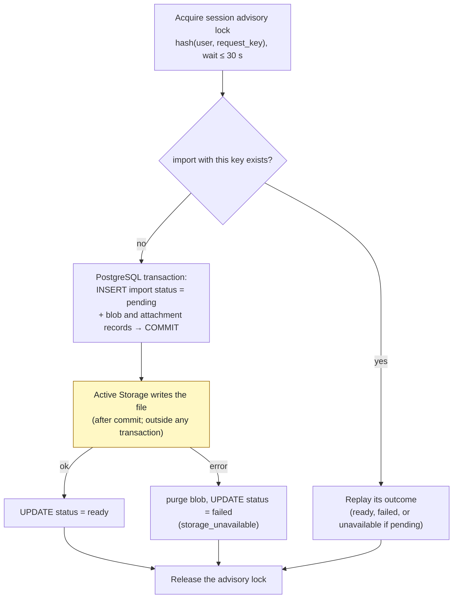
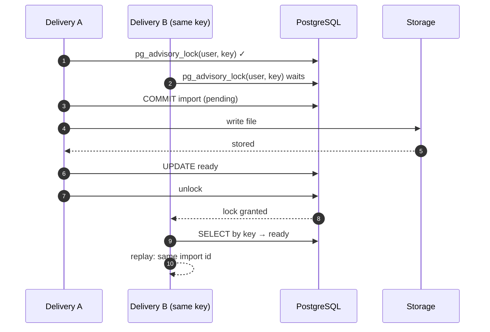
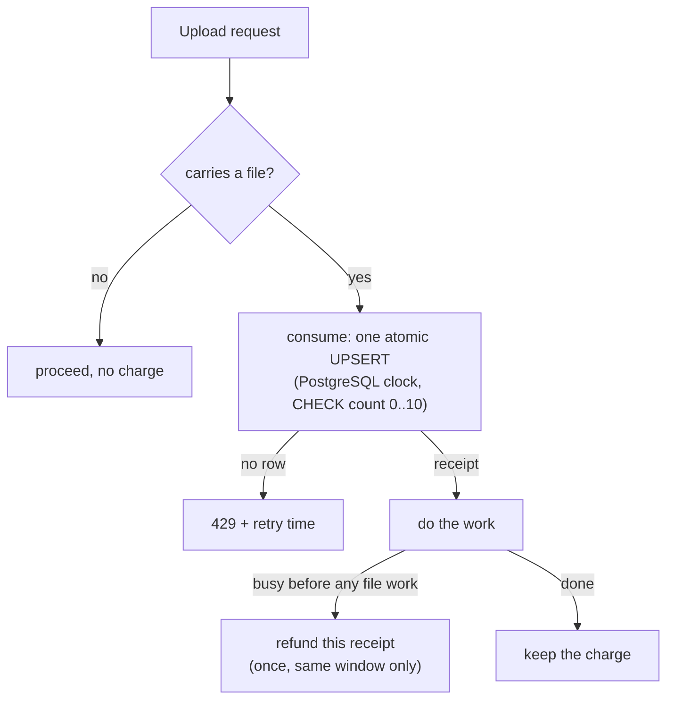

# Case 12 — Uploads that survive lost responses, duplicates and quota races

[← All case studies](README.md) · Topics: idempotency, durability, concurrency, abuse limits · Evidence: [PR #64](https://github.com/XKeviNguyen/three_heavens/pull/64), [PR #71](https://github.com/XKeviNguyen/three_heavens/pull/71), [PR #72](https://github.com/XKeviNguyen/three_heavens/pull/72)

## Incident snapshot

| | |
| --- | --- |
| **Problem** | A source upload touches four things that finish at different times: the HTTP response, a PostgreSQL row, a file in storage, and a per-account upload budget. Five distinct failure modes were found across three PRs (table below). |
| **Impact / risk** | Duplicate imports; an import reported "ready" before its file existed (found within PR #64's own branch); text-only edits and busy answers spending the upload budget. |
| **Classification** | Release-audit and review findings reproduced in tests. No production incident or duplicate provider bill is claimed. |
| **Fixed in** | PR #64 (2026-09-29): [`b99d31f`](https://github.com/XKeviNguyen/three_heavens/commit/b99d31f5f54187f4964b3cc0de17396d8324646c), [`9db5271`](https://github.com/XKeviNguyen/three_heavens/commit/9db527181cf5625480d5b426551a818ce39d3ac6).<br/>PR #71 (2026-10-04): [`4b52945`](https://github.com/XKeviNguyen/three_heavens/commit/4b529453501ad8978ca130afa5b1fe2fbe440d08), [`165db8c`](https://github.com/XKeviNguyen/three_heavens/commit/165db8c8f4bc887b7c20c6c84ec40ebb6b6dca0d).<br/>PR #72 (2026-10-07): [`e16c2d3`](https://github.com/XKeviNguyen/three_heavens/commit/e16c2d342e01ea6d5339c823230013c7c32d5241). |
| **Verification** | A browser lost-response test, threaded duplicate-delivery tests, held-storage durability tests, and multi-process budget tests (24 and 12 processes). |



*The upload flow as fixed in PR #64. No transaction spans the yellow step. A crash after the commit leaves a `pending` row, which a replay reports as unavailable, never as success. Expiry cleanup removes it later.*

*PR #72 later split the first commit in two: the budget charge and a `pending` import with no file commit together **before** extraction, and the extracted metadata plus blob and attachment records commit afterwards ([`create.rb#L53-L62` and `#L101-L111` at `0a82540`](https://github.com/XKeviNguyen/three_heavens/blob/0a82540f32e86f88883b4ef47275fee5c3a26131/app/services/source_imports/create.rb#L53-L111)). A worker that dies during extraction therefore leaves a pending import with no blob; replaying it costs nothing and starts no new work (see failures 4 and 5).*

## What went wrong

Five separate failure modes, found across three PRs:

| # | Failure mode | Where it existed | Fixed by |
| --- | --- | --- | --- |
| 1 | Lost response → retry creates a second import | `develop` before PR #64 | request key + unique index (PR #64) |
| 2 | Row marked `ready` before the file was stored | PR #64's own first version only (`b99d31f`, reproduced at branch head `9af7271`) | pending → ready ordering (PR #64) |
| 3 | A concurrent duplicate reported success too early | same intermediate commit | advisory lock held across storage (PR #64) |
| 4 | Budget admission under concurrency | cache-store `rate_limit` (PR #71's first commits) | one atomic SQL statement (PR #71). A race on the old limiter is **not established** in the PR text. |
| 5 | Text-only edits and "busy" answers spent the upload budget | PR #71's first commits | scoped admission + receipt refunds (PR #71), then charging only new actions (PR #72) |

## Root cause and fix, failure by failure

### Failure 1: a lost response duplicated the import

**Root cause:** no identity for the upload action, so a retry was indistinguishable from a new upload.

**Before PR #64**, `SourceImports::Create` had no idempotency at all. Every POST created a new `SourceImport` and a new blob. When the response to a committed upload was lost and the user clicked Upload again, the server did all the work twice.

The PR's reproduction showed this through the *test* failing: `source_imports.sole` raised `ActiveRecord::SoleRecordExceeded` because two imports existed. The application itself raised nothing; it quietly made a duplicate.

**Fix** ([`b99d31f`](https://github.com/XKeviNguyen/three_heavens/commit/b99d31f5f54187f4964b3cc0de17396d8324646c)):
- The browser generates one random request key per upload *action*.
- The database enforces a partial unique index on `(user_id, request_key) WHERE request_key IS NOT NULL`.
- A retry with the same key replays the original outcome, and the same key with a different file is refused.
- Choosing Upload again after a *decided* failure is a new action with a new key. See [Case 07](07-async-source-import-ownership.md) for how the browser tells a retry from a new action.

### Failures 2 and 3: success reported before the file existed

**Root cause:** the row said `ready` before the slower system (storage) had confirmed, and duplicates did not wait for the original delivery.

PostgreSQL and the storage service **cannot share a transaction**. Active Storage writes the file in an *after-commit* callback, so a row can be committed while its file is still being written.

The first PR #64 version ([`b99d31f`](https://github.com/XKeviNguyen/three_heavens/commit/b99d31f5f54187f4964b3cc0de17396d8324646c), unchanged for uploads up to branch head [`9af7271`](https://github.com/XKeviNguyen/three_heavens/commit/9af727184194dde8e6e60a7209e56da52d84a256)) committed the import as `ready` in the same transaction as the blob record. A duplicate delivery could therefore find a `ready` row and report success while the file did not exist. If the write then failed, the import that had been reported to the client was destroyed.

PR #64 records: "On `9af7271` the duplicate returned a `ready` import immediately, while the object was not stored." **This state never reached `develop`.** It was found and fixed inside the same PR.

**Fix** ([`9db5271`](https://github.com/XKeviNguyen/three_heavens/commit/9db527181cf5625480d5b426551a818ce39d3ac6)). There is no cross-system atomicity, so the fix orders the writes, compensates on failure, and makes duplicates wait. That is the flowchart at the top of this page.

The advisory lock ([`create.rb#L138-L156` at `9a2476f`](https://github.com/XKeviNguyen/three_heavens/blob/9a2476fcdcd896c51540b7316d9378d030a1288e/app/services/source_imports/create.rb#L138-L156)) is **session-level**, so it outlives the separate transactions of one delivery:

```ruby
# A session-level advisory lock, so it spans the separate transactions of
# one delivery. Waiting is bounded; a delivery that cannot get the lock in
# time reports that the upload is still in progress.
def with_request_lock
  lock_key = Digest::SHA256.digest("source_import_request:#{user.id}:#{request_key}").unpack1("q>")
  SourceImport.transaction(requires_new: true) do
    connection.execute("SET LOCAL lock_timeout = '#{Limits::REQUEST_LOCK_WAIT_SECONDS}s'")
    connection.select_value(SourceImport.sanitize_sql_array([ "SELECT pg_advisory_lock(?)", lock_key ]))
  end
  locked = true
  yield                                   # ← extraction, pending commit, storage write, ready/failed
  # …
ensure
  connection.select_value(… "SELECT pg_advisory_unlock(?)" …) if locked
end
```



### Failures 4 and 5: an upload budget that is both fair and atomic

**Root cause:** the first limiter charged by route rather than by file work, and its check-and-charge lived outside the database that serializes everything else.

PR #71 found that one account could monopolize the single PDF-extraction worker slot: "3 threads × 24 KB CPU-bound PDF vs victim: 1 ok / 13 busy in 40 s". The fix was a shared per-account budget of **10 file-carrying uploads per 5-minute window**, across source imports and reference uploads.

The first version used Rails' cache-backed `rate_limit`. PR #71 then found that it charged text-only reference edits ("10 text-only reference PATCHes → 429 'uploaded many files'") and charged answers that were refused as busy. The final PR #71 version moved the budget into PostgreSQL as **one statement** ([`upload_budget.rb#L9-L25` at `8e09b9c`](https://github.com/XKeviNguyen/three_heavens/blob/8e09b9c1862daa9ff6c689cafd04f5ad021691fc/app/models/upload_budget.rb#L9-L25)):

```sql
INSERT INTO upload_budgets (user_id, window_id, count, receipts)
VALUES (?, <current 5-minute window>, 1, ARRAY[?]::uuid[])
ON CONFLICT (user_id) DO UPDATE
SET window_id = EXCLUDED.window_id,
    count     = CASE WHEN upload_budgets.window_id < EXCLUDED.window_id THEN 1 ELSE upload_budgets.count + 1 END,
    receipts  = …append this request's receipt…
WHERE upload_budgets.window_id < EXCLUDED.window_id                         -- ← new window: reset
   OR (upload_budgets.window_id = EXCLUDED.window_id AND upload_budgets.count < 10)
RETURNING window_id                                                          -- ← no row returned = 429
```



- **Check and increment are one statement.** PostgreSQL serializes concurrent upserts on the `user_id` key and supplies the clock. A `CHECK` keeps `count` between 0 and 10 and equal to the number of receipts.
- **Each admission gets a receipt.** A refund removes only its own receipt, at most once, and only within the same window.

PR #72 ([`e16c2d3`](https://github.com/XKeviNguyen/three_heavens/commit/e16c2d342e01ea6d5339c823230013c7c32d5241)) moved source-import admission **inside** the request lock, **after** the replay check ([`create.rb#L42-L72` at `0a82540`](https://github.com/XKeviNguyen/three_heavens/blob/0a82540f32e86f88883b4ef47275fee5c3a26131/app/services/source_imports/create.rb#L42-L72)):
- The charge and the pending import commit together.
- A replay is never charged.
- A worker killed mid-extraction leaves one pending import whose replay costs nothing.

That closed a limitation PR #71 had listed as theoretical: "Replays count toward the upload budget".

## Before vs after

| Scenario | Before | After |
| --- | --- | --- |
| Lost response, same-file retry | 2 imports, 2 blobs | 1 import, 1 blob |
| 3 simultaneous deliveries of one action | — | 1 import, 1 blob |
| Duplicate arrives while the file is still being written | (`9af7271`) immediate `ready`, file missing | waits; converges on the same `ready` or the same `storage_unavailable` |
| 24 same-account processes uploading at once | — | exactly 10 succeed, 14 get 429 |
| 10 text-only reference edits | 429 "uploaded many files" | never charged |
| Answers refused as busy | charged | refunded; the budget stays at 0 |

"—" means the PRs record no before-fix run for that scenario.

## Reproduction and regression tests

- **Lost response (browser):** [`source_import_replay_test.rb#L15` at `9a2476f`](https://github.com/XKeviNguyen/three_heavens/blob/9a2476fcdcd896c51540b7316d9378d030a1288e/test/system/source_import_replay_test.rb#L15). A `fetch` wrapper reads the committed response and then throws `TypeError`. Asserts one import, the same id in the form, and one attachment.
- **Duplicates (threads):** [`create_concurrency_test.rb#L24`](https://github.com/XKeviNguyen/three_heavens/blob/9a2476fcdcd896c51540b7316d9378d030a1288e/test/services/source_imports/create_concurrency_test.rb#L24). Three deliveries with one key; one import, one blob, no stray blobs.
- **Durability:** [`create_durability_test.rb#L42` and `#L62`](https://github.com/XKeviNguyen/three_heavens/blob/9a2476fcdcd896c51540b7316d9378d030a1288e/test/services/source_imports/create_durability_test.rb#L42-L80).
  - The test blocks `ActiveStorage::Blob.service.upload` *after* the database commit.
  - It confirms the replay is waiting, by polling `pg_locks` for an ungranted lock.
  - It asserts the import is not `ready` while held.
  - It then releases with success or failure and asserts both deliveries converge.
- **Budget (processes):** [`upload_budget_concurrency_test.rb#L12` at `8e09b9c`](https://github.com/XKeviNguyen/three_heavens/blob/8e09b9c1862daa9ff6c689cafd04f5ad021691fc/test/integration/upload_budget_concurrency_test.rb#L12). 24 forked processes alternate source and reference uploads; 10 succeed and 14 get 429.
- **Budget scope and refunds:** [`upload_rate_limit_test.rb#L67-L129`](https://github.com/XKeviNguyen/three_heavens/blob/8e09b9c1862daa9ff6c689cafd04f5ad021691fc/test/integration/upload_rate_limit_test.rb#L67-L129).
  - Text-only edits are never charged.
  - Busy answers do not spend the budget.
  - A reference that is busy *after* its first extraction keeps its charge.
- **Admission inside the lock:** [`create_budget_concurrency_test.rb#L23-L53` at `0a82540`](https://github.com/XKeviNguyen/three_heavens/blob/0a82540f32e86f88883b4ef47275fee5c3a26131/test/services/source_imports/create_budget_concurrency_test.rb#L23-L53).
  - Twelve processes share the tenth admission.
  - A process killed at the tenth admission replays without another charge.
  - Twelve different actions admit exactly ten.

PR #64 states that its lost-response and durability proofs "fail on the old code and pass on the new". PRs #71 and #72 give no per-test before-fix runs for the budget tests.

## Trade-offs and remaining limitations

- **No cross-system atomicity.** Correctness comes from ordering (pending → stored → ready), compensation (purge + `failed`), and replay rules. A crash window leaves a `pending` import that the user must re-upload; it is never shown as ready.
- **Fixed windows.** The budget resets at 5-minute boundaries, so up to 20 uploads can land in a short span across a boundary. A refund after the window rolls over is dropped.
- **Rolling deploys.** Pre-V1.1 JavaScript gets 400 on upload until the page reloads, because `request_key` is now required (PR #64).
- **Later layers.** A further admission layer that rejects malformed or oversized uploads *before* multipart parsing came later ([`c47a87a`](https://github.com/XKeviNguyen/three_heavens/commit/c47a87a40fa4ac843f490ee3b7cf69b569d34fca), PR #80).
- **The lock is shared namespace.** The lock key is a 64-bit hash in PostgreSQL's global advisory-lock namespace. Collisions with other advisory-lock users were not analysed.

## Lessons learned

- **Deduplicate at the domain boundary with the caller's action identity.** The request key belongs to the user's action, not to the HTTP request.
- **"One row" is not "done".** When the data lives in two systems, model the in-between state (`pending`) and never report success before the slower system confirms.
- **Duplicates should wait for the original outcome, not race it.** A per-key lock held across the whole delivery makes every duplicate observe the final result.
- **Make admission a single atomic statement**, and give each admission a receipt so refunds are exact.

## Interview explanation

> Uploading a source file involves an HTTP response, a database row, a file in storage, and a per-account quota, and they don't finish together. First, if the response was lost and the user retried, we created a second import. We added a per-action request key with a unique index and replayed the original outcome. During review we found that our first version marked the import ready in the same transaction as the blob record, but Active Storage writes the file after commit. A duplicate could report success before the file existed. Since Postgres and storage can't share a transaction, we commit the import as pending, write the file, then mark it ready, or purge and mark it failed. We hold a session-level advisory lock on user and key across the whole delivery, so duplicates wait and see the final outcome. Separately, a shared upload budget had been charging text-only edits and busy responses. We replaced it with a single atomic upsert that issues receipts for exact refunds, and later charged only newly admitted actions inside the same lock. Multi-process tests show exactly 10 of 24 concurrent uploads admitted. The lesson: when one action spans two systems, model the in-between state and never report success early.

## Sources

- PRs: [#64](https://github.com/XKeviNguyen/three_heavens/pull/64) (section "Upload replay idempotency" and the response-loss proofs), [#71](https://github.com/XKeviNguyen/three_heavens/pull/71) (findings 5.3 and R5d), [#72](https://github.com/XKeviNguyen/three_heavens/pull/72)
- Current code at `develop` [`c39a15c`](https://github.com/XKeviNguyen/three_heavens/blob/c39a15c1dfdda7718658865ae00f4ce07d4eec01/app/services/source_imports/create.rb) · lock helper [`request_lock.rb`](https://github.com/XKeviNguyen/three_heavens/blob/c39a15c1dfdda7718658865ae00f4ce07d4eec01/app/services/source_imports/request_lock.rb)
