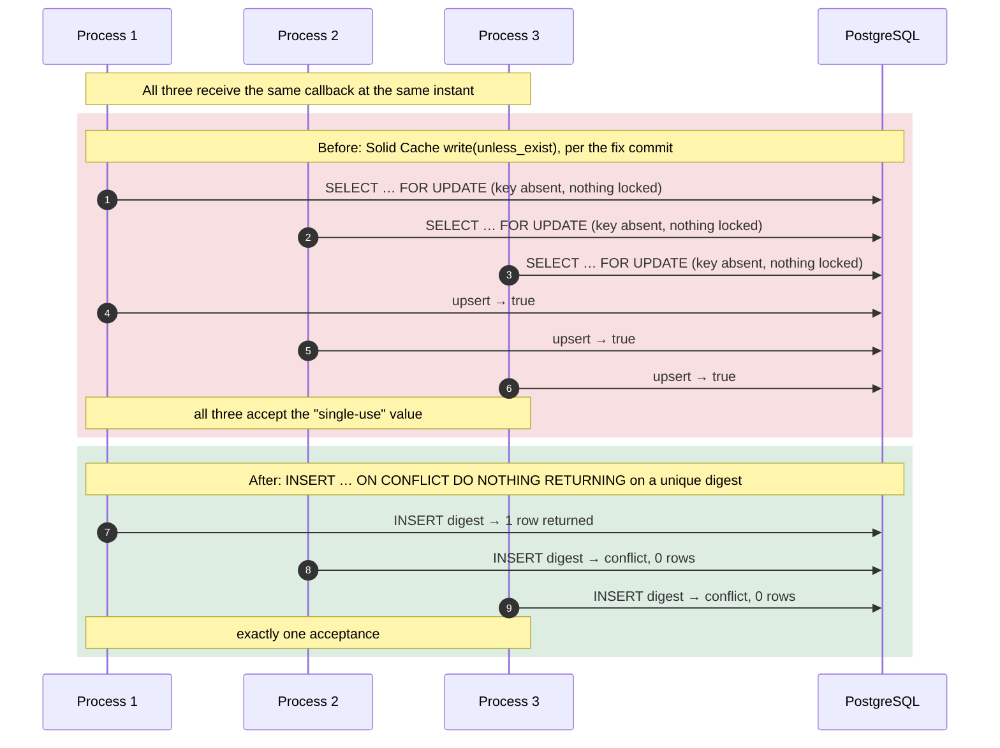

# Case 13 — A "single-use" sign-in token that several processes could all use

[← All case studies](README.md) · Topics: security, concurrency, atomicity · Evidence: [PR #71](https://github.com/XKeviNguyen/three_heavens/pull/71) (finding 1.2)

## Incident snapshot

| | |
| --- | --- |
| **Problem** | Google sign-in ceremonies and pending sign-ins were marked "used" with `Rails.cache.write(…, unless_exist: true)`. Under the production cache store, simultaneous callers could **all** be told they were first. |
| **Impact / risk** | A duplicated Google callback or sign-in completion could be accepted more than once, so the single-use guarantee did not hold under concurrency. No exploitation was observed or is claimed. |
| **Classification** | Security-relevant bug (P3, "class A: bug, fixed") in PR #71's audit table, measured against a real Solid Cache database. PR #69 had already listed "`unless_exist` in Solid Cache is not strictly atomic" as a known limitation. Not a reported production incident. |
| **Fixed in** | [`8a5cd84`](https://github.com/XKeviNguyen/three_heavens/commit/8a5cd843c81844183cefc9082f9f2963ff238bb9), merged 2026-10-04 |
| **Verification** | Forked-process test: 6 consumers released together, 5 rounds, exactly 1 success per round, for both ceremonies and pending sign-ins. |



## What went wrong

Google sign-in uses two values that must be spent exactly once:

- a **ceremony** token tied to the OAuth round trip;
- a short-lived **pending sign-in** that carries the user across a same-site redirect. That redirect was added in [Case 06](06-server-side-session-invalidation.md).

Both were "spent" by writing a cache key only if it did not already exist.

PR #71 measured the result against a real Solid Cache database: **4 processes consuming the same 300 keys accepted 207–223 keys more than once, some by all 4.**

## Root cause — the actual code

[`ceremony.rb#L70-L73` at `8c5d79c`](https://github.com/XKeviNguyen/three_heavens/blob/8c5d79cfe785b2edfbd09dd2c2f262483cdaf91b/app/services/google_identity/ceremony.rb#L70-L73):

```ruby
# True only for the first caller; a replayed credential carries a used nonce.
def consume!
  Rails.cache.write("google_identity/ceremony/#{id}", true, unless_exist: true, expires_in: TTL + 1.minute)
end
```

[`pending_sign_in.rb#L28-L39`](https://github.com/XKeviNguyen/three_heavens/blob/8c5d79cfe785b2edfbd09dd2c2f262483cdaf91b/app/services/google_identity/pending_sign_in.rb#L28-L39) used the same pattern.

The comment states the intent ("true only for the first caller"). Whether that holds depends entirely on the cache backend's implementation of `unless_exist`. Production uses `solid_cache_store`. According to the fix commit, Solid Cache implements `unless_exist` as `SELECT … FOR UPDATE` followed by an upsert. When the key is absent there is no row to lock, so every concurrent writer sees "absent" and every write reports success. The gem's source was not re-inspected for this write-up.

**The violated assumption:** a conditional cache write is an atomic compare-and-set. A cache API is a convenience contract; its atomicity under concurrency depends on the backend and is not a security primitive.

This is the same shape as [Case 11](11-two-tab-first-save-uniqueness-race.md): *row locks cannot serialize the creation of a row that does not exist yet.*

## How the fix works

Spending a value moved from the cache to a table in the primary database whose **unique index decides the first use** ([`consumed_nonce.rb` at `8e09b9c`](https://github.com/XKeviNguyen/three_heavens/blob/8e09b9c1862daa9ff6c689cafd04f5ad021691fc/app/models/consumed_nonce.rb)):

```ruby
# A single-use value that has been spent. The unique index decides the first
# use atomically across every process and thread: exactly one insert of a
# digest succeeds, and every later or simultaneous one inserts nothing.
class ConsumedNonce < ApplicationRecord
  def self.consume(namespace, value, expires_at:)
    digest = OpenSSL::Digest::SHA256.hexdigest("#{namespace}:#{value}")
    insert({ digest:, expires_at:, created_at: Time.current }, unique_by: :digest, returning: :digest).rows.any?
  end
end
```

- **One statement decides.** `INSERT … ON CONFLICT (digest) DO NOTHING RETURNING digest` returns a row for exactly one caller.
- **Only digests are stored.** The value is namespaced and hashed, and a `CHECK` admits only 64 lowercase hex characters ([migration](https://github.com/XKeviNguyen/three_heavens/blob/8e09b9c1862daa9ff6c689cafd04f5ad021691fc/db/migrate/20261003090000_create_consumed_nonces.rb)).
- **Bounded growth.** Each row expires when the value could no longer be accepted anyway, and the hourly `SessionCleanupJob` deletes expired rows.

Both callers now use it: `ConsumedNonce.consume("google_identity/ceremony", id, …)` and `ConsumedNonce.consume("google_identity/pending_sign_in", payload["n"], …)`.

## Before vs after

| Same value consumed concurrently | Before (Solid Cache) | After (unique index) |
| --- | --- | --- |
| 4 processes × 300 keys (fix commit's reproduction) | 207–223 keys accepted more than once, some 4 times | — |
| 6 forked processes × 5 rounds (regression test) | fails ("the old cache path fails it", per the commit) | exactly 1 acceptance every round |
| A later replay of a spent value | refused (single process) | refused |

## Reproduction and regression tests

- [`single_use_concurrency_test.rb`](https://github.com/XKeviNguyen/three_heavens/blob/8e09b9c1862daa9ff6c689cafd04f5ad021691fc/test/services/google_identity/single_use_concurrency_test.rb#L15-L70):
  - **`#L15`**: simultaneous consumers of one ceremony; exactly one succeeds, every round.
  - **`#L24`**: simultaneous completions of one pending sign-in; exactly one succeeds, every round.
  - Each consumer is a **forked OS process** with its own database connection, released together through a pipe. That way the outcome rests on PostgreSQL alone, not on Ruby thread scheduling.
- [`consumed_nonce_test.rb`](https://github.com/XKeviNguyen/three_heavens/blob/8e09b9c1862daa9ff6c689cafd04f5ad021691fc/test/models/consumed_nonce_test.rb):
  - a value is consumed once per namespace, and only its digest is stored;
  - the database refuses a non-digest value;
  - cleanup removes only expired rows.

The 300-key measurement was a separate reproduction against a real Solid Cache database. Its harness is not in the repository; the numbers come from the commit message and the PR #71 table. The test environment's `Rails.cache` is `:null_store`. The replay tests swapped in an in-process memory cache (`with_memory_cache`, removed by the fix). Neither exercises Solid Cache across processes, so the existing tests could not see this flaw. For the same reason, the forked test's failure on the old code comes from `:null_store` accepting every write, not from reproducing Solid Cache's race; the Solid Cache behaviour rests on the 300-key measurement.

## Trade-offs and remaining limitations

- One extra insert in the primary database per Google sign-in. That is negligible next to an OAuth round trip, and it makes the guarantee independent of the cache backend.
- PR #71 lists a related, separate item as *not fixed*: the pending sign-in is not bound to a specific browser (1.3, P4, documented rather than fixed). Exploiting it would require cookie injection, which already implies a compromised session.
- Whether the old flaw was exploitable through Google's real callback timing was **not established**. The fix removes the question instead of answering it.

## Lessons learned

- **Never build a security guarantee on a cache API.** "Write if absent" is only as atomic as the backend makes it.
- **Use the database's uniqueness check as the arbiter of "first".** One `INSERT … ON CONFLICT DO NOTHING RETURNING` is an exact, portable compare-and-set.
- **Test concurrency with processes when the guarantee must hold across processes.** Threads in one process can share state that hides the bug.

## Interview explanation

> Our Google sign-in flow had two single-use values, the OAuth ceremony token and a short-lived pending sign-in. We marked them spent with `Rails.cache.write(unless_exist: true)`. In production the cache is Solid Cache, backed by Postgres, and its conditional write does a `SELECT … FOR UPDATE` and then an upsert. When the key doesn't exist there's nothing to lock, so concurrent callers all succeed. A reproduction with 4 processes and 300 keys had 207 to 223 keys accepted more than once. We moved spending into a `consumed_nonces` table with a unique digest column and one `INSERT … ON CONFLICT DO NOTHING RETURNING`, so exactly one caller gets a row back. Only digests are stored and rows expire on schedule. The regression test forks six processes, releases them together and asserts exactly one success per round, which the old code fails. The lesson: cache APIs aren't security primitives, and uniqueness belongs to a database constraint.

## Sources

- PR: [#71 — V1.1 final mega stabilization](https://github.com/XKeviNguyen/three_heavens/pull/71) (finding 1.2)
- Corrective commit: [`8a5cd84`](https://github.com/XKeviNguyen/three_heavens/commit/8a5cd843c81844183cefc9082f9f2963ff238bb9)
- Earlier known limitation: [PR #69](https://github.com/XKeviNguyen/three_heavens/pull/69), limitations list, bullet "Single-use under Solid Cache"
- Identity docs: [Google sign-in](../identity/google-sign-in.md)
