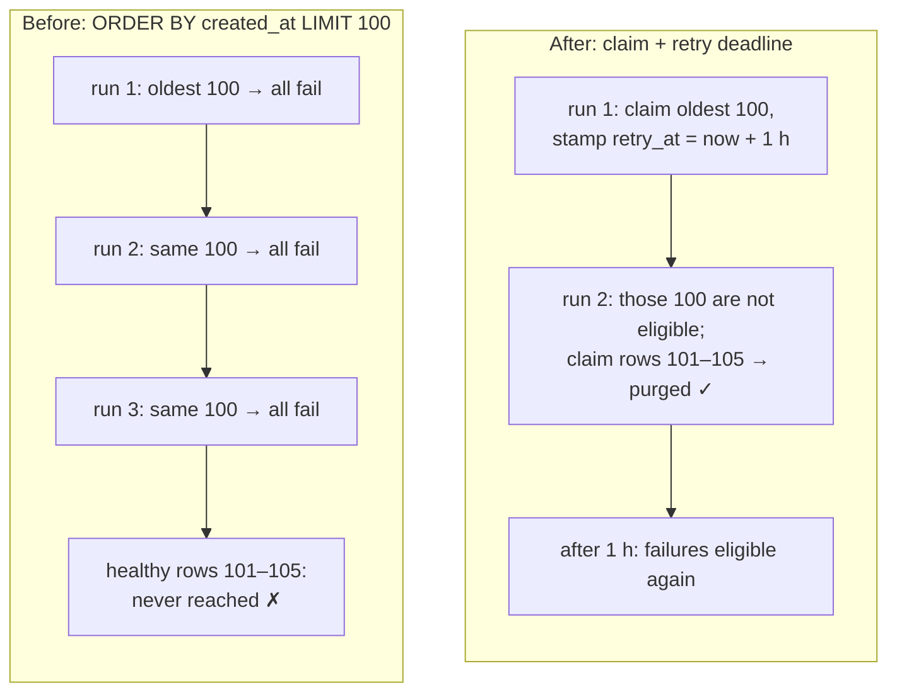

# Case 14 — Background sweeps that kept retrying the same broken rows

[← All case studies](README.md) · Topics: reliability, background jobs, fairness · Evidence: [PR #72](https://github.com/XKeviNguyen/three_heavens/pull/72), [PR #21](https://github.com/XKeviNguyen/three_heavens/pull/21)

## Incident snapshot

| | |
| --- | --- |
| **Problem** | Bounded cleanup and recovery jobs picked "the oldest N rows" each run. Rows that failed every time stayed oldest, so every run picked them again and never reached the healthy rows behind them. |
| **Impact / risk** | Abandoned files that should have been deleted, or automatic translation workflows that should have advanced, would wait indefinitely behind permanently failing rows. |
| **Classification** | **Blob cleanup:** P2 reproduced in PR #72's [failure-mode audit](../pr72_failure_modes.md) against the PR's own reviewed baseline `7d31de7`, and flagged by Codex review there. An earlier commit of the same PR created it and [`da810e2`](https://github.com/XKeviNguyen/three_heavens/commit/da810e25540193e1c2aae05d0dcae5f0014a10e0) fixed it before merge, so **it never shipped on `develop`**. **Pipeline reconciliation:** a design correction in PR #21 with a fairness regression test; no reproduction is recorded. Neither is a reported production incident. |
| **Fixed in** | PR #72 (2026-10-07): [`da810e2`](https://github.com/XKeviNguyen/three_heavens/commit/da810e25540193e1c2aae05d0dcae5f0014a10e0), blob retry deadlines.<br/>PR #21 (2026-08-29): [`1becdf5`](https://github.com/XKeviNguyen/three_heavens/commit/1becdf586409531418fb4f9976bac38cb8bdabff), reconciliation cursor. |
| **Verification** | 105 blobs with the oldest 100 failing permanently: the healthy tail is purged by the next run instead of never. 3 blocked pipelines and 1 recoverable pipeline with a batch of 3: the recoverable one advances on the second run. |



*The same pattern in both jobs: the batch was ordered by a key that a failing row never advances.*

## What went wrong

### Abandoned file cleanup (PR #72): one fix created the next bug

`ActiveStorageCleanupJob` deletes unattached files more than seven days old, at most 100 per run.

1. **On `develop` before PR #72**, the job called Active Storage's `Blob#purge`, which deletes the database row **first** and the file **second**. If the file deletion failed, the row, the only record that a file still needed deleting, was already gone, and the exception aborted the rest of the batch. The result was an orphaned file, not starvation.
2. **PR #72's first fix** ([`e16c2d3`](https://github.com/XKeviNguyen/three_heavens/commit/e16c2d342e01ea6d5339c823230013c7c32d5241)) added `ActiveStorageMaintenance::Purge`, which deletes the file first and **keeps the row** when storage raises `IOError`, so the failure stays retryable. That fixed the leak, but rows that failed every time now stayed at the front of the oldest-first queue.
3. **PR #72's failure-mode audit reproduced the new problem** at that intermediate state: "Oldest 100 delete calls persistently raise IOError; three 100-row invocations never reach the healthy five-row tail." [`da810e2`](https://github.com/XKeviNguyen/three_heavens/commit/da810e25540193e1c2aae05d0dcae5f0014a10e0) fixed it before the PR merged.

### Automatic workflow reconciliation (PR #21)

`PipelineReconciliationJob` re-advances running and blocked translation workflows, 100 per run by default. Blocked workflows, and running ones still waiting on their current stage, are examined and left unchanged.

## Root cause — the actual code

Blob cleanup at PR #72's reviewed baseline `7d31de7` ([`cleanup.rb#L30-L47`](https://github.com/XKeviNguyen/three_heavens/blob/7d31de73d068298fdd1a0391c574d8295b106953/app/services/active_storage_maintenance/cleanup.rb#L30-L47), [`purge.rb#L4-L19`](https://github.com/XKeviNguyen/three_heavens/blob/7d31de73d068298fdd1a0391c574d8295b106953/app/services/active_storage_maintenance/purge.rb#L4-L19)):

```ruby
def candidate_ids
  ActiveStorage::Blob.unattached
    .where(created_at: ..cutoff)
    .order(:created_at, :id)        # ← a failing blob's created_at never changes
    .limit(batch_size)
    .pluck(:id)
end
# …
Purge.call(blob:)                   # ← on IOError: logs, returns false, keeps the row
```

Pipeline reconciliation at `dcfa6a2` ([`pipeline_run.rb#L31`](https://github.com/XKeviNguyen/three_heavens/blob/dcfa6a24554821965281f870e356d952b4f1d181/app/models/pipeline_run.rb#L31), [`reconcile.rb#L12-L20`](https://github.com/XKeviNguyen/three_heavens/blob/dcfa6a24554821965281f870e356d952b4f1d181/app/services/pipelines/reconcile.rb#L12-L20)):

```ruby
scope :reconcilable, -> { where(status: %w[running blocked]).order(:updated_at, :id) }

ids = PipelineRun.reconcilable.limit(limit).pluck(:id)   # ← a run that Advance doesn't
# …                                                       # ←   change keeps its old updated_at
```

**The violated assumption:** that processing a row moves it out of the way. A *failed* attempt changes nothing about the row, so a sort key derived from the row's own data (`created_at`, `updated_at`) puts it right back at the front of the queue. Once failures fill a whole batch, the rows behind them starve.

## How the fix works

Record **that a row was looked at**, separately from whether the attempt succeeded, and order by that.

**Blob cleanup** ([`cleanup.rb#L32-L48` at `0a82540`](https://github.com/XKeviNguyen/three_heavens/blob/0a82540f32e86f88883b4ef47275fee5c3a26131/app/services/active_storage_maintenance/cleanup.rb#L32-L48)):

```ruby
def claim_candidates
  ActiveStorage::Blob.transaction do
    ids = candidate_scope.limit(batch_size).lock("FOR UPDATE OF active_storage_blobs SKIP LOCKED").pluck(:id)
    # Commit a retry deadline before filesystem work. Failure or process
    # death remains discoverable, but cannot monopolize the oldest batch.
    ActiveStorage::Blob.where(id: ids).update_all(cleanup_retry_at: RETRY_DELAY.from_now)
    ids
  end
end
```

- The claimed rows get `cleanup_retry_at = now + 1 hour` **before** any storage call. Whether the deletion fails or the process dies, those rows step aside until the deadline passes.
- Candidates are ordered by `COALESCE(cleanup_retry_at, created_at + 7 days)`, so a retried row rejoins the queue at its retry time.
- `SKIP LOCKED` lets two cleanup runs work side by side without contending for the same rows.
- `ActiveStorageMaintenance::Purge` turns storage errors into a `false` result. One bad blob no longer aborts the rest of its batch.

**Pipeline reconciliation** ([`reconcile.rb#L24-L39` at `74ac8fc`](https://github.com/XKeviNguyen/three_heavens/blob/74ac8fc1f6de10c675891608c1c4d7a7bbede159/app/services/pipelines/reconcile.rb#L24-L39)):

```ruby
pipeline_run = PipelineRun.reconcilable
                          .where.not(id: excluding)
                          .order(Arel.sql("last_reconciled_at ASC NULLS FIRST"), :id)
                          .lock("FOR UPDATE SKIP LOCKED")
                          .first
# …
Advance.call(pipeline_run: pipeline_run)
pipeline_run.update_columns(last_reconciled_at: at)   # ← stamped whether or not it advanced
```

A **fairness cursor**, `last_reconciled_at`, means every examined workflow moves to the back of the queue, advanced or not.

## Before vs after

| Scenario | Before | After |
| --- | --- | --- |
| 105 abandoned blobs, the oldest 100 always fail to delete | At `7d31de7`: the healthy 5 are never reached (reproduced in PR #72) | Run 1 claims the 100 failures; run 2 purges the healthy 5; the failures stay discoverable |
| Next run within the hour | The same 100 failures | 0 candidates (deadlines hold) |
| Storage recovers, 1 hour later | — | The 100 are purged |
| 3 blocked workflows + 1 recoverable, batch size 3 | The recoverable one waits behind the blocked ones (by `updated_at`) | Reached on the second run and advanced to review |

## Reproduction and regression tests

- [`replay_adversarial_test.rb#L119` at `0a82540`](https://github.com/XKeviNguyen/three_heavens/blob/0a82540f32e86f88883b4ef47275fee5c3a26131/test/integration/replay_adversarial_test.rb#L119-L142), *persistent oldest blob failures cannot starve later healthy candidates*.
  - Creates 105 blobs. The storage service's `delete` raises `IOError` for the first 100.
  - Runs cleanup three times, each run claiming at most 100.
  - Asserts the newest (healthy) blob is gone, the 100 failing blobs remain, and a fourth run finds 0 candidates.
  - After the retry delay, with storage restored, all 100 are purged.
- [`#L144`](https://github.com/XKeviNguyen/three_heavens/blob/0a82540f32e86f88883b4ef47275fee5c3a26131/test/integration/replay_adversarial_test.rb#L144), *an unavailable legacy service cannot abort healthy cleanup or its successor*. 99 of 100 are purged and the follow-up job is still enqueued.
- [`pipeline_jobs_test.rb#L76` at `74ac8fc`](https://github.com/XKeviNguyen/three_heavens/blob/74ac8fc1f6de10c675891608c1c4d7a7bbede159/test/jobs/pipeline_jobs_test.rb#L76-L100), *least recently reconciled cursor prevents blocked rows from starving later recoverable work*.
  - The first run with a batch of 3 examines the 3 blocked workflows and leaves the recoverable one unstamped.
  - The second run reaches it, moves it to review, and creates exactly one review round.

PR #72's failure-mode audit records the blob starvation as reproduced at `7d31de7`, an intermediate commit of the same PR. PR #21 does not record a failing run for the reconciliation test.

## Trade-offs and remaining limitations

- PR #72: "Healthy drainage requires service capacity above arrivals; worker/scheduler outages and permanently unavailable storage remain documented limits." Fairness doesn't help if the job never runs or storage never recovers.
- A permanently failing blob is retried hourly forever. It stays *discoverable*, which is intentional, but is never deleted until storage works.
- The one-hour delay is a fixed constant, not exponential backoff.
- [`docs/pr72_failure_modes.md`](../pr72_failure_modes.md) gives an analytic bound for draining a finite snapshot of N candidates: at most `floor(N/100)+1` runs. That is analysis, not a measurement.

## Lessons learned

- **A bounded batch needs a cursor that every attempt advances**, success or failure. Otherwise the batch is only as good as its worst rows.
- **Record the claim before the risky work.** If the process dies mid-batch, the claimed rows still step aside.
- **A fix that makes failures retryable must also make them yield.** Keeping the row was right; leaving it at the head of the queue was not.
- **Test with poison data that fills a whole batch.** A single failing row never shows this bug; a full batch of them does.

## Interview explanation

> Our daily cleanup job deleted abandoned uploads, 100 at a time, oldest first. Originally Active Storage's purge deleted the database row before the file, so a storage failure lost track of the file. Our first fix kept the row when deletion failed, so the job could retry. But those rows stayed oldest, so every run picked the same failures again. In our audit, with the oldest 100 failing permanently, five healthy blobs behind them were never reached. We caught that before merging. The final fix claims each batch in a short transaction and stamps a one-hour retry deadline before touching storage. Failed rows step aside, remain discoverable, and the very next run reaches the healthy tail; concurrent runs skip rows another run has already claimed. Our workflow reconciler had the same shape, ordered by `updated_at`, which a stuck workflow never changes, so it now stamps a `last_reconciled_at` cursor on every row it examines. The lesson: a bounded sweep needs a cursor that advances whether the attempt succeeds or not.

## Sources

- PRs: [#72](https://github.com/XKeviNguyen/three_heavens/pull/72) (row "Storage poison starvation"), [#21](https://github.com/XKeviNguyen/three_heavens/pull/21) ("`last_reconciled_at` fairness cursor")
- Commits: [`da810e2`](https://github.com/XKeviNguyen/three_heavens/commit/da810e25540193e1c2aae05d0dcae5f0014a10e0), [`1becdf5`](https://github.com/XKeviNguyen/three_heavens/commit/1becdf586409531418fb4f9976bac38cb8bdabff)
- Design notes: [`docs/pr72_failure_modes.md`](../pr72_failure_modes.md) ("Cleanup fairness and throughput")
