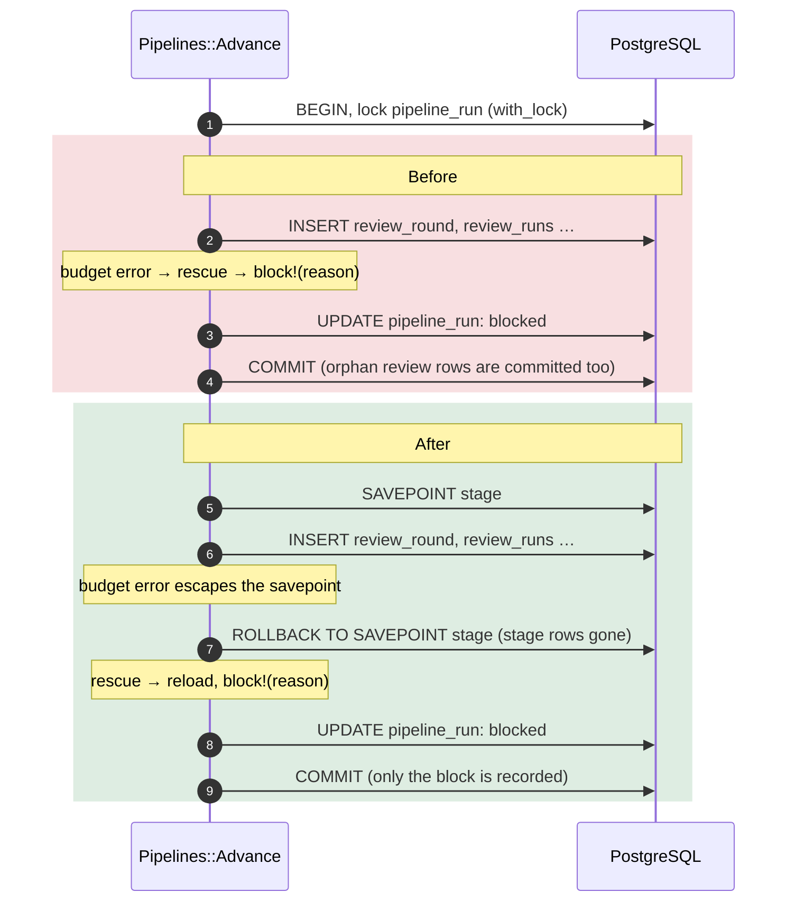

# Case 15 — A `rescue` inside a transaction committed half-built work

[← All case studies](README.md) · Topics: data consistency, transactions, recovery · Evidence: [PR #43](https://github.com/XKeviNguyen/three_heavens/pull/43)

## Incident snapshot

| | |
| --- | --- |
| **Problem** | When an automatic workflow stage failed its budget check *after* creating some rows, the error was rescued inside the same transaction. The workflow was marked blocked, and the half-created review, judge or refinement rows were committed with it. |
| **Impact / risk** | Orphan rounds with no queued work. PR #43: "Those rows had no enqueued work and could obstruct recovery". After the cause was fixed (for example a larger model context), recovery could be obstructed. |
| **Classification** | P2 from the V1 release audit, reproduced with deterministic local tests and fake provider responses. Not a reported production incident. |
| **Fixed in** | [`f4579d7`](https://github.com/XKeviNguyen/three_heavens/commit/f4579d782fc841ea66a81f5f8a1b2150cf7d2bb5), merged 2026-09-10 |
| **Verification** | Three regression tests (review, judge, refinement). PR #43: "the new regressions first reproduced the defects; affected tests passed after correction." |



## What went wrong

An automatic translation workflow moves through stages: translation → blind review → judging → refinement. Each stage creates a round of rows, for example `ReviewRound`, `ReviewRun` and `ReviewEvaluation`, and schedules AI jobs for them.

Some checks only fail partway through creating a stage. An example is "this model's context window cannot fit the reference material". The intended behaviour is to mark the workflow **blocked** with a reason and let the owner fix the cause and resume.

## Root cause — the actual code

[`advance.rb#L18-L36` at `612d516`](https://github.com/XKeviNguyen/three_heavens/blob/612d516292897201ab8a907aec95bfeac4560eef/app/services/pipelines/advance.rb#L18-L36), where the `rescue` clauses belong to the `with_lock` block:

```ruby
def call
  pipeline_run.with_lock do                       # ← one transaction for everything below
    return pipeline_run if pipeline_run.stopped? || pipeline_run.ready_for_editor?

    send("advance_#{pipeline_run.current_stage}")  # ← creates stage rows, then may raise
  rescue WorkflowProfiles::RoutingModels::ConfigurationUnavailableError
    block!(reason: "configuration_unavailable")
  rescue BlindReviews::Start::Error, Judging::Start::Error, FinalTranslations::Error => error
    # …
    block!(reason: reason)                        # ← still inside the same transaction
  end
  pipeline_run
end
```

Rescuing an exception **inside** a transaction block stops it from reaching the block's boundary. ActiveRecord only rolls back when an exception escapes the block, so it commits normally, including every row the failed stage had already inserted.

The code was introduced with the automatic pipelines in [`de1cd64`](https://github.com/XKeviNguyen/three_heavens/commit/de1cd648ce4b682840bd827820dba6880fc15fff) (PR #20).

**The violated assumption:** that "handling" an error and "undoing its effects" happen together. Inside a transaction, a `rescue` handles the error but keeps every effect.

## How the fix works

Each stage runs in a **nested transaction (a savepoint)**, so a failure inside the stage rolls the stage back without losing the outer lock or the ability to record the block
([`advance.rb#L18-L42` at `adc1733`](https://github.com/XKeviNguyen/three_heavens/blob/adc17337650db5b5bf99b2a06c1539f72f4e9c84/app/services/pipelines/advance.rb#L18-L42)):

```ruby
pipeline_run.with_lock do
  return pipeline_run if pipeline_run.stopped? || pipeline_run.ready_for_editor?

  # A failed stage must roll back its graph and commit callbacks before
  # the outer transaction records the recoverable pipeline block.
  PipelineRun.transaction(requires_new: true) do        # ← SAVEPOINT
    send("advance_#{pipeline_run.current_stage}")
  end
rescue WorkflowProfiles::RoutingModels::ConfigurationUnavailableError
  pipeline_run.reload                                   # ← drop in-memory changes from the rolled-back stage
  block!(reason: "configuration_unavailable")
rescue BlindReviews::Start::Error, Judging::Start::Error, FinalTranslations::Error => error
  pipeline_run.reload
  # …
  block!(reason: reason)
end
```

Three details matter:

- **`requires_new: true`** creates a real `SAVEPOINT`. A plain nested `transaction` call in Rails joins the outer transaction and would not roll back on its own.
- **The exception escapes the savepoint block**, which rolls it back, and is then rescued by the outer block, which records the block reason and commits.
- **`pipeline_run.reload`** throws away in-memory attribute changes made by the rolled-back stage, so `block!` writes from the database's state.

The savepoint also rolls back **commit callbacks** registered inside it. Jobs are enqueued after commit (see [Case 08](08-double-submit-exactly-once-launch.md)), so a rolled-back stage schedules no AI work.

## Before vs after

| After a budget failure while starting a stage | Before | After |
| --- | --- | --- |
| Pipeline status | `blocked` with a reason | `blocked` with a reason |
| Half-created round, run and evaluation rows | **committed** (orphans) | rolled back (0 rows) |
| Jobs enqueued for the failed stage | none (the rows had no work) | none |
| Owner fixes the cause and the stage restarts | could be obstructed by the orphan round | starts cleanly; jobs enqueued |

## Reproduction and regression tests

[`test/services/pipelines/advance_test.rb` at `adc1733`](https://github.com/XKeviNguyen/three_heavens/blob/adc17337650db5b5bf99b2a06c1539f72f4e9c84/test/services/pipelines/advance_test.rb#L161-L232):

- **`#L161`**, *review budget failure rolls back the entire stage before recording its block*.
  - It shrinks the reviewer model's context window (6,000 tokens) and runs the recurring `Pipelines::Reconcile`.
  - Asserts: **no change** in `ReviewRound`, `ReviewRun` or `ReviewEvaluation` counts; no `ReviewRunJob` enqueued; the pipeline blocked and still in translation.
  - Then it raises the context window, advances again, and asserts exactly one `ReviewRunJob` and the review stage.
- **`#L182`**, *judge budget failure leaves no partial round and can recover*. The same pattern for `JudgeRound`, `JudgeRun` and `JudgeEvaluation`.
- **`#L205`**, *refinement budget failure rolls back draft and round creation together*. Covers `FinalTranslation`, `FinalTranslationVersion`, `FinalizationRound` and `FinalizationRun`, with no "final workspace created" event.

PR #43 records that these regressions first reproduced the defects and passed after the correction, using "deterministic local tests and fake provider responses". No real provider call was made.

## Trade-offs and remaining limitations

- A savepoint costs one extra round trip per stage advance, which is negligible next to an AI call.
- The fix covers the exceptions `Advance` rescues. Any new rescue added *inside* a transaction elsewhere would need the same care. The pattern is a review checklist item, not something the framework enforces.
- PR #43's overall audit verdict was conditional ("controlled smoke testing has not begun") and covered other findings. This case is only item 1 of that PR.
- `Pipelines::Advance` still uses the savepoint on `develop` [`c39a15c`](https://github.com/XKeviNguyen/three_heavens/blob/c39a15c1dfdda7718658865ae00f4ce07d4eec01/app/services/pipelines/advance.rb).

## Lessons learned

- **A `rescue` inside a transaction keeps every write made before the error.** Either let the exception escape the transaction, or give the failing part its own savepoint.
- **In Rails, nested transactions need `requires_new: true` to mean anything.** Without it, the inner block is just part of the outer one.
- **Test recovery, not just failure.** These tests fix the cause afterwards and prove the stage restarts cleanly, which is the behaviour orphan rows broke.

## Interview explanation

> Our automatic translation pipeline advanced stages inside a row lock, which is one database transaction. If starting the review stage failed a budget check, we rescued the error and marked the pipeline blocked so the owner could fix it. But the rescue was inside the transaction, so it committed normally, along with the review round and runs the stage had already inserted. Those orphans had no queued jobs and got in the way of a clean restart. The fix wraps each stage in `transaction(requires_new: true)`, which is a real savepoint. The exception rolls the stage back to the savepoint, the outer block still records the blocked status, and we reload the model to drop stale in-memory state. Three regression tests shrink a model's context window to force the failure, assert zero round, run or evaluation rows and zero jobs, then fix the limit and prove the stage starts with exactly one job. The lesson: handling an error inside a transaction doesn't undo its writes.

## Sources

- PR: [#43 — Correct V1 release audit recovery, privacy, and segmentation defects](https://github.com/XKeviNguyen/three_heavens/pull/43) (item 1, "Failed automatic stage creation could commit partial state")
- Corrective commit: [`f4579d7`](https://github.com/XKeviNguyen/three_heavens/commit/f4579d782fc841ea66a81f5f8a1b2150cf7d2bb5)
- Introduced in: [`de1cd64`](https://github.com/XKeviNguyen/three_heavens/commit/de1cd648ce4b682840bd827820dba6880fc15fff) ([PR #20](https://github.com/XKeviNguyen/three_heavens/pull/20))
