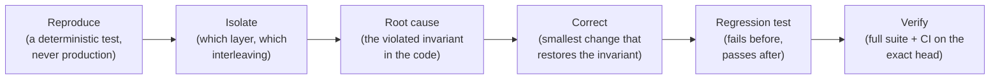

# Three Heavens — Engineering Case Studies

Fifteen engineering cases, mostly defects plus some design hardening, from building [Three Heavens](https://github.com/XKeviNguyen/three_heavens), a Rails 8.1 and PostgreSQL 17 translation workspace. Each case traces one failure from symptom to root cause, fix and regression test, with links to the exact code before and after the change.

**Evidence standard**

- Every case is reconstructed from its merged pull request, the corrective commits, the code at the commit **before** the fix, and the tests that pin the fix.
- Measurements are copied from the PRs together with their environment and workload. Where the record is silent, the case says *not established*.
- Audit reproductions, CI failures and design hardening are labelled as such. **None of these cases is a reported outage or data loss on the live site.**

## How to read a case

| Time | Read | You get |
| --- | --- | --- |
| 30 seconds | *Incident snapshot* + the first diagram | What broke, why it mattered, the fix in one picture |
| 2 minutes | *What went wrong*, *Root cause*, *How the fix works* | The mechanism and the design decision |
| 10 minutes | Code excerpts, tests, *Trade-offs*, *Sources* | Enough to verify every claim against the repository |

Just before its sources, each case gives a 60-second **interview explanation**: problem → root cause → fix → verification → lesson.

## Where the failures live

*Blue tags are case numbers. Most defects sit on a boundary: between browser and server, between two concurrent actors, or between PostgreSQL and storage.*

## The cases

| # | Case | What failed | Fix in one line | Evidence |
| --- | --- | --- | --- | --- |
| 01 | [A backup that could not be restored](01-postgresql-restore-and-binary-fidelity.md) | `pg_restore` failed on a `CHECK` whose function relied on `search_path`, and binary files broke text-mode extraction | Fully qualified built-in hashing, sectioned restore, `binmode` | [#64](https://github.com/XKeviNguyen/three_heavens/pull/64) |
| 02 | [A lost autosave response made the next edit a conflict](02-autosave-lost-response.md) | A committed save with a lost response made the page's next edit look like another tab | Editor identity + monotonic sequence | [#64](https://github.com/XKeviNguyen/three_heavens/pull/64) |
| 03 | [A per-request limit did not stop many requests](03-concurrent-request-memory.md) | 80 concurrent 30 MiB bodies OOM-killed the container | jemalloc decay 0 + per-socket buffer caps | [#68](https://github.com/XKeviNguyen/three_heavens/pull/68) |
| 04 | [One `require` line broke the production preflight](04-bundler-boot-order.md) | Default `json` activated before Bundler pinned the locked version | Delete the early require; fresh-process test | [#44](https://github.com/XKeviNguyen/three_heavens/pull/44) |
| 05 | [A red CI build that was a test race](05-turbo-system-test-races.md) | The test used a shared sidebar before Turbo had rendered the next page | Wait for page-specific state, never sleep | [#70](https://github.com/XKeviNguyen/three_heavens/pull/70) |
| 06 | [Sign-out did not revoke a copied cookie](06-server-side-session-invalidation.md) | The cookie store kept `user_id` client-side | Server-side session rows | [#69](https://github.com/XKeviNguyen/three_heavens/pull/69) |
| 07 | [An older upload response overwrote newer text](07-async-source-import-ownership.md) | A response checked its replay key but not whether the user had moved on | Source generation + ownership check after each `await` | [#77](https://github.com/XKeviNguyen/three_heavens/pull/77) |
| 08 | [Launching paid AI work once](08-double-submit-exactly-once-launch.md) | Every POST built a new launch graph (hardening) | One-time submission token, row lock, replay | [#21](https://github.com/XKeviNguyen/three_heavens/pull/21), [#64](https://github.com/XKeviNguyen/three_heavens/pull/64) |
| 09 | [Back and Forward while a save is in flight](09-back-forward-turbo-history-races.md) | Stale snapshots, late renders, corrupted history, fragment no-op | Claim `popstate` before Turbo, reload after acknowledgement | [#64](https://github.com/XKeviNguyen/three_heavens/pull/64), [#72](https://github.com/XKeviNguyen/three_heavens/pull/72) |
| 10 | [Deleting the winner's draft revived the loser](10-retry-after-discard-and-rejected-editor.md) | The record of a rejection lived on a deletable row | Editor ledger: `active / rejected / retired` | [#72](https://github.com/XKeviNguyen/three_heavens/pull/72) |
| 11 | [A validation raced the unique index](11-two-tab-first-save-uniqueness-race.md) | `RecordInvalid` instead of the handled `RecordNotUnique` | Remove the racy validation; the index decides | [#66](https://github.com/XKeviNguyen/three_heavens/pull/66) |
| 12 | [Uploads, lost responses and quota races](12-upload-response-loss-and-atomic-quota.md) | Duplicate imports, early "ready", a mischarged budget | Request key, pending→ready, advisory lock, atomic upsert | [#64](https://github.com/XKeviNguyen/three_heavens/pull/64), [#71](https://github.com/XKeviNguyen/three_heavens/pull/71), [#72](https://github.com/XKeviNguyen/three_heavens/pull/72) |
| 13 | [A "single-use" token several processes could use](13-single-use-tokens-and-non-atomic-cache-writes.md) | A cache `write(unless_exist:)` was not atomic | `INSERT … ON CONFLICT DO NOTHING RETURNING` | [#71](https://github.com/XKeviNguyen/three_heavens/pull/71) |
| 14 | [Sweeps that kept retrying the same broken rows](14-bounded-sweeps-that-starve-their-tail.md) | Oldest-first batches never reached rows behind permanent failures | Claim + retry deadline / fairness cursor | [#72](https://github.com/XKeviNguyen/three_heavens/pull/72), [#21](https://github.com/XKeviNguyen/three_heavens/pull/21) |
| 15 | [A `rescue` inside a transaction committed half-built work](15-rescue-inside-a-transaction-commits-partial-state.md) | A rescued stage error committed orphan rows | Savepoint per stage | [#43](https://github.com/XKeviNguyen/three_heavens/pull/43) |

## Cases by engineering topic

| If you're interested in… | Start with | Then |
| --- | --- | --- |
| **Security** | [06](06-server-side-session-invalidation.md) revocation | [13](13-single-use-tokens-and-non-atomic-cache-writes.md) atomic single use, [03](03-concurrent-request-memory.md) resource exhaustion |
| **Data consistency** | [11](11-two-tab-first-save-uniqueness-race.md) validation vs constraint | [15](15-rescue-inside-a-transaction-commits-partial-state.md) savepoints, [10](10-retry-after-discard-and-rejected-editor.md) negative knowledge, [01](01-postgresql-restore-and-binary-fidelity.md) restore |
| **Concurrency** | [02](02-autosave-lost-response.md) lost acknowledgements | [08](08-double-submit-exactly-once-launch.md), [12](12-upload-response-loss-and-atomic-quota.md), [13](13-single-use-tokens-and-non-atomic-cache-writes.md) |
| **Performance and resources** | [03](03-concurrent-request-memory.md) aggregate memory | [14](14-bounded-sweeps-that-starve-their-tail.md) batch fairness |
| **CI and testing** | [05](05-turbo-system-test-races.md) flaky test vs real bug | [04](04-bundler-boot-order.md) fresh-process tests |
| **Reliability** | [01](01-postgresql-restore-and-binary-fidelity.md) proven recovery | [14](14-bounded-sweeps-that-starve-their-tail.md), [15](15-rescue-inside-a-transaction-commits-partial-state.md) |
| **UX state** | [07](07-async-source-import-ownership.md) async ownership | [09](09-back-forward-turbo-history-races.md) Back/Forward |

### Recurring patterns

- **Locking a row that doesn't exist yet locks nothing.** In [11](11-two-tab-first-save-uniqueness-race.md) and [13](13-single-use-tokens-and-non-atomic-cache-writes.md), a unique constraint is what makes "first" well-defined.
- **A timeout means *unknown*, not *failed*.** See [02](02-autosave-lost-response.md), [07](07-async-source-import-ownership.md), [08](08-double-submit-exactly-once-launch.md), [10](10-retry-after-discard-and-rejected-editor.md) and [12](12-upload-response-loss-and-atomic-quota.md).
- **The check must cover the whole resource.** One request ([03](03-concurrent-request-memory.md)), one row ([12](12-upload-response-loss-and-atomic-quota.md)) or one browser ([06](06-server-side-session-invalidation.md)) is not the system.

## Terms used

| Term | Meaning here |
| --- | --- |
| **Idempotent** | Repeating a request has the same effect as sending it once. |
| **Replay** | A repeated delivery of the same action, answered with the original outcome. |
| **Optimistic locking** | A write succeeds only if the row's version is still the one the client read (`lock_version`). |
| **Row lock / advisory lock** | PostgreSQL locks: one on a specific row (`SELECT … FOR UPDATE`), one on an arbitrary application key. |
| **Savepoint** | A nested transaction that can be rolled back without abandoning the outer one. |
| **Unique index** | A database constraint that rejects a second row with the same key, atomically with the write. |
| **OOM-killed** | Terminated by the kernel for exceeding the container's memory limit (cgroup). |
| **Turbo / Stimulus** | The page-navigation and JavaScript-controller libraries the UI uses. |
| **bfcache** | The browser's back-forward cache, which can restore a whole page from memory. |

## The debugging method behind every case

Case 05 shows the first step mattering most: the "regression" turned out to be the test.

## Historical findings vs live guarantees

- **These are snapshots.** Code links are pinned to commit SHAs on `develop`: the parent of each fix (*before*), the merge (*after*), and sometimes `develop` at [`c39a15c`](https://github.com/XKeviNguyen/three_heavens/tree/c39a15c1dfdda7718658865ae00f4ce07d4eec01) (*current*). Later work may have changed the mechanism, and each case notes what it knows about that.
- **Test counts and measurements belong to the PR that recorded them**, not to today's deployment.
- **Not a certification.** Nothing here is a security audit, an uptime claim, or proof that every interleaving was explored. Where a test matrix is finite, the case says so.
- **No private data.** The repository contains no personal data, secrets, real credentials or production dumps, and neither do these pages.

## Coverage: what was considered and not written up

The collection is a selection. Merged corrective PRs were reviewed for further cases, with these results:

| Candidate | Status | Why not a case (yet) |
| --- | --- | --- |
| Lineage trigger loophole for childless records ([#53](https://github.com/XKeviNguyen/three_heavens/pull/53)) | Fixed, good evidence | A strong runner-up; overlaps with the database-integrity lessons in 11 and 15 |
| Glossary ownership enforced in PostgreSQL triggers ([#30](https://github.com/XKeviNguyen/three_heavens/pull/30), [#31](https://github.com/XKeviNguyen/three_heavens/pull/31)) | Fixed | Defence in depth rather than a single failure; #53 is the sharper lesson |
| Uploads parsed before any budget charge ([#80](https://github.com/XKeviNguyen/three_heavens/pull/80)) | Fixed | Extends 03 and 12; noted in 12 |
| Model-catalog backoff and single-flight ([#65](https://github.com/XKeviNguyen/three_heavens/pull/65)) | Fixed | Measurements are in the PR; the code was not re-verified for this collection |
| Fail closed unless the model finished cleanly ([#27](https://github.com/XKeviNguyen/three_heavens/pull/27)) | Fixed | Not re-verified in code for this collection |
| Per-account sign-in throttling ([#69](https://github.com/XKeviNguyen/three_heavens/pull/69)) | Fixed | Its client-IP premise depends on the proxy chain, an area still open in #87 |
| Supply-chain pinning ([#42](https://github.com/XKeviNguyen/three_heavens/pull/42)) | Hardening | Not a defect with a root cause |
| **Client IP through the Cloudflare Tunnel ([#87](https://github.com/XKeviNguyen/three_heavens/pull/87))** | **Open, unresolved** | Excluded from the resolved cases until it is merged and verified |
