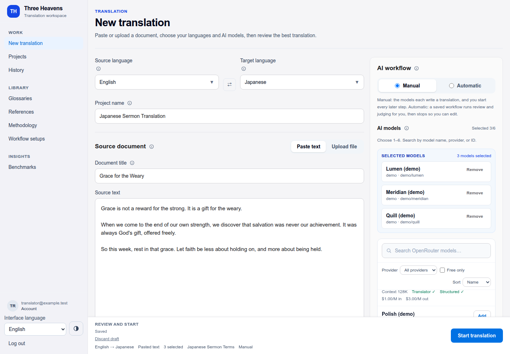
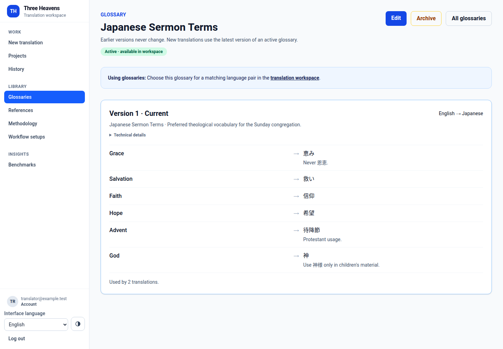
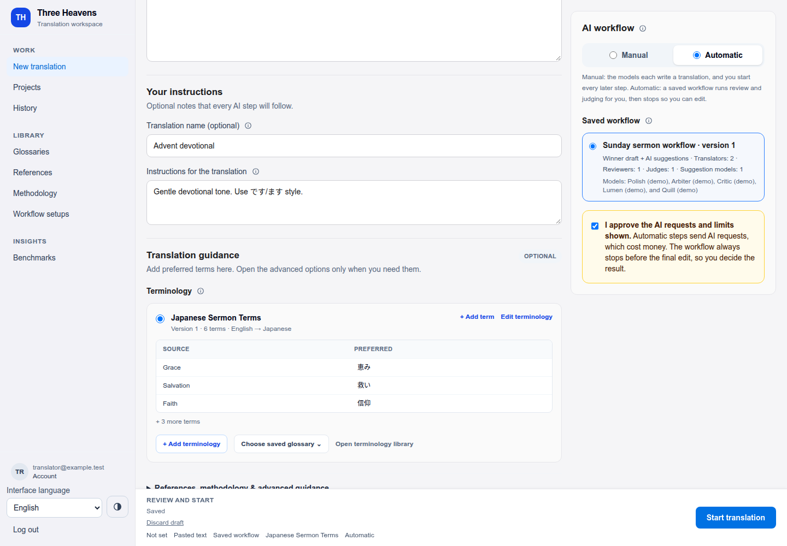
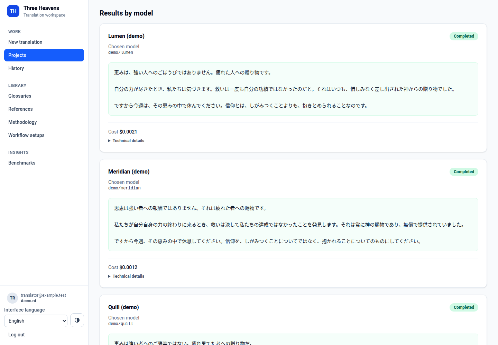
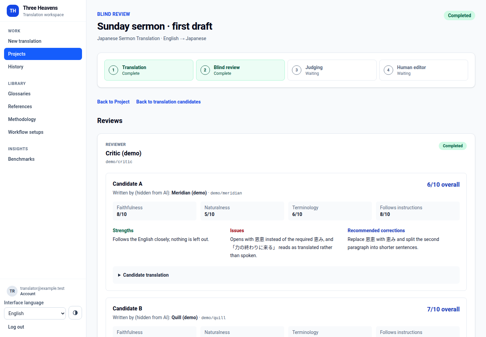
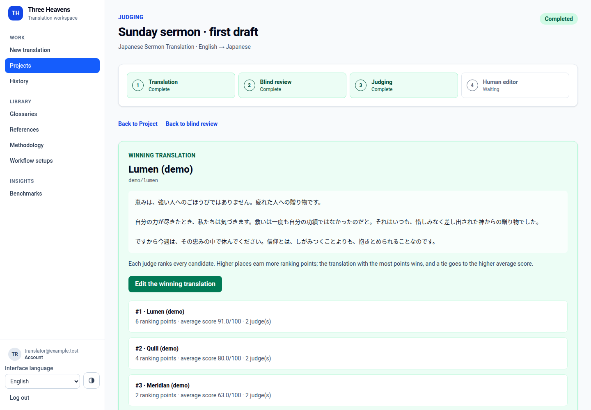
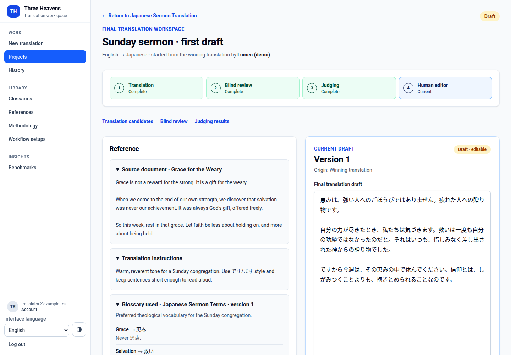
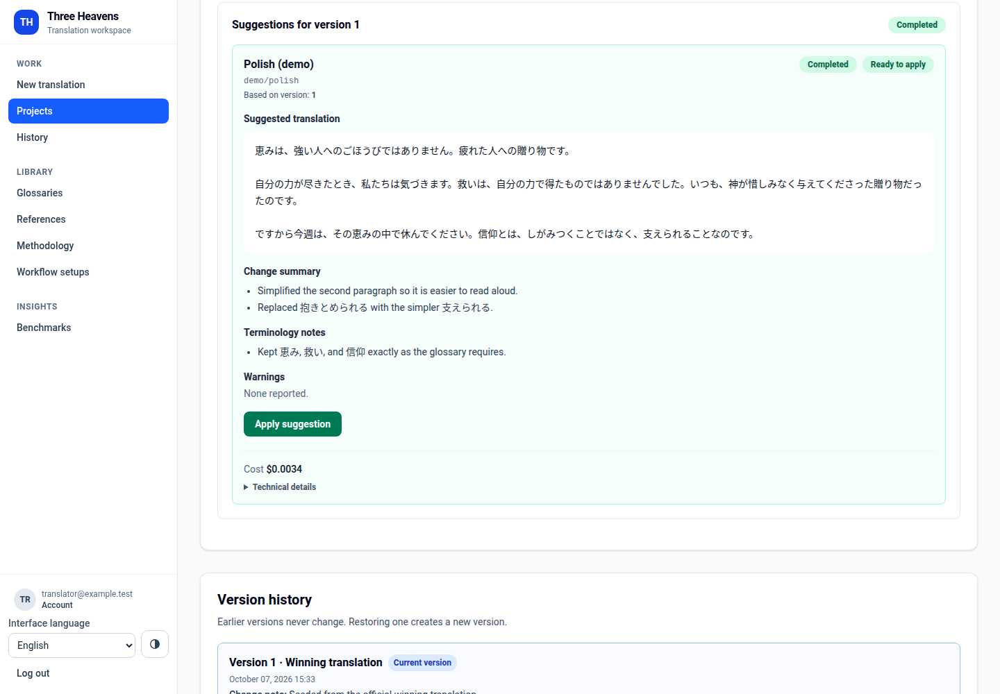
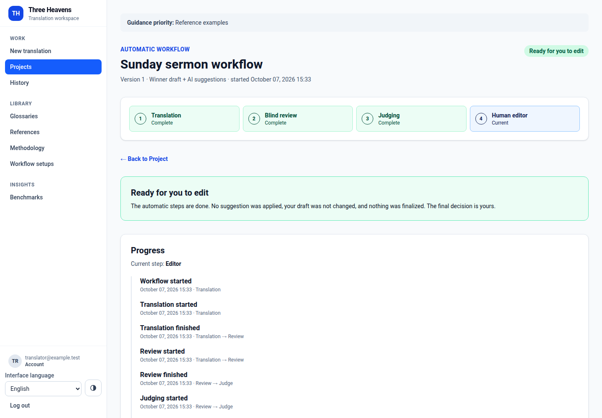
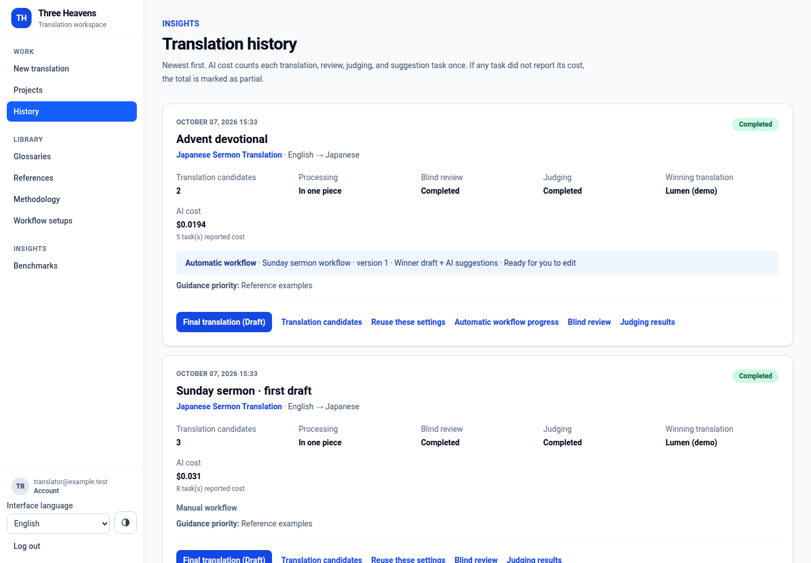

# User guide

A walkthrough of Three Heavens from sign-in to an approved translation. Screenshots use synthetic demo data; see [the README](../README.md) for how they are produced. The interface language can be switched between English, Vietnamese, and Japanese at the bottom of the sidebar.

## Key terms

| English | Tiếng Việt | 日本語 | Meaning |
| --- | --- | --- | --- |
| Translation | Lượt dịch | 翻訳 | One source text translated by several models |
| Translation candidates | Bản dịch ứng viên | 翻訳候補 | Each model's independent translation |
| Blind review | Nhận xét ẩn danh | ブラインドレビュー | Models score candidates without seeing who wrote them |
| Judging | Chấm điểm | 判定 | Models rank the candidates; the rankings choose a winner |
| AI suggestions | Đề xuất chỉnh sửa | 修正案 | Proposed improvements you may apply to your draft |
| Version | Phiên bản | 版 | A saved state of your final translation |
| Glossary | Bảng thuật ngữ | 用語集 | Terms that must always be translated the same way |
| Reference | Bản dịch tham khảo | 参考訳 | An approved example translation the AI should imitate |
| Workflow setup | Cấu hình quy trình | ワークフロー設定 | Saved models for an automatic run |
| Translation history | Lịch sử dịch | 翻訳履歴 | Every translation with its winner and cost |

## 1. Sign in

Create an account with your email and a password of at least 12 characters, then confirm your email from the message you receive. If the server has Google sign-in configured you can also continue with Google, or connect Google later under **Account**.

Translation itself needs **AI access**, which an administrator turns on under **Admin → Users**. Without it you can still prepare documents, glossaries, references, methodologies, and workflow setups.

## 2. Start a translation

Open **New translation**:

1. **Languages.** Choose the source and target languages (or type a custom language). Use the ⇄ button to swap them.
2. **Project.** Name a new project, or start from an existing project's page to add a translation to it. A project keeps one language pair.
3. **Source document.** Give it a title, then **Paste text** or **Upload file** (TXT, Markdown, DOCX, or text PDF, up to 10 MiB). After an upload, review and edit the extracted text before you start. Uploading never sends anything to AI.
4. **Your instructions (optional).** Tone, audience, names to keep, formatting — every AI step follows them.

The form saves itself as you type. If you close the tab or your browser crashes, the draft is restored the next time you open the page. **Discard draft** clears it.

## 3. Add guidance (optional)

- **Terminology.** Choose a saved glossary, or add terms directly with **+ Add terminology**. A glossary is a list of source terms and the exact target terms to use (for example *Grace → 恵み*). Editing it saves a new version; translations that already used it keep their version.
- **References.** Pick up to five approved bilingual examples that show the wording and style you want.
- **Methodology.** A reusable style guide describing how the translation should be written.
- **Guidance priority.** If the guidance disagrees, choose which source wins.

Manage these under **Glossaries**, **References**, and **Methodology** in the sidebar.

## 4. Choose how AI works

In the **AI workflow** panel:

- **Manual** — choose 1–6 models. Each writes its own translation; you start every later step yourself. Blind review and judging need at least two completed translations.
- **Automatic** — choose a saved **workflow setup** (made under **Workflow setups** in the sidebar). It runs translation, blind review, and judging for you — and optionally AI suggestions — then stops so you can edit. Check **I approve the AI requests and limits shown** each time; the panel shows how many AI requests the run may send.

Click **Start translation**. Clicking twice, or retrying after a network error, never starts a second paid run.

## 5. Translation candidates

The page refreshes every 5 seconds while models are working. Each card shows the translation, the model you chose, the model actually used, and the cost when the AI service reports it. Token counts (how much text the AI processed) are under **Technical details**. If a model fails, **Retry failed translations** redoes only the failed work after a cost warning.

## 6. Blind review

Choose one or more reviewer models and click **Start blind review**. Reviewers see the candidates as *Candidate A, B, C…*; the app never tells them which model wrote which. Each review scores faithfulness, naturalness, terminology, and how well the instructions were followed, and lists strengths, issues, and suggested corrections. Only you see "Written by (hidden from AI)".

## 7. Judging

Choose judge models and click **Start judging**. Each judge ranks every candidate; the rankings are combined into one **winning translation**. If any judge fails, no winner is chosen until you retry it.

## 8. Edit the final translation

Click **Edit the winning translation**. The winner becomes **version 1** of your draft. The source, instructions, glossary, and the reasons the translation won stay beside the editor.

- **Save version** creates a new version when the text has changed (saving unchanged text keeps the current version); earlier versions are kept and can be viewed or **restored as a new version**.
- **Get AI suggestions** asks one or more models to improve the current version. Each suggestion shows the proposed text, a change summary, and terminology notes. **Apply suggestion** turns it into a new version; nothing is ever applied automatically. A suggestion made for an older version is marked *Out of date*.
- If another tab saved a newer version, you are told before anything is overwritten, and your text stays in the editor so you can combine the changes.

## 9. Finalize and download

**Finalize current version** marks it as the approved translation and makes it read-only. **Download TXT** or **Download DOCX** at any time; until finalized, downloads are labeled as drafts. **Reopen for editing** if you need changes later — nothing is lost.

## 10. Automatic workflows

An automatic run has its own progress page with a timeline of each step. It ends at **Ready for you to edit**, with nothing applied or finalized. **Stop automation** prevents the remaining steps; requests already sent still finish, nothing is deleted, and you can continue by hand. **Technical details** on that page shows request counts, tokens, which costs were reported, and the exact models used.

## 11. History and benchmarks

**History** lists every translation with its candidates, winner, AI cost (marked partial when a step did not report cost), and links to each step. **Reuse these settings** starts a new translation with the same configuration. **Benchmarks** compares models across your translations: wins, win rate, review and judge scores, cost, and response time, each with its sample size.

## For administrators

- **Admin → Users:** turn AI access on or off per account.
- **Admin → Models:** add models from the OpenRouter catalog (searching is free), set context-window and output limits needed for long documents, and deactivate models without losing history.
- **Admin → Operations:** aggregate health of the databases, storage, queues, and AI work, plus a button to mark stuck AI work as failed (no AI request is sent).
